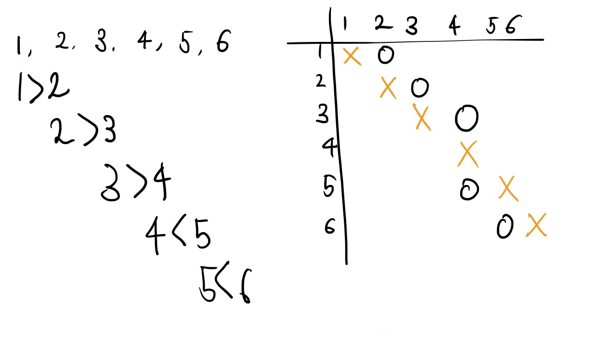
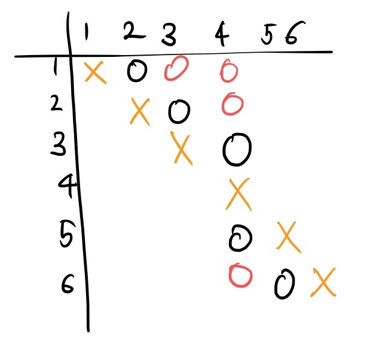
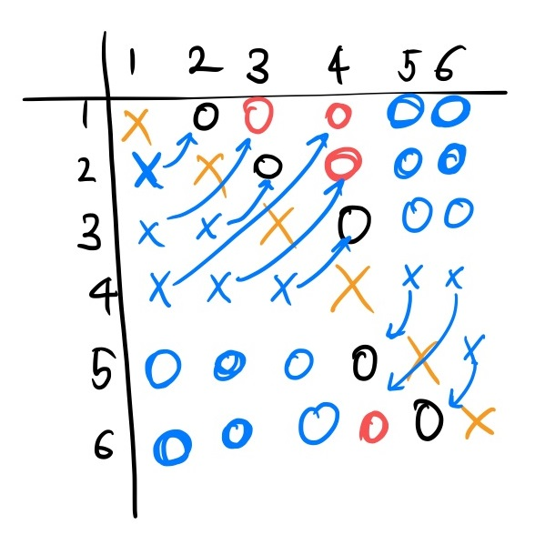

# BOJ 10159 저울

a > b 가 정의되어있다면, a 는 b 를 타고 계속 접근할 수 있게된다.

이는 경로로 생각할수 있는데, 모든 node 에서 모든 node 로 가는 경로를 찾으면 되므로

플로이드 와샬 알고리즘을 사용하여 모든 경로를 구한다.






여기서 자기 자신으로 가는 경로와 갈수 있는 경로를 제외한 나머지 node 가 접근 불가 node 라고 생각할 수 있다.

하지만 한가지 문제가 발생하는데, logic 상에서 '접근 불가' 의 의미가 '단방향' 으로 계산했는데

문제에서 원하는 '비교 가능' 은 양방향이다.

따라서 단방향으로 접근가능한 경로를 구한후, 최종적으로 접근불가능한 node 를 카운팅할때는

양방향 경로로 고려하여 count 해야한다는것이다.



```c++
#include <cstdio>
#include <cstdlib>
#include <iostream>
#include <cstring>
#include <string>
#include <algorithm>
#include <cmath>
#include <vector>
#include <queue>
#include <stack>
#include <deque>
#include <map>
#include <unordered_map>
#include <set>
#include <unordered_set>

using namespace std;
#define INF 1234567890

int a[105][105];

int main() {
	ios::sync_with_stdio(false);
	cin.tie(NULL);
	cout.tie(NULL);

	int n, m;
	cin >> n >> m;
	for (int i = 0; i < m; i++) {
		int s, d;
		cin >> s >> d;
		a[s][d] = 1;
	}
	for (int k = 1; k <= n; k++) {
		for (int i = 1; i <= n; i++) {
			for (int j = 1; j <= n; j++) {
				if (a[i][k] && a[k][j]) a[i][j] = 1;
			}
		}
	}

	for (int i = 1; i <= n; i++) {
		int res = 0;
		for (int j = 1; j <= n; j++) {
			if (i != j && a[i][j] == 0 && a[j][i] == 0) {
				res++;
			}
		}
		cout << res << "\n";
	}

	return 0;
}


```


---


# 저울

| 시간 제한 | 메모리 제한 | 제출 | 정답 | 맞은 사람 | 정답 비율 |
| --------- | ----------- | ---- | ---- | --------- | --------- |
| 1 초      | 256 MB      | 2707 | 1555 | 1232      | 59.259%   |

## 문제

무게가 서로 다른 N 개의 물건이 있다. 각 물건은 1부터 N 까지 번호가 매겨져 있다. 우리는 일부 물건 쌍에 대해서 양팔 저울로 어떤 것이 무거운 것인지를 측정한 결과표를 가지고 있다. 이 결과표로부터 직접 측정하지 않은 물건 쌍의 비교 결과를 알아낼 수도 있고 알아내지 못할 수도 있다. 예를 들어, 총 6개의 물건이 있고, 다음 5개의 비교 결과가 주어졌다고 가정하자. ([1]은 1번 물건의 무게를 의미한다.)

[1]>[2], [2]>[3], [3]>[4], [5]>[4], [6]>[5]

우리는 [2]>[3], [3]>[4]로부터 [2]>[4]라는 것을 알 수 있다. 하지만, 물건 2와 물건 6을 비교하는 경우, 앞서의 결과만으로는 어느 것이 무거운지 알 수 없다. 이와 같이, 물건 2는 물건 1, 3, 4와의 비교 결과는 알 수 있지만, 물건 5, 6과의 비교 결과는 알 수 없다. 물건 4는 모든 다른 물건과의 비교 결과를 알 수 있다. 

비교 결과가 모순되는 입력은 없다고 가정한다. 위 예제의 기존 측정 결과에 [3]>[1]이 추가되었다고 가정하자. 이 경우 [1]>[2], [2]>[3]이므로 우리는 [1]>[3]이라는 것을 예측할 수 있는데, 이는 기존에 측정된 결과 [3]>[1]과 서로 모순이므로 이러한 입력은 가능하지 않다. 

물건의 개수 N 과 일부 물건 쌍의 비교 결과가 주어졌을 때, 각 물건에 대해서 그 물건과의 비교 결과를 알 수 없는 물건의 개수를 출력하는 프로그램을 작성하시오. 

## 입력

첫 줄에는 물건의 개수 N 이 주어지고, 둘째 줄에는 미리 측정된 물건 쌍의 개수 M이 주어진다. 단, 5 ≤ N ≤ 100 이고, 0 ≤ M ≤ 2,000이다. 다음 M개의 줄에 미리 측정된 비교 결과가 한 줄에 하나씩 주어진다. 각 줄에는 측정된 물건 번호를 나타내는 두 개의 정수가 공백을 사이에 두고 주어지며, 앞의 물건이 뒤의 물건보다 더 무겁다.

## 출력

여러분은 N개의 줄에 결과를 출력해야 한다. i 번째 줄에는 물건 i 와 비교 결과를 알 수 없는 물건의 개수를 출력한다.

## 예제 입력 1

```
6
5
1 2
2 3
3 4
5 4
6 5
```

## 예제 출력 1

```
2
2
2
0
3
3
```


## 출처

[Olympiad ](https://www.acmicpc.net/category/2)> [한국정보올림피아드 ](https://www.acmicpc.net/category/55)> [한국정보올림피아드시․도지역본선 ](https://www.acmicpc.net/category/57)> [지역본선 2014 ](https://www.acmicpc.net/category/301)> [고등부](https://www.acmicpc.net/category/detail/1269) 2번

[Olympiad ](https://www.acmicpc.net/category/2)> [한국정보올림피아드 ](https://www.acmicpc.net/category/55)> [한국정보올림피아드시․도지역본선 ](https://www.acmicpc.net/category/57)> [지역본선 2014 ](https://www.acmicpc.net/category/301)> [중등부](https://www.acmicpc.net/category/detail/1270) 3번

[Olympiad ](https://www.acmicpc.net/category/2)> [한국정보올림피아드 ](https://www.acmicpc.net/category/55)> [한국정보올림피아드시․도지역본선 ](https://www.acmicpc.net/category/57)> [지역본선 2014 ](https://www.acmicpc.net/category/301)> [초등부](https://www.acmicpc.net/category/detail/1271) 4번

- 데이터를 만든 사람: [baekjoon](https://www.acmicpc.net/user/baekjoon)