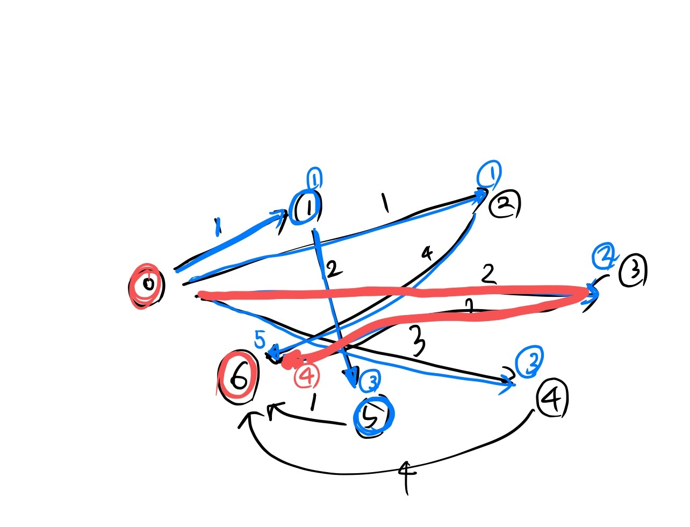
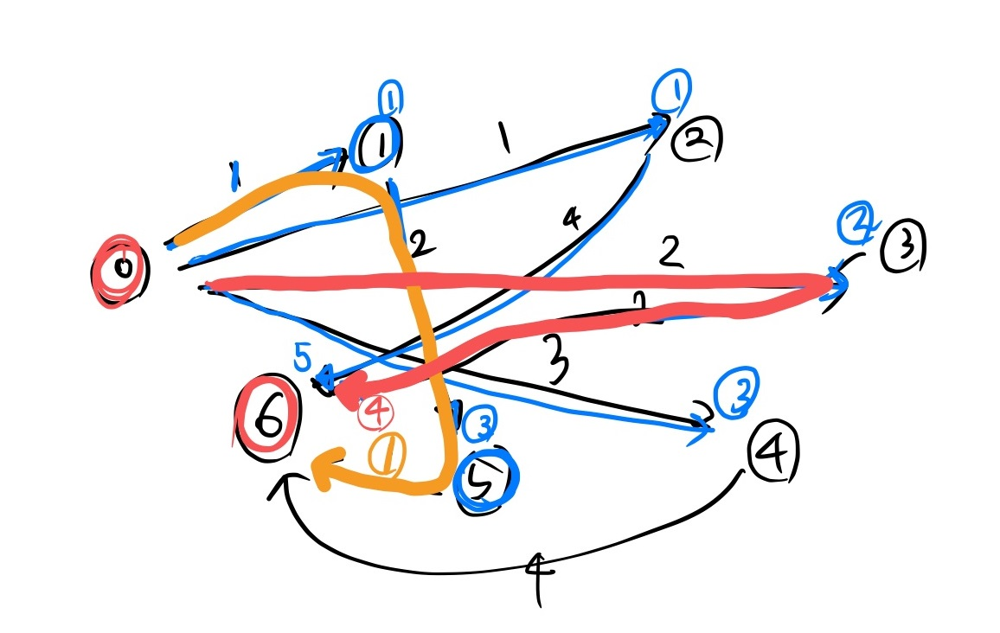
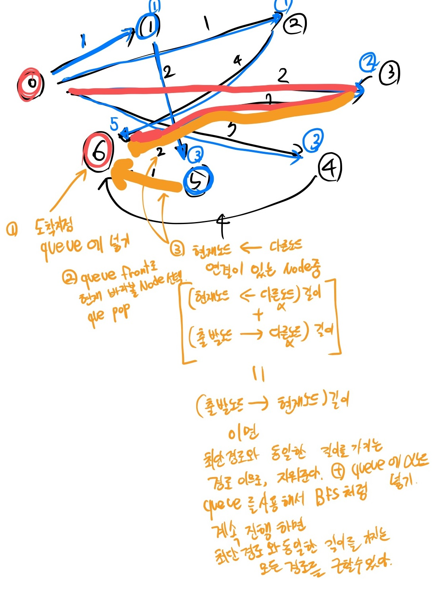

# BOJ 5719 거의 최단경로

푸는대 2시간은 걸린거같다.

문제는 최단경로를 제거하고 그 다음의 최단경로

즉 '2번째 최단경로' 를 구하는것이다.

조건은, 최단경로에 사용되는 경로를 사용하면 안되는 2번째 최단경로를 구하는것이다.


이 문제는 조건이 큰 힌트가 되었다.

'최단 경로에서 사용되는 경로를 사용하면 안된다' 라는 것은 곧

최단 경로를 구하고, 최단경로에 해당하는 모든 Edge 를 지우고

다시 최단경로를 구하면 되기 때문이다.

 

하지만 여기서 문제가 생긴다. 바로 **'최단경로가 여러가지 일때'** 이다.




이 문제를 해결하기 위해서, BFS 를 사용한다.

다익스트라의 결과는 결국 '출발 노드에서 모든 노드까지의 최단 경로의 집합' 이 나오고

초기 입력으로 노드간의 거리가 저장되어있기 때문에

다익스트라를 계산하는 BFS 를 역으로 돌리면서 '모든 최단경로' 를 도출해낼 수 있다.

그 방법은 아래 이미지에 설명을 써두었다.



최단경로를 BFS 가 흘러가면서 구하면서, 바로바로 Edge를 지워준다.

이 이후에는 처음 사용했던 다익스트라를 초기화한후 다시 사용해서 거의 최단경로를 구하면 된다.


처음엔 back node 를 넣어서 경로를 트래킹하려 했지만, 모든 최단경로라는 조건에 막혀 BFS 로 바꿨다.

그래서 dist 가 node 구조체가 아니여도 되었는데 쓸모없는 코드가 들어가버렸다. 리펙토링 해야하는데 일단 안헀다.


```c++
#include <cstdio>
#include <cstdlib>
#include <iostream>
#include <cstring>
#include <string>
#include <algorithm>
#include <cmath>
#include <vector>
#include <queue>
#include <stack>
#include <deque>
#include <map>
#include <unordered_map>
#include <set>
#include <unordered_set>

using namespace std;
#define INF 1234567890

struct node
{
	int u;
	int v;
	int dist;
}typedef node;

vector<node> dijkstra(int s, int d, int n, vector<vector<int>> mmap) {
	vector<node> dist(n, {-1,-1,INF});
	vector<bool> check(n, false);
	priority_queue<pair<int, int>> pq;
	dist[s] = {-1,s,0};
	pq.push({ 0, s });

	while (!pq.empty()) {
		int cur_cost = -pq.top().first;
		int cur_node = pq.top().second;
		pq.pop();
		check[cur_node] = true;
		for(int i=0; i<n; i++){
			if (mmap[cur_node][i] == -1) continue;
			
			node next_node = {cur_node, i, mmap[cur_node][i]};
			
			if (!(cur_cost + next_node.dist < dist[next_node.v].dist)) continue;
			if (!(check[next_node.v] == false)) continue;
			
			dist[next_node.v].dist = cur_cost + next_node.dist;
			dist[next_node.v].u = cur_node;
			dist[next_node.v].v = next_node.v;
			pq.push({ -dist[next_node.v].dist, next_node.v });
		}
	}
	return dist;
}

void erase(int s, int d, int n, vector<node> &dist, vector<vector<int>> &mmap) {
	queue<int> que;
	que.push(d);
	while (!que.empty()) {
		int cur_node = que.front();
		que.pop();
		for (int i = 0; i < n; i++) {
			if (mmap[i][cur_node] == -1) continue;
			if (dist[cur_node].dist != dist[i].dist + mmap[i][cur_node]) continue;

			mmap[i][cur_node] = -1;
			que.push(i);
		}
	}

}


int main() {
	ios::sync_with_stdio(false);
	cin.tie(NULL);
	cout.tie(NULL);

	while (1)
	{
		
		int n, m;
		cin >> n >> m;
		vector<vector<int>> mmap(n+5, vector<int>(n+5, -1));

		if (n == 0 && m == 0) break;
		int s, d;
		cin >> s >> d;
		for (int i = 0; i < m; i++) {
			int u, v, p;
			cin >> u >> v >> p;
			mmap[u][v] = p;
		}
		vector<node> dist = dijkstra(s,d,n,mmap);
		erase(s, d,n, dist, mmap);
		dist = dijkstra(s, d, n, mmap);
		if (dist[d].dist == INF)
			cout << -1 << "\n";
		else
			cout << dist[d].dist << "\n";
		
	}

	return 0;
}


```


---


# 거의 최단 경로

| 시간 제한 | 메모리 제한 | 제출 | 정답 | 맞은 사람 | 정답 비율 |
| --------- | ----------- | ---- | ---- | --------- | --------- |
| 1 초      | 256 MB      | 4031 | 1101 | 703       | 27.185%   |

## 문제

요즘 많은 자동차에서는 GPS 네비게이션 장비가 설치되어 있다. 네비게이션은 사용자가 입력한 출발점과 도착점 사이의 최단 경로를 검색해 준다. 하지만, 교통 상황을 고려하지 않고 최단 경로를 검색하는 경우에는 극심한 교통 정체를 경험할 수 있다.

상근이는 오직 자기 자신만 사용 가능한 네비게이션을 만들고 있다. 이 네비게이션은 절대로 최단 경로를 찾아주지 않는다. 항상 거의 최단 경로를 찾아준다.

거의 최단 경로란 최단 경로에 포함되지 않는 도로로만 이루어진 경로 중 가장 짧은 것을 말한다. 

예를 들어, 도로 지도가 아래와 같을 때를 생각해보자. 원은 장소를 의미하고, 선은 단방향 도로를 나타낸다. 시작점은 S, 도착점은 D로 표시되어 있다. 굵은 선은 최단 경로를 나타낸다. (아래 그림에 최단 경로는 두 개가 있다)거의 최단 경로는 점선으로 표시된 경로이다. 이 경로는 최단 경로에 포함되지 않은 도로로 이루어진 경로 중 가장 짧은 경로이다. 거의 최단 경로는 여러 개 존재할 수도 있다. 예를 들어, 아래 그림의 길이가 3인 도로의 길이가 1이라면, 거의 최단 경로는 두 개가 된다. 또, 거의 최단 경로가 없는 경우도 있다.


## 입력

입력은 여러 개의 테스트 케이스로 이루어져 있다. 각 테스트 케이스의 첫째 줄에는 장소의 수 N (2 ≤ N ≤ 500)과 도로의 수 M (1 ≤ M ≤ 104)가 주어진다. 장소는 0부터 N-1번까지 번호가 매겨져 있다. 둘째 줄에는 시작점 S와 도착점 D가 주어진다. (S ≠ D; 0 ≤ S, D < N) 다음 M개 줄에는 도로의 정보 U, V, P가 주어진다. (U ≠ V ; 0 ≤ U, V < N; 1 ≤ P ≤ 103) 이 뜻은 U에서 V로 가는 도로의 길이가 P라는 뜻이다. U에서 V로 가는 도로는 최대 한 개이다. 또, U에서 V로 가는 도로와 V에서 U로 가는 도로는 다른 도로이다. 

입력의 마지막 줄에는 0이 두 개 주어진다.

## 출력

각 테스트 케이스에 대해서, 거의 최단 경로의 길이를 출력한다. 만약, 거의 최단 경로가 없는 경우에는 -1을 출력한다.

## 예제 입력 1

```
7 9
0 6
0 1 1
0 2 1
0 3 2
0 4 3
1 5 2
2 6 4
3 6 2
4 6 4
5 6 1
4 6
0 2
0 1 1
1 2 1
1 3 1
3 2 1
2 0 3
3 0 2
6 8
0 1
0 1 1
0 2 2
0 3 3
2 5 3
3 4 2
4 1 1
5 1 1
3 0 1
0 0
```

## 예제 출력 1

```
5
-1
6
```


## 출처

[ACM-ICPC ](https://www.acmicpc.net/category/1)> [Regionals ](https://www.acmicpc.net/category/7)> [Latin America ](https://www.acmicpc.net/category/103)> [South America Regional Contests 2008](https://www.acmicpc.net/category/detail/568) A번

- 문제를 번역한 사람: [baekjoon](https://www.acmicpc.net/user/baekjoon)
- 데이터를 추가한 사람: [gkswjdzz](https://www.acmicpc.net/user/gkswjdzz) [smsm8111](https://www.acmicpc.net/user/smsm8111)
- 잘못된 데이터를 찾은 사람: [tncks0121](https://www.acmicpc.net/user/tncks0121)

## 링크

- [ACM-ICPC Live Archive](https://icpcarchive.ecs.baylor.edu/index.php?option=com_onlinejudge&Itemid=8&page=show_problem&problem=2211)
- [Sphere Online Judge](http://www.spoj.com/problems/SAMER08A/)