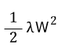
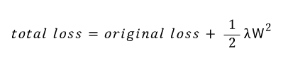

# Weight Decay

애매하게 알던것 공부하기

- global average pooling :heavy_check_mark:
- weight decay :heavy_check_mark:
- 1x1 convolution 
- resnet
- attention
- seq2seq
- google net
- fast r-cnn
- faster r-cnn
- mask r-cnn
- yolo
- dropout
- transformer
- gru
- CAM

---

Overfitting 을 막기위한 기법중 하나로, 한국어로는 가중치 감소, 영어로는 Weight Decay 라고 부르는 방법이 있다.

학습과정에서 큰 가중치에 대해서 큰 페널티를 부여하여 오버피팅을 억제하는 방식입니다.

보통 오버피팅은 Weight 의 parameter 가 커져서 해당 node 의 영향력이 너무 커져서 발생하는 문제 입니다.

따라서 해당 node 에 페널티를 주는 방식으로 overfitting 을 막는 겁니다.

L2 norm 을 사용할 경우, 앞에  1/2 를 붙여서 미분시 값을 조정하는 역활을 하고,

람다는 얼마나 강하게 Weight decay 를 할지 정하는것이다.

따라서 loss function 에 위와같은 식이 들어가게 되는데, 최종적으로 loss function은 다음과 같은 꼴이 된다.

loss 의 값이 올라감에 따라, weight 의 증감폭이 줄어들게 되고,  그만큼 Weight 를 억제하는 역활을 수행 하게 된다.

참고

책) 밑바닥 부터 시작하는 딥러닝