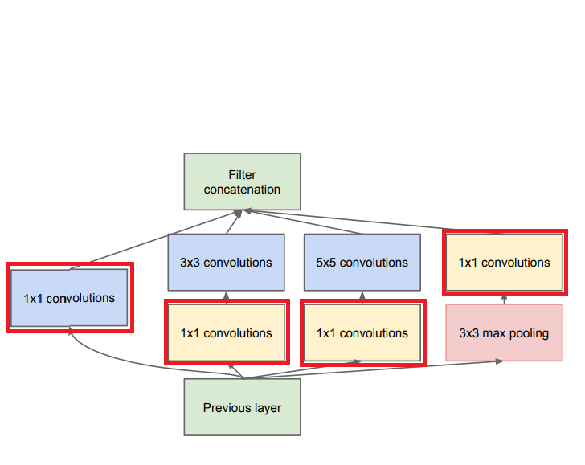

# 1x1 convolution

애매하게 알던것 공부하기

- global average pooling :heavy_check_mark:
- weight decay :heavy_check_mark:
- 1x1 convolution :heavy_check_mark:
- resnet
- attention
- seq2seq 
- google net
- fast r-cnn
- faster r-cnn
- mask r-cnn
- yolo
- dropout
- transformer
- gru
- CAM

------





1x1 Convolution 이란?

convolution 의 filter 개수에 따라 ouput dimension 이 달라지지만, 각 filter 의 결과, 즉 feature map 의 가로 세로 크기는 동일한 convolution 연산이다.


사실 transpose convolution 같은 아예 연산방식이 달라지는것과는 다르게, 일반적인 convolution 과 동일한 연산을 하지만, filter 의 크기가 1x1 로 고정되어있는것이 특징이다.


1x1 filter 를 사용하기 때문에,  이미지의 공간적 정보를 feature map 에 함축적으로 담는 기존 covolution 의 역활 보다는, dimension reduction , 계산량을 줄이는 전처리 등으로 사용된다.

```
That is, 1×1 convolutions are used to compute reductions before the expensive 3×3 and 5×5 convolutions.
```


GoogleNet 에서는 1x1 convolution 의 역활을 2가지로 설명한다.

```
1 × 1 convolutions have dual purpose
- most critically, they are used mainly as dimension reduction modules to remove computational bottlenecks, 
- that would otherwise limit the size of our networks.

This allows for not just increasing the depth, but also the width of our networks without significant performance penalty.
```


GoogleNet 에서는 inception network 를 사용하는데, 하나의 network 를 지날때마다 naive 한 inception network 의 경우 계속 크기가 커지게 된다.

network 의 depth 와 width 가 지속적으로 커지게 되는것을, 1x1 convolution 이 일종의 `bottleneck layer` 역활을 하여 크기를 줄여서 연산을 하고, 나중에 다시 늘어나도 같은 크기를 유지할 수 있게 해주는 역활을 하게 된다.


참고

<https://arxiv.org/pdf/1409.4842.pdf>