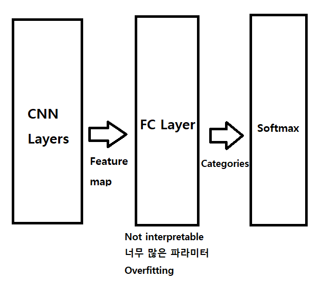
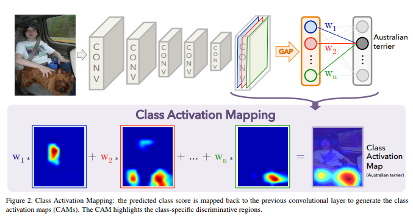

# Global average pooling

애매하게 알던것 공부하기

- global average pooling :heavy_check_mark:
- weight decay 
- 1x1 convolution 
- resnet
- attention
- seq2seq
- google net
- fast r-cnn
- faster r-cnn
- mask r-cnn
- yolo
- dropout
- transformer
- gru
- CAM

---


## Global Average pooling 이란?

Fully connected layer 의 대안으로 나온 pooling layer.

Global Average pooling 이 나올때 Deep learning 에서 큰 화두였던 `Deeper and Deeper` 문제를 풀다가 나온 방식.

Layer를 깊게 쌓으면서, model 의 parameter 수가 너무 많아지는 경향이 있었는데,

도대체 어디서 이 수많은 parameter 를 필요로 하는지 알아보니, FC layer 에서 상당량의 parameter 를 요구하고 있었다.


또한, FC layer 특성상, 저 많은 parameter 를 학습할때 필연적으로 overfitting 이 발생하는데, Hinton 교수님의 Dropout 으로 어느정도 Regularization을 한다. 


수많은 Parameter, Drop out, 긴 학습 시간 이 만나면서 FC layer 는 하나의 `Black box` 가 된다. 전혀 interpretable 하지 않다는것이다.


여기서 왜 interpretable 이라는 속성이 나오냐면, 이전 CNN 들은 `아무튼 잘되면 잘된거다` 라는 기조 였지만, 이제는 `그래서 왜 잘되는데?` 를 시각적으로 볼 수 있어야 하기 때문이다.




아래는 CAM (flass activation map) 에서 사용한 global average pooling 이다.

FC layer를 거치지 않고 충분히 많은 convolution 을 통해 feature map 에 함축된 정보를 잘 담아두고,

그 feature map 을 각각 average pooling 하게 되면, 각 feature 의 class 가 도출된다는 원리이다.




GAP 의 장점은, feature map 과 category data를 직접 연관지음으로서 covolution structure 를 훨씬 더 native 하게 만든다는것이다.

```
One advantage of global average pooling over the fully connected
layers is that it is more native to the convolution structure by enforcing correspondences between feature maps and categories.
```

따라서 model 이 훨씬 더 interpretable 하다는 장점이 있다.

또한 FC layer 에서는 Overfitting 을 막기 위해 dropout 을 사용했지만, Parameter 가 없는 GAP 는 그 자체적으로 overfitting 을 막게 되어 regularization 효과도 있다고 한다.

```
 Another advantage is that there is no parameter to optimize in the global average pooling thus overfitting is avoided at this layer.
```

또한 GAP 는 spatial information 을 요약하여 반영하기때문에, fc layer 에서 공간 정보가 없어지는 것을 막을 수 있고, 훨씬 공간적 정보를 잘 담을 수 있다고 한다.


참고

<https://arxiv.org/pdf/1312.4400.pdf>

<https://arxiv.org/pdf/1512.04150.pdf>