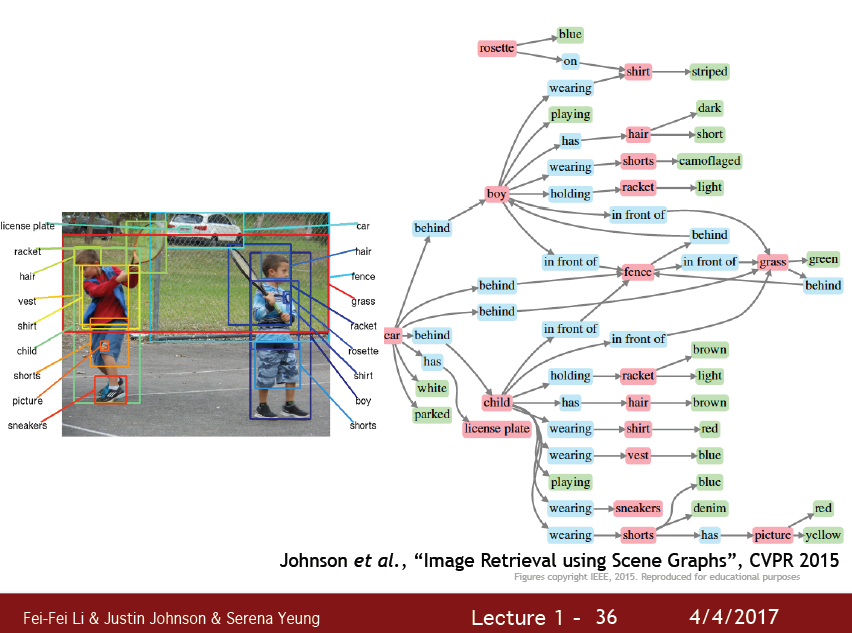
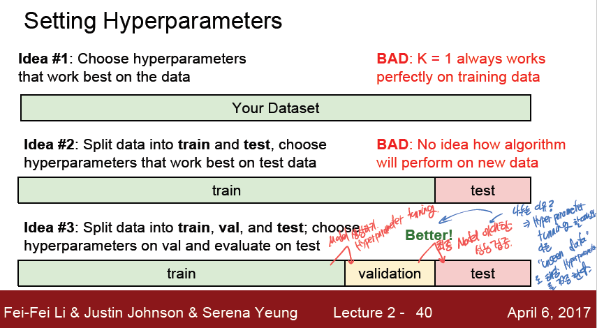

# cs231n - Lecture 1 & 2

## 1강

이미지 처리란 매우 복잡하다. 

하지만 이 이미지를 매우 잘 처리하고있는게 바로 '동물' 과 '사물' 이다.

동물, 사람은 이미지를 아래와 같은 방식으로 이해한다고 한다.

1. 복잡한 이미지를 나누어서 처리하기.

2. 복잡한 물체를 단순한 물체의 결합으로 이해하기
3. feature 를 중심으로 이해하기

이러한 '이미지' 들에 대한 정보들이 있어야 컴퓨터가 우리가 어떤방식으로 이해하는지 알려줄 수 있을것이다.

'Data driven Learning' 으로, 수많은 데이터들이 있어야 한다.

최근에 딥러닝이 다시 각광받기 시작하고, 성능이 좋아진 이유도 이 데이터가 풍부해 졌고, 컴퓨팅 파워가 매우 좋아졌기 때문이다.

이 데이터의 한 축을 담당하는게 바로 ImageNet project 이다.

ImageNet Project 는 미국의 주요 대학들에서 제작한 이미지 데이터셋이다.

이 데이터로 매년 Image Classification Challenge를 개최하는데, 머신러닝을 사용할때보다, 딥러닝이 발전하면서 휴먼 에러보다 낮은 에러율을 보이는 놀라운 성능을 보여줬다.

위의 '딥러닝' 모델은 2012년도의 Alexnet을 기점으로 시작해서 점점 성능을 높여왔는데,

이 모델이 바로 CNN을 이용한 모델이다.

하지만 CNN은 이 시점에서 나온 모델이 아닌 1998년도에 나온 모델이다.

점차 CNN Layer 가 Wide, Deep 해지면서 성능이 향상됨을 알 수 있다.

하지만 아직은 갈 길이 먼 것이 사실이다.

이미지에 대한 상세한 정보, 어떤 물체가 어떤 동작을 하고 뒤에는 어떤 물체가 있고 이 물체들이 어떤 상호작용을 하는등의 이미지를 설명하는 작업은 대부분은 아직 불가능의 영역이다.

## 2강

보통 Image 를 분류하기 위해서는

이미지 - class label 형식으로 이 이미지가 어떤 class 인지 먼저 구분지어둔다.

사람이 바라보는 이미지는 저렇게 화려한 이미지이지만, 컴퓨터가 인식하는 이미지는 큰 숫자 덩어리에 불과하다.

여기서 sementic idea of cat 와 숫자 데이터간의 gap이 발생한다.

또한 이미지에 여러가지 변화가 있을수 있는데

- viewpoint variation
- illumination
- deformation
- occlusion
- background clutter
- interclass variation

등이 발생할 수 있다.

이것들은 이미지에 데이터적 변화를 주지만, 다른 데이터가 같은 '고양이' 를 나타내는것이 되버린다.

그럼 컴퓨터는 정말 다른 데이터가 주어졌는데 같은 고양이라고 이해해야 하는것이다.

그럼 이런 문제를 어떻게 해결해야 할까?

바로 Data-Driven Approach 이다.

많은 데이터로부터 분류를 위해서 train 을 하고, 실제 사용때는 model 을 사용하는 predict 과정을 거치게 된다.

그럼 이미지를 어떻게 분류해야할까?

가장 간단하게 가장 가까운것의 label 을 자기의 label 이라고 생각해보자.

CIFAR10 데이터셋은 32*32 의 이미지들로 구성되어있고 10개의 class 가 있다.

이미지에서 가장 가깝다 라는것을 정의하기 위해서는 Distance Metric 이 정의되야할탠데,

가장 간단하게 L1 distance 를 적용해보자.

그냥 모든 pixel 을 각 pixel끼리 뺀것의 절댓값을 모두 더하는게 L1 distance 이다.

하지만 이것의 구현체는 썩 좋지 않다.

train 과정은 그저 data를 저장하는것이고,

predict 는 모든 데이터를 순회하면서 계산해야한다.

우리가 원하는것은 train이 짧고 predict 가 긴 것이므로 올바른 알고리즘이 아니다.

### K-NN

K-NN 알고리즘은 해당 영역에 background 에 coloring 을 해두어서, 데이터가 주어졌을때 해당 구역의 color 만으로 O(1) 만에 Class를 판별해준다.

그저 가장 가까운 이웃이 아닌, 가장 가까운 N개의 이웃들 중에서 가장 많이 나온 Class 를 자신의 class로 사용한다 라는 간단한 알고리즘을 사용한다.

distance metric 에도 여러가지 방법이 있는데, 바로 L1, L2 distance이다.

L1 distacne 는 좌표축에 영향을 받는다 좌표축이 바뀐다면 거리가 달라질 수 있다. 

L2 distance 는 좌표축에 영향을 받지 않는다.

그럼 data 는 어떻게 사용해야할까?

가장 올바른 방법은 train, validation, test 로 데이터를 나누는 방법이다.

train 으로 데이터를 학습시키면서, 해당 hyperparameter 튜닝의 경우는 validation 으로진행하고,

validation 과 train 이 모두 볼수 없는 unseen data 인 test 데이터가 hyperparameter 가 잘 설정되었는지, generalize된 model 이 도출되었는지 검사한다.

또다른 방법으로는 Cross-validation 방식이 있다.

데이터를 여러 fold 로 나누어서 하나를 validation 으로 지정하는 방식이다.  

작은 데이터셋에 효과적이며 deep learning 에는 그렇게 좋은 방법은 아니다.

지금까지 공부했던 K-NN 은 이미지 데이터에 절대 사용되지 않는다. 

'거리' 라는 값이 위에 나와있는 변형된 이미지 3개와 원본 이미지간의 거리가 모두 동일하다.

어디서 어떤 변화로 거리가 바뀌었던간에, 그 정도가 똑같다면 어떻게 바뀌어도 똑같은 거리가 되기 때문이다.

### Linear Classification

linear classification 은 하나의 linear 한 선을 그어서 데이터를 구분하는것이다.

이때 모델은 W 라는 matrix 와 b 라는 bias 를 학습하게된다.

위 그림처럼 linear classification 은 하나의 기준으로 한가지만 분류할수 있다, Yes, No 같은 개념으로.

여기서 나오는 문제가 있는데, 직선으로 구분할 수 없는것은 정말로 구분할 수 없게된다는것이다.

