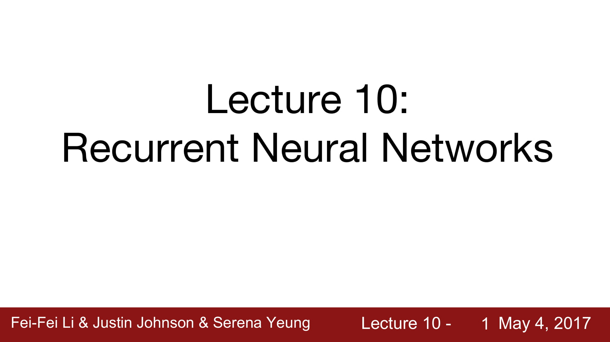
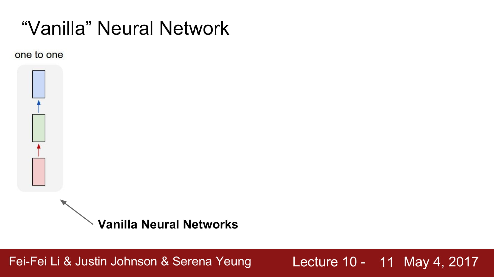
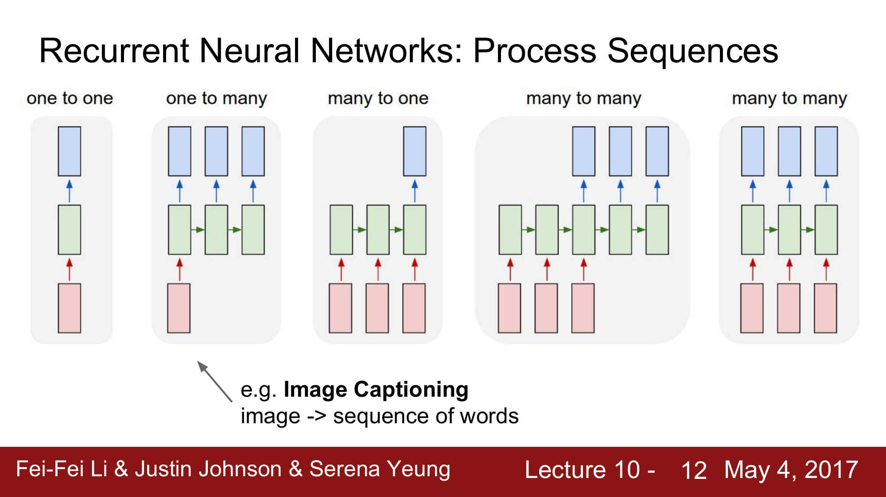
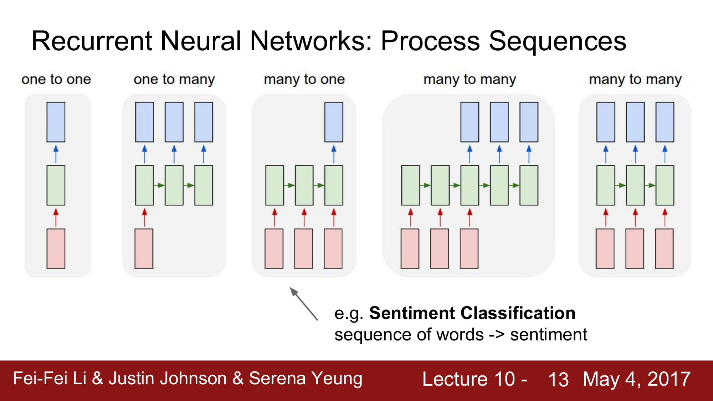
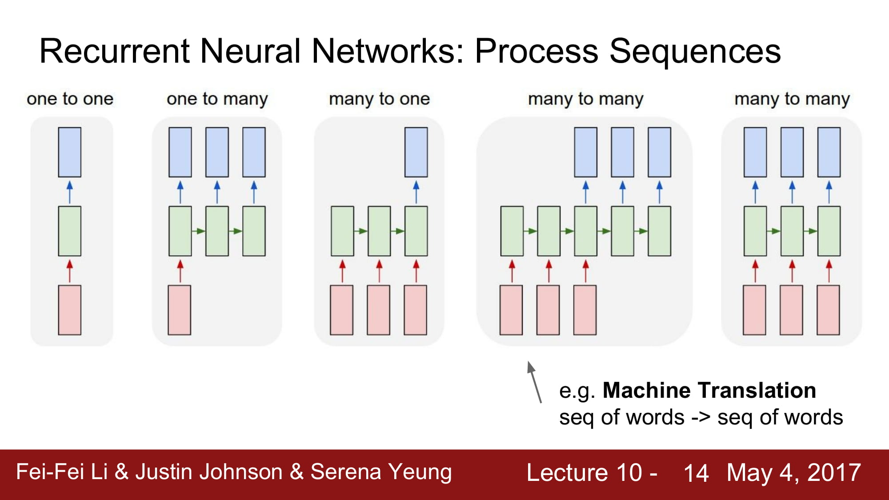
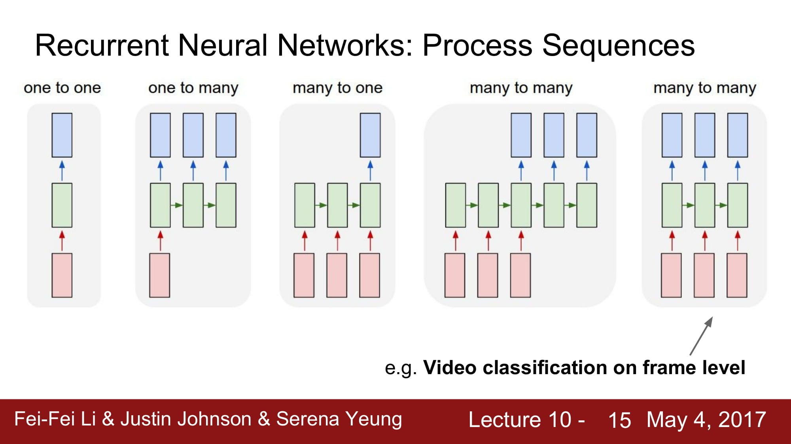
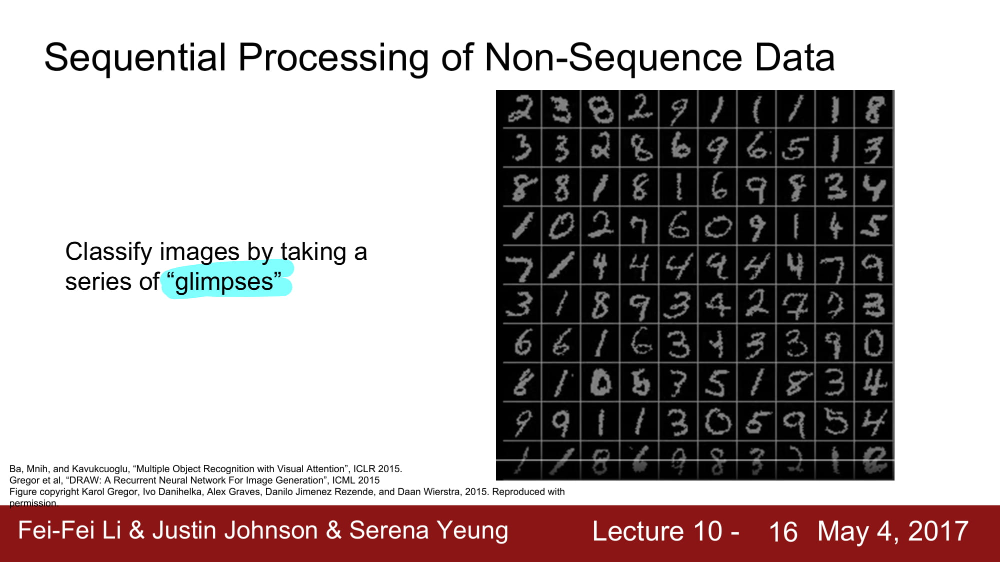

# cs231n Lecture 10-1 Recurrent Neural Networks

10 장에서는 RNN, CNN 과 RNN 을 같이 사용하는 모델, 그리고 Vanilla RNN 이 아닌 LSTM, GRU 등을 공부한다.

RNN 에는 여러 구조가 있다. 

가장 기본적인 구조는 One to One

input 과 ouput 이 1:1 의 비율을 맞추는 모델이다.

그 외 여러가지 모델이 있는데, 우리가 생각할 수 있는 1:1, N:1, 1:N, N:M 모두 가능하다.

1:N 모델은 image captioning 모델에 많이 쓰인다고 한다.

이미지를 여러 단어의 집합인 문장으로 나타내는 테스크라고 한다.

N:1 은 sentiment classification 에 사용된다고 한다.

NLP 에서 문장 분류를 할때 이 모델이 사용된다고 생각하면 될꺼같다.

N:M 모델의 경우 Machine Translation 에 많이 사용된다고 한다.

이는 추후에 Seq2Seq 모델로 요즘 많이 사용되는 encoder-decoder 모델의 기본형이다.

N:M 모델은 여러가지 변형이 가능한데, 위의 그림처럼 N:1 1:M 으로 나뉜 encoder,decoder 가 합쳐져있는 모델이 있고,

4번째 모델처럼 완전한 N:N 으로 input 에 output이 무조건 달려있는 모델도 존재한다고 한다.

이는 Video classification 처럼 real time 으로 작동할 때 사용된다고한다.

None-sequence Data 에 Sequential Processing 을 어떻게 적용할까?

고정된 길이의 데이터를 조금씩 sequential 하게 접근한다.

흘긋 본다 인 glimpses 라는 표현이 재밌다.

