# cs231n Lecture 10-3 Recurrent Neural Networks

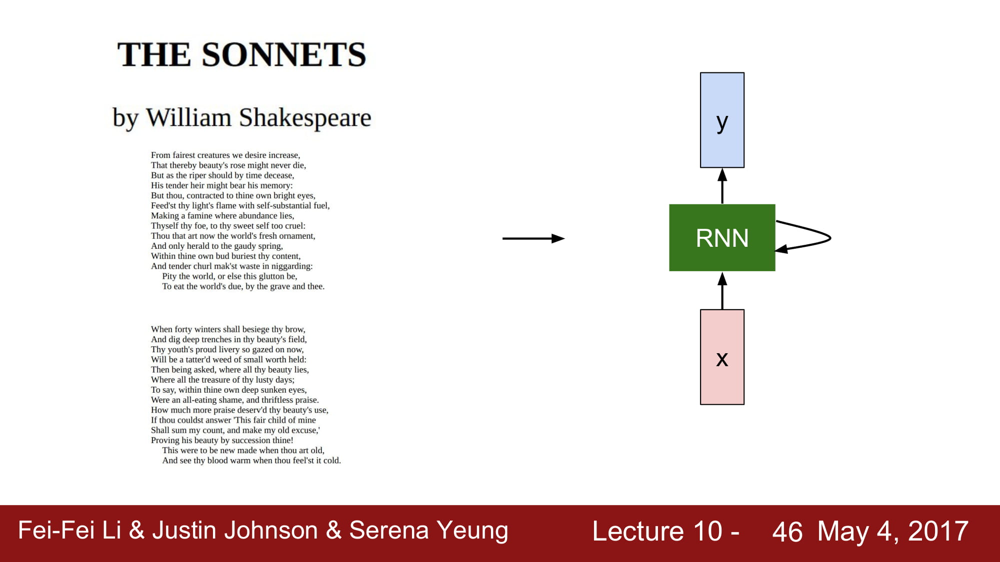

여러가지 재밌는 예시를 살펴보자.

셰익스피어 글을 RNN 으로 학습한다고 해보자. character 단위 다음 단어 예측으로 학습한다고 해보자.

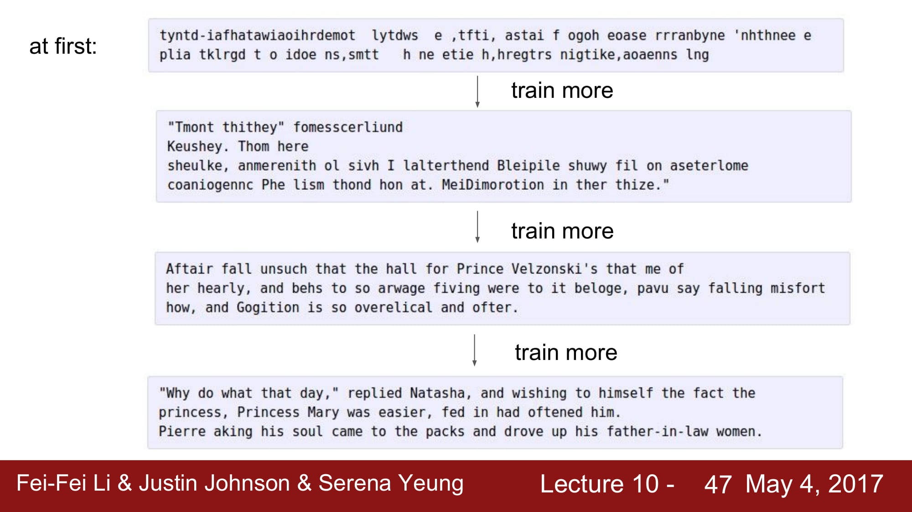

학습을 진행하면서 초기에는 별로지만 점점 좋아지는것을 볼 수 있다.

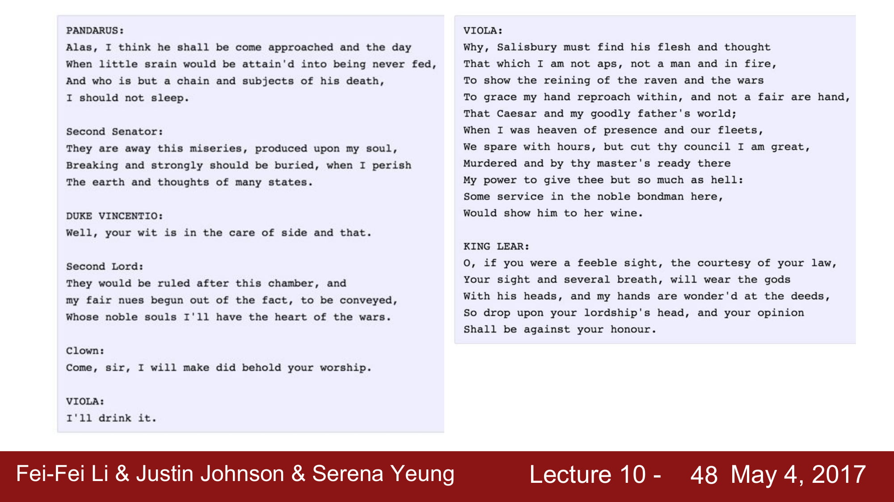

꽤 그럴듯하게 학습하는것을 볼 수 있다. 물론 문법이나 의미등은 틀릴 수 있어도

형태는 비슷하게 나오는 것을 볼 수 있다.

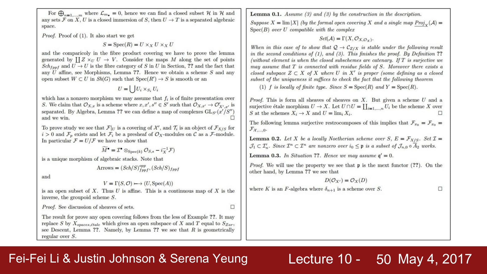

다음은 논문을 학습한것이다.

완전한 개소리지만 수식도 적고 Lemma 도 넣고 형태를 갖추는것을 알 수 있다.

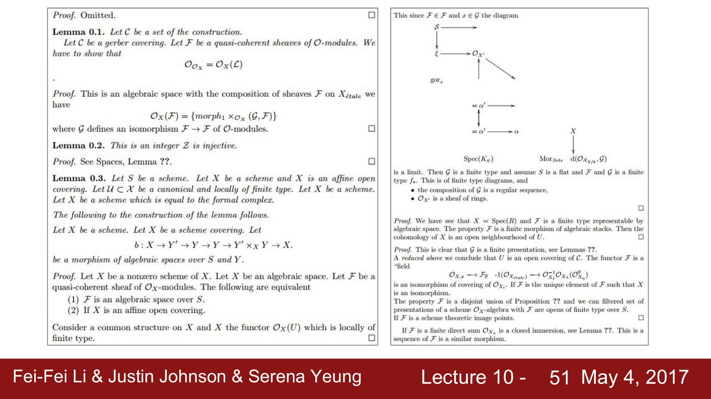

이젠 막 diagram 까지 그리는데

그냥 개소리다.

형태가 나온다는것에 재미를 느낄뿐이다.

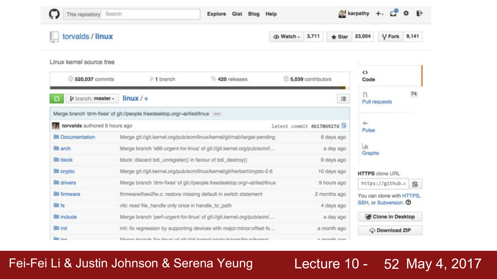

다음은 linux kernel 의 code를 학습해보자.

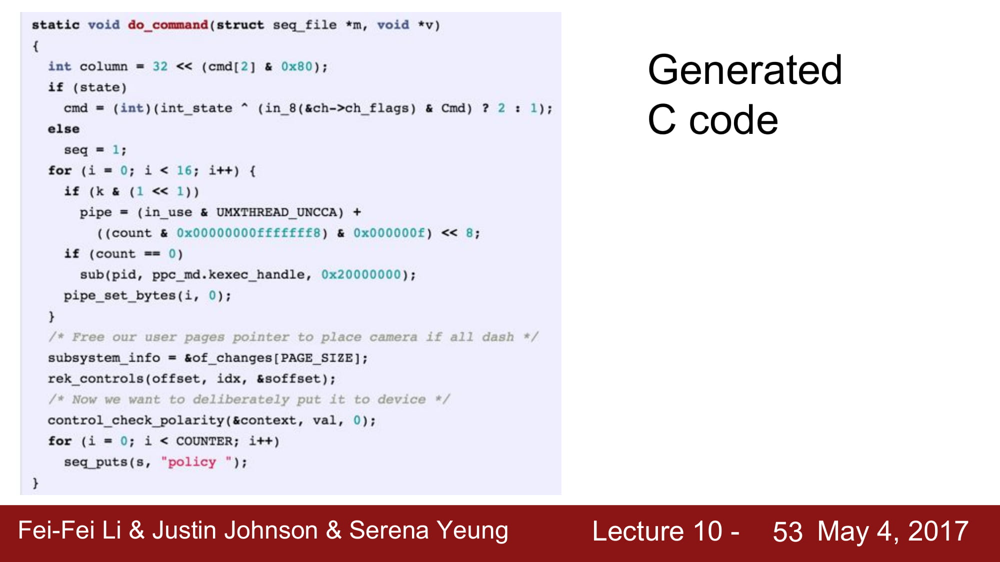

꽤 그럴듯하게 나온다,

하지만 선언되지않은 변수를 사용하거나 로직에 맞지않은 코드가 막 나오는것을 볼 수 있다.

그냥 형태만 비슷하다.

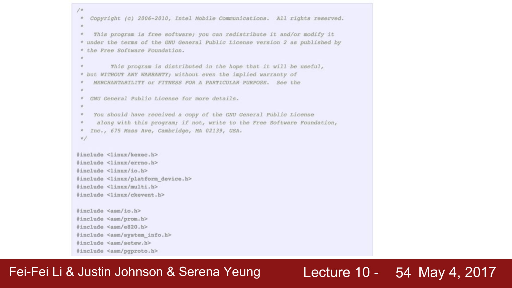

음.. 뭘보고 copyright 까지 따라 적긴 한거같다.

역시 형태만 비슷하고 의미는 크게 없다.

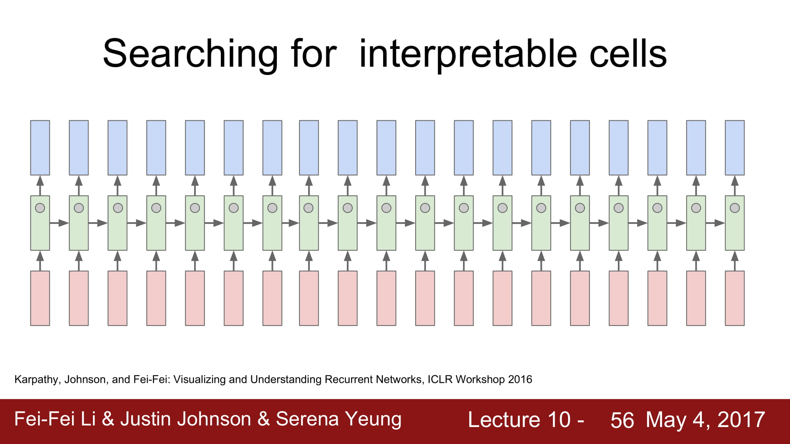

위의 hidden vector 를  예측하여 시각적으로 표현한것이 아래 내용들이다.

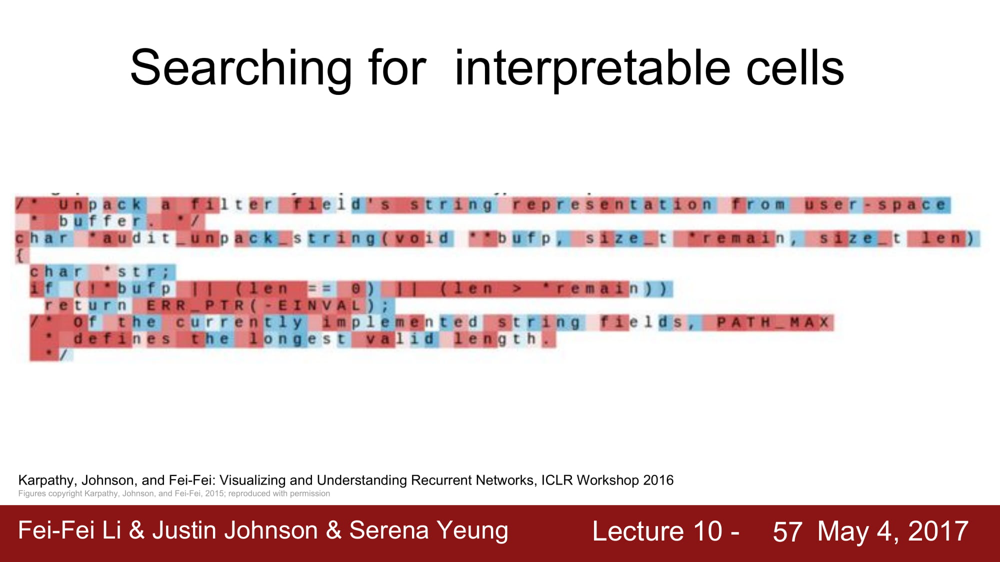

이렇게 초기에는 아무 의미 없는 정보를 가지고 있다.

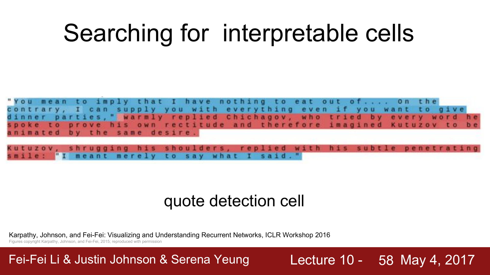

점점 학습을 하다보면 "" 를 기준으로 패턴을 나누는 모습을 볼 수 있다.

quote detection 을 진행하는 cell 이라고 분석할 수 있다.

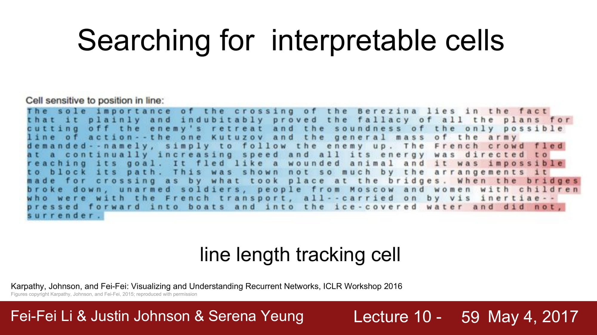

이 cell 이 해주는 역활은 line length tracking 이다.

문장의 길이에 따라 데이터가 변하는 모습을 볼 수 있다.

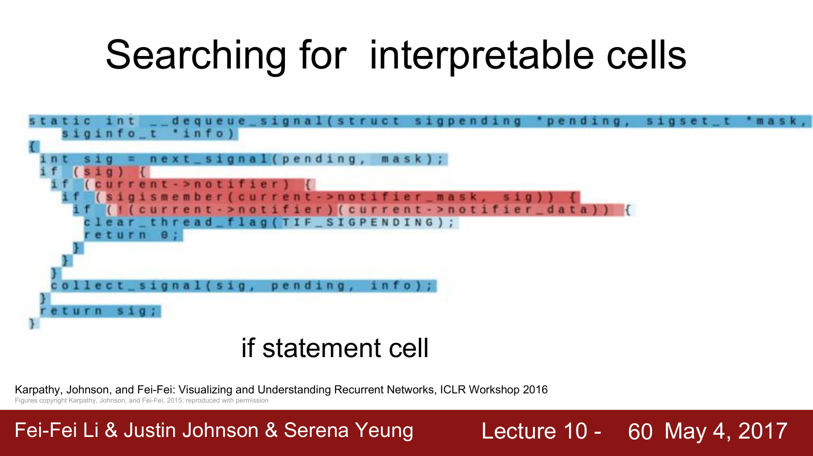

if state 만 걸러주는 cell 도 학습할 수 있다.

이렇게 interpretable 하게 cell 을 바라볼 수도 있다고 한다.

