# cs231n Lecture 11-1 Detection and Segmentation

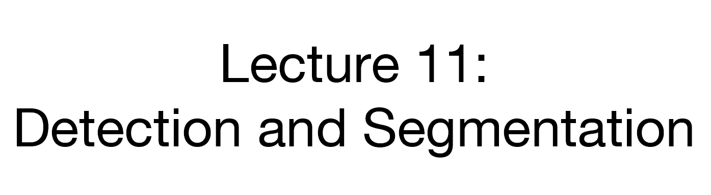

11장은 Classfication 이 외에 비전 분야에서 유명한 다른 문제들을 소개하고, 대표 모델들을 학습합니다.

또한 Multi Loss 와 Region Proposlas, downsampling, upSampling 등을 학습합니다.

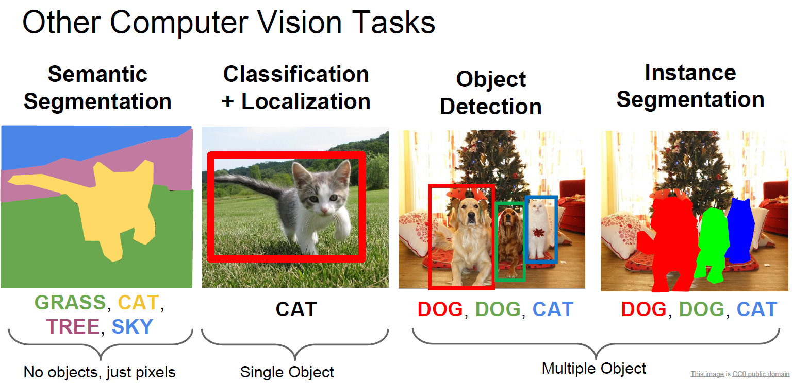

기본적으로 배운 Classification

그 외에도 Segmentation, Object Detection 등이 있고 두 개의 발전 모델인 instance Segmentation 등이 있습니다.

이제 하나하나 학습해봅시다.

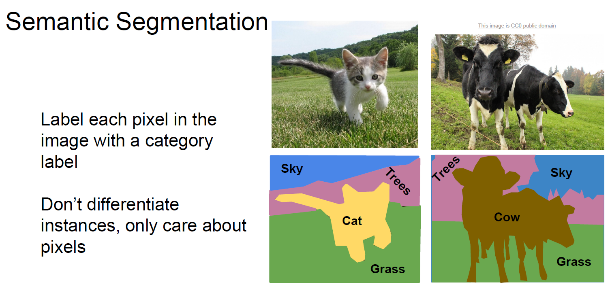

Semantic Segmentation은 Pixel에 Label 을 붙이는 작업 입니다.

어떻게 Segmentation 문제를 풀까요?

일단 기본적으로 생각나는 Sliding Window 부터 생각해봅시다.

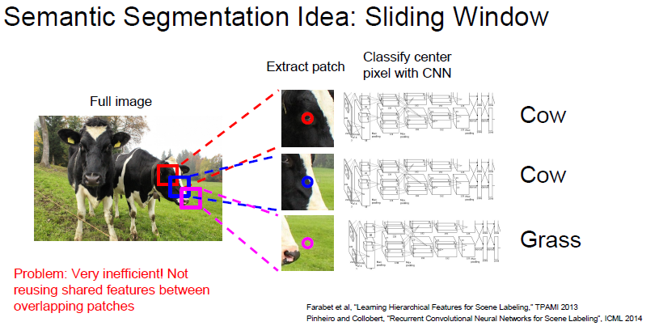

일단 Sliding window 하면서 각각 뽑힌 patch 들을 CNN 으로 분류한다고 생각해봅시다.

일단 Computational cost 가 굉장히 크고, feature 들을 서로 공유하지않아 중복 연산이 매우 많게됩니다.

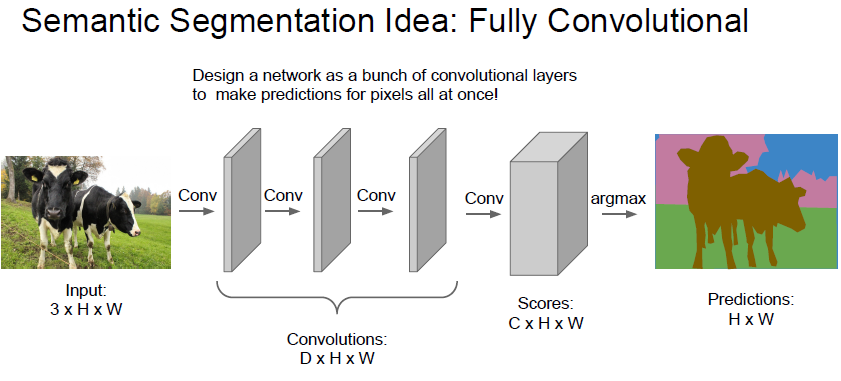

두 번째 아이디어는 Fully Convolutional 이라는 아이디어인데,

3 channel 로 이루어지고 크기가 H x W 인 이미지가 있다면, 여기서 Conv layer를 거치면서 

`원본 이미지와 크기가 같은 Convolution` 을 계속 거치게 되는것입니다.

최종적으로 C 개의 Class 가 있다면, Convolution 의 결과는 C x H x W 

즉 각 pixel 별로 해당 pixel 이 각각 어느 Class 인지 정보를 Pixel 단위로 학습하는것입니다.

하지만 원본 이미지만큼의 Convolution은 매우매우 computational cost 가 비쌉니다. 

> 학습 전 어떻게 데이터 전처리를 해두어야하나? 정말 pixel 단위로 Class 를 레이블링 해둬야하나????
>
> > 맞다. Pixel 별로 Class 를 레이블링 해두어야 학습 할 수 있다.
> >
> > 전처리가 매우 빡세다.

일단 Conv layer 를 저렇게 활용하는것보다, Data 를 압축시켜서 러닝 시키자! 라는 아이디어가 있었다

이게 바로 `downsampling` 과 `upsampling` 의 등장 배경이다.

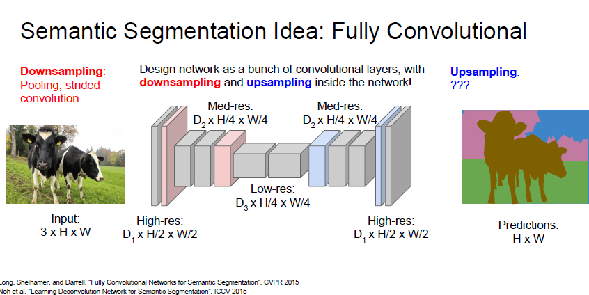

위와 같은 U 자 네트워크를 통해서 feature 를 뽑아 낸 후, 해당 feature를 다시 upsampling 하는 형식으로 학습한다고 합니다.

근데 여기서 잠시 생각해보면

downsampling 의 경우 strided Convolution과 Pooling layer 를 통해 충분히 가능하겠지만

그럼 upsampling 은 어떻게 하는걸까요?

이제 알아봅시다.

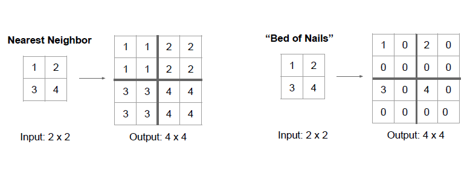

Nearest Neighbor 는 down sampling 되어있는 feature 를 복사해서 늘리는 방식입니다.

만약 크기가 가로 새로로 2배 늘어난다면, 그 값을 복사해서 주변에 넣는 방식입니다.

Bed of Nails 방식은 1번 위치에 해당 값을 넣고 남은 자리는 0으로 채우는 방식입니다.

해당 영역에서 자신만 혼자 튀어나와있어서 Bed of Nails 라고 부른다하네요

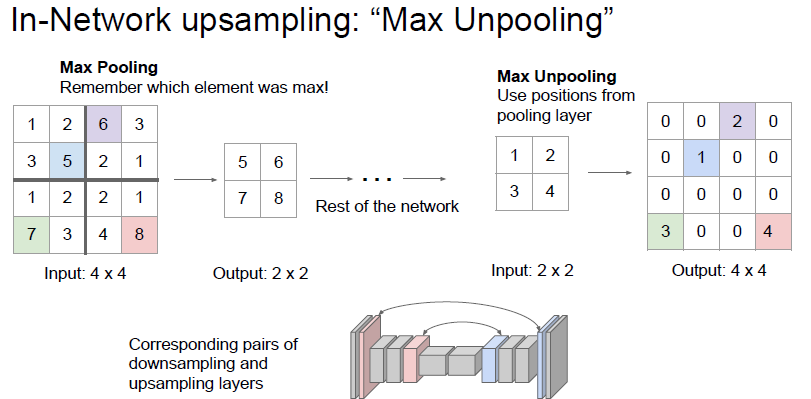

다음으로 `max Unpooling` 이라는 방식이 있습니다.

이전 downsampling 할때 max pooling 한 자리를 기억해두었다가 max unpooling 할 때 다시 그 자리로 값 을 넣고 upsampling 하는 방식입니다.

max pooling 으로 잃는 공간 정보를 max unpooling 으로 다시 일부 회복할 수 있다고 합니다.

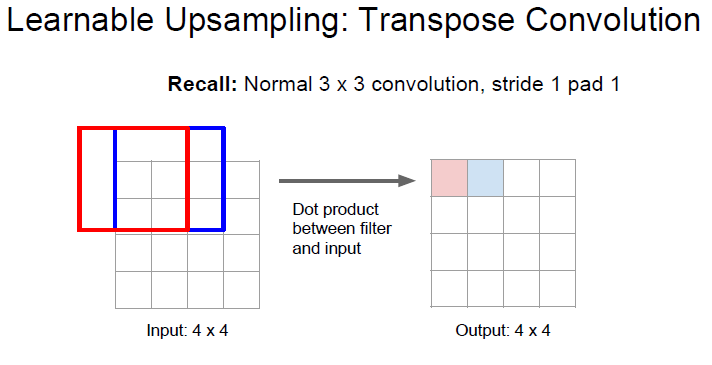

지금까지는 `Pooling layer` 이였기 때문에 학습할 수 있는 파라미터가 없었습니다.

이제 down sampling 에 있던 2가지 요소중 하나인 Convolution layer 를 upsampling 에도 가져와봅시다.

stride 가 1 인 상태에서 convolution 하게되면 위와같은 결과가 나오게 됩니다.

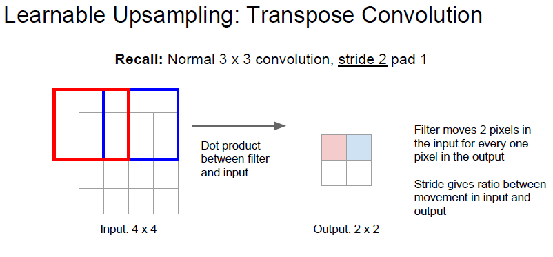

stride 가 2 인 상태에서 convolution 하게된다면 위와같이 down sampling 되게 됩니다.

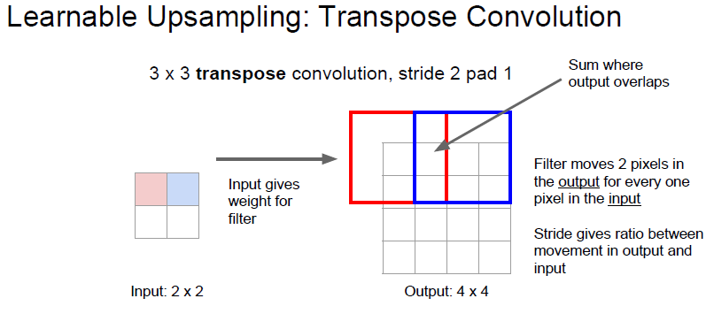

**Transpose Convolution** 은 위의 Convolution 을 반대로 한것입니다.

`filter`가 input matrix 에서 움직이는것이 아닌 `output`  matrix 에서 움직이게 하는것입니다.

우리가 원하는 transpose convolution 은 위와같은 연산입니다.

행렬의 하나 하나 원소들을 filter 를 거쳐서 matrix 의 일부분에  `투영` 시키는 것이죠.

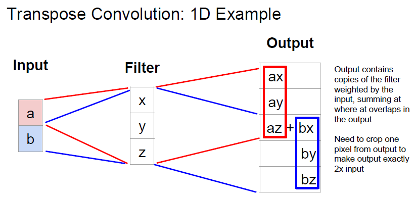

조금 더 예시를 보면

[x,y,z]T 라는 filter 가 있다면, input 과 filter 를 곱하여 output 에 붙여넣게 됩니다.

사실 위의 그림을 보면, 왜 처음에 ouput matrix 위에서 움직이게 하지? 라는 생각이 들기는합니다.

여기서 위 연산을 2가지 관점으로 생각 할 수 있는데 다음과 같습니다.

- input 에 filter 를 적용하는것이 아닌 output 에 filter 를 적용한다
- input 에 filter 를 적용하는대신 filter 를 transpose 해서 곱한다

사실 두 관점이 같은걸 말하는것입니다.

그래서 사람들이 `deconvolution` 이라는 말로도 표현하고, `transpose convolution` 이라는 말로도 표현한다고 합니다.

하지만 실제로 deconvolution 을 하는게 아니므로 transpose convolution 이 맞는 표현이라고 합니다.

deconvolution 이 해야하는 연산은 convolutoin 의 결과를 되돌리는 역활입니다. 수식적으로 역산을 하는것이죠.

하지만 위의 연산은 그게 아니죠. upsampling 을 위해 사용하는것이니까요.

Matrix multiplication 영역에서 Convolution 연산을 살펴봅시다.

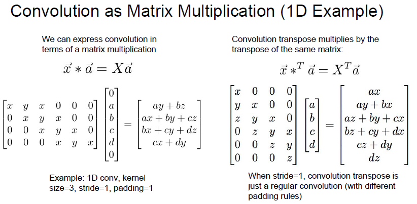

1D Convolution 에서 filter 의 움직임을 위와같이 matrix 로 표현할 수 있습니다.

upsampling 에서는 오른쪽과같이 matrix 가 형성된다고 합니다.

잘 보면 왼쪽 stride 1 convolution 의 filter를 transpose 시키면 오른쪽의 filter 가 됩니다.

일반적인 filter 를 사용하는 convolution 이랑 비슷해보입니다.

하지만 stride 가 2 이상이라면 상황은 달라집니다.

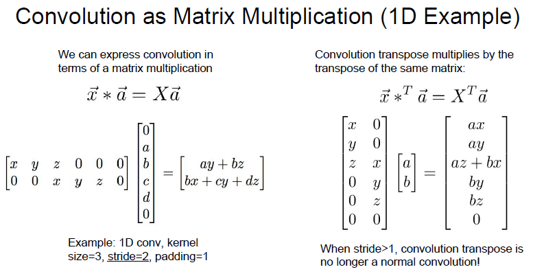

stride 가 2 이상이 되면, 일반적인 Convolution 과 달라진다고 합니다.

음.. 이건 왜 그런지 잘 모르겠네요..

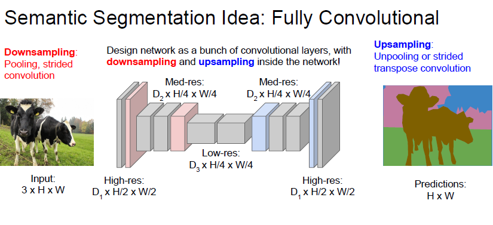

주로 Semantic Segmentation 은 위와같은 구조를 가진다 합니다.

down-sampling 과 upsampling 을 통해 각 pixel 에 대해 Cross-entrorpy 를 통해 class 를 prediction 한다고 합니다. Loss 는 마지막 layer 로 부터 흘릴  수 있기 때문에 End2End 학습이 가능하다고 합니다.

