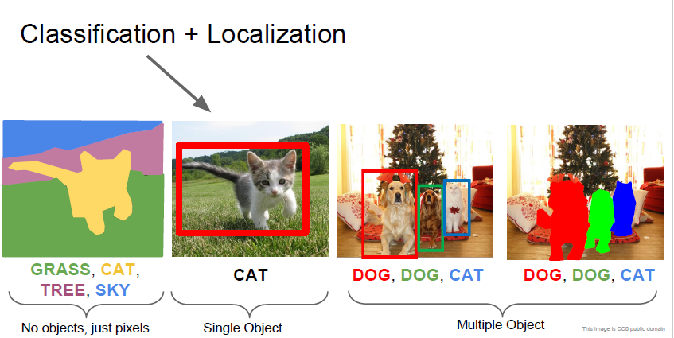
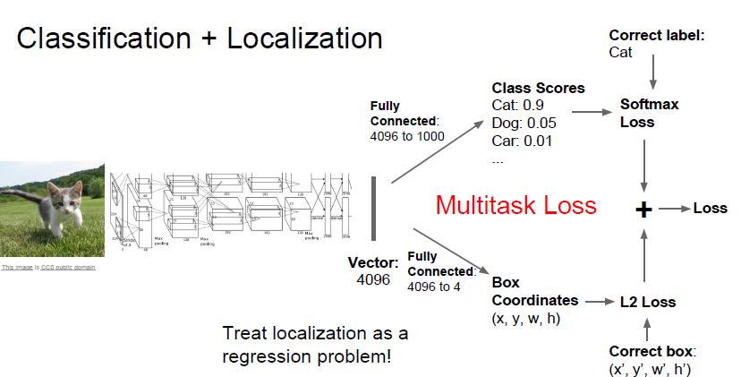
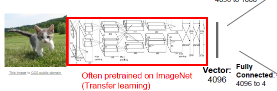
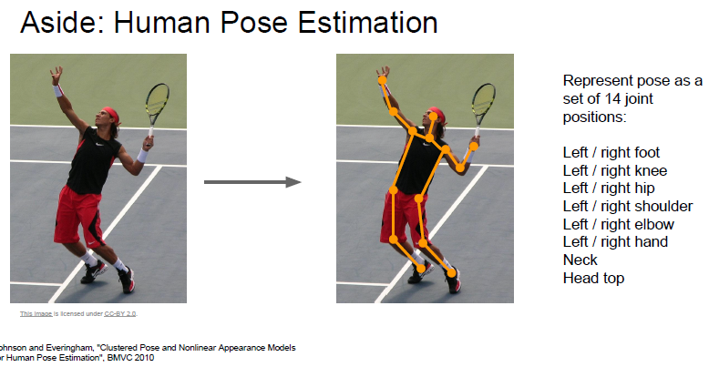
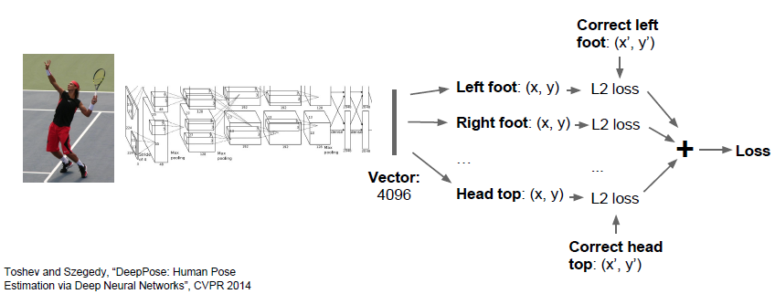

# cs231n Lecture 11-2 Detection and Segmentation

다음 주제는 Classification + Localization 입니다.

Object 가 image 안에서 어디에 존재하는지 box 를 배치하는 문제 입니다.

Object detection 과 다른것은, 한 이미지당 1개의 object 만 파악할 수 있다 라네요.

주로 아키텍쳐는 Classification 과 유사합니다. 아니 거의 동일합니다.

일단 어떤 Object 가 image 에 존재하는지 알아야 하기 때문입니다.

그래서 2가지 문제중 하나인 Classification 을 해결하기 위한 하나의 fc layer 가 존재합니다.

또한 bounding box 위치를 찍기 위해서는 regression 문제를 풀어야 합니다.

x , y (위치) w, h (크기) 문제는 연속적인 값이므로 regression 문제입니다.

이 문제를 풀기 위한 fc layer 가 마지막에 하나 더 존재합니다.

따라서 네트워크의 구조는

일반적은 Conv-pooling Layer -> FC layer -> 각 기능을 위한 FC layer 2개

로 구성됩니다.

분류문제는 softmax 를 통해 loss 를 구하게 되고

bounding box 문제는 L2 loss 를 통해서 loss 를 구하게 됩니다.

이와같이 2개의 task 가 존재하는 model 에서 loss 는 multi task loss 라고 하고 여러개의 loss 의 합으로 나타냅니다.

최종 loss 에서 두 loss 의 가중치를 어떻게 둘 것인지는 Hyper parameter 라고 합니다. 이는 model 을 직접 찍어보면서 Hyper parameter tuning 을 거칠 수 밖에 없다고 합니다.

물론 Conv layer 는 직접 학습할 필요는 없습니다. 이미 학습되어있는 Conv layer를 가져다가 Freeze 시키고 transfer learning 하면 더 좋은 성능을 쉽게 가져올 수 있습니다.

비슷하게 multitask 이면서 localization 인 문제가 있는데 바로 `Human Pose Estimation` 입니다.

사람의 14개의 관절의 X,Y 좌표를 각각 Regression 하는 문제입니다.

각각 14개의 loss 를  합하여 하나의 통합 Loss 를 구하게 되고, 이를 통해 학습하게됩니다.

모두 연속적인 값이기 때문에 L1, L2 같은 Regression Loss 를 사용하게됩니다.

