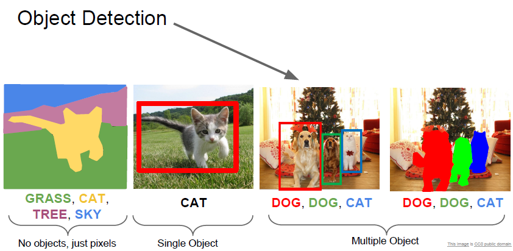
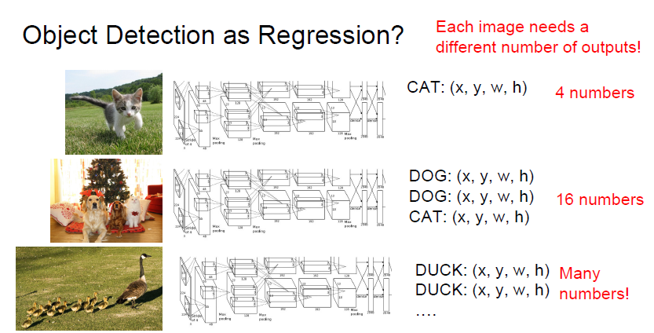
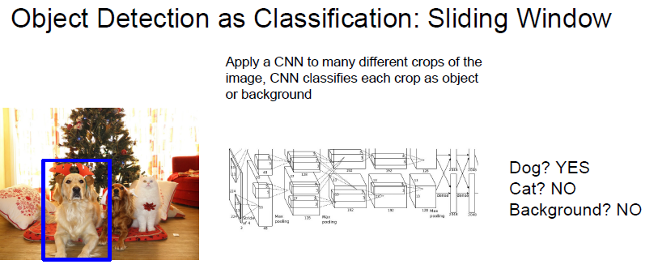
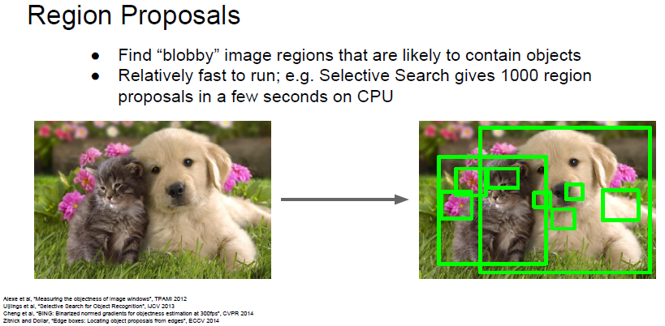
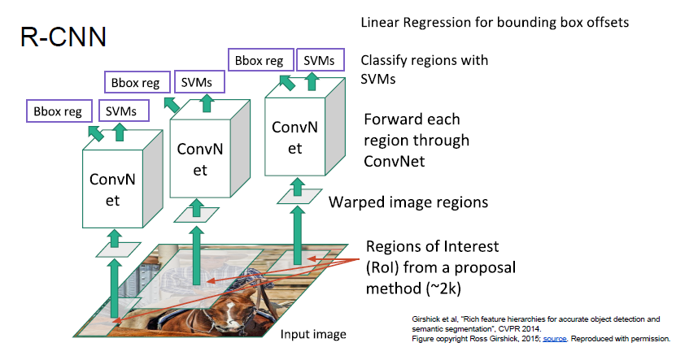
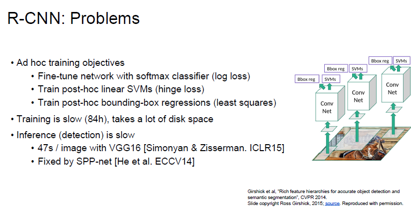

# cs231n Lecture 11-3 Detection and Segmentation

다음 문제는 Object Detection 입니다.

한번 나이브 하게 문제를 어떻게 풀지 생각해봅시다.

일단 Regression 으로 어떻게 풀지 생각해봅시다. 

Localization 문제에서는 하나의 Object 만 파악하면 되기때문에 x,y,w,h 를 일반적인 Regression 으로 풀 수 있었습니다.

하지만 Object Detection 의 경우 찾아야하는 Object 가 몇게인지, 모르는 상황입니다. 심지어 Class 도 여러가지 이죠.

그럼 이러한 문제들을 가지고 다시 나이브하게 생각해봅시다.

가장 간단하게 Sliding window 로 이미지의 일부를 crop 해서 CNN 으로 계속 분류를 해보는 방식이 떠오릅니다.

저 파랑색 Box 를 sliding window 로 옮겨가면서 해당 영역을 Crop 하고,그 Crop 된 영역을 계속 모델에 물어봅니다.

하지만 또 문제가 있습니다. 물체의 크기가 유동적이므로 이러한 방식으로는 크기를 대응할 수 없다는것입니다.

따라서 sliding window 대신 Region Proposals 방식을 사용합니다.

Selective Search 방식으로 물체가 있을만한 공간을 1000~2000개 정도 구합니다.

Selective Search 일단 이미지를 잘게 쪼갠 후, 비슷한 이미지를 그리디하게 합치는 방식입니다. 그리디 + 유니온 파인드 같은 느낌인데, 이미지의 Color, 크기, 등 여러 수치들을 통해서 대략적으로 비슷한 영역을 잡습니다.

이렇게 대략적으로 비슷한 영역들을 잡은 1000개의 Region Proposals 들을 구하면, 이것들을 더 고도화 하기 위해서 Neual Network 로 태우는겁니다.

Region Proposalm Selective Search 에 Convolution network 를 넣은게 바로 R-CNN 입니다.

Region Proposal 은 Regions of interest 라고도 부른다.(통칭 ROI)

selective search 를 통해 얻은 ~2k 개의 ROI 들을 각각 ConvNet 에 태운다.

각각 ROI 들은 크기가 다를것이므로, FC - layer 를 통해서 동일한 size 의 이미지로 변형한다.

각 ROI 들은 Conv Net 을 통해 각 ROI 의 Feature 를 뽑은 후, SVM 을 통해서 Classification 을 하게 된다.

SVM 옆에 Bounding Box Regression 이 있는데, 이는 ROI 를 보정하기 위함이다.

ROI 는 대략적인 위치를 나타내므로 이를 보정해주어야한다. 

다시 생각해보면 위의 Classification + Localization 문제를 ROI 단위로 푸는것과 비슷하다.

R-CNN 은 강력하지만, 너무 느리고 많은 disk 를 차지합니다.

생각해보면, Two-stage 로 나뉘어져 있고, ROI 를 구하는 Selective search 가 느리다는 점 입니다.

또한 ROI 별로 다 다른 Conv Net 을 돌리기 때문에 Conv Net 에 중복되는 연산도 있을것입니다.

