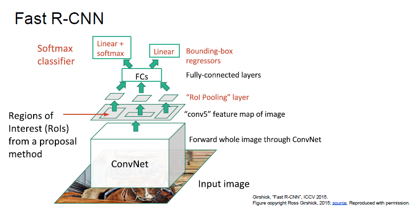

# cs231n Lecture 11-4 Detection and Segmentation

R-CNN 이 ROI 끼리 feature map 을 공유하지 못하면서 계산상 비효율이 생기는것을 보완하기 위해 나온것이 Fast R-CNN 입니다.

Fast R-CNN 은 위와같이 생겼습니다.

R-CNN 의 단점이자 너무 많은 시간과 공간을 잡아먹었던 ROI 별로 Conv Net 을 돌리던 문제를

단일 ConvNet 을 전체 이미지에 적용하는것으로 해결하였습니다.

처음에 Selective Search 를 통해 ROI 를 가져옵니다.

그 후 전체 `이미지` 를 Conv Net 에 태웁니다.

Conv Net 에서 나온 feature map 에서 ROI 에 해당하는 영역을 Pooling 합니다.

ROI Pooling 의 설명은 아래 링크에 있습니다.

<https://deepsense.ai/region-of-interest-pooling-explained/>

Region 안에 있는 feature 데이터를 Region 단위로 Pooling 시키는겁니다.

이렇게되면 각 feature 를 ROI 들이 공유할 수 있게 됩니다. 계산량이 줄어든것이죠.

그 후 FC Layer 에 넣은 후 softmax classification 을 해서 어떤 class 인지 알아낼 수 있고

Regression 을 통해서 Bounding Box 를 구할 수 있게 됩니다.

최종적으로 합친 Multi-task loss 를 back prop 시키면서 하나의 network 에서 모든 ROI 들에 대한 학습이 가능하게됩니다.

다시 한번 정리해줍니다.

결론은, ROI 와 Conv 결과를 언제 합쳐줄까 인데, Conv Net 이후에 Feature 를 자르는 기준을 Region 으로 하면 학습이 빠르게 된다! 

feature 를 중복해서 구하지 않아도 된다! 였습니다.

Fast- R-CNN 은 정말 빨라졌습니다. 중복 계산이 없어졌으니까요.

하지만 아직도 시간이 걸립니다. 

ROI 를 구하기 위해 가장 앞에서 Selective search 를 진행하기 때문입니다.

실제로 Selective Search 가 많은 시간을 잡아먹는다고 합니다.(병목구간)

그래서 나온게 바로 Faster-R-CNN 이라고 합니다.

ROI 를 Selective Search 로 만드는것이 아니라 Region proposal network (RPN)를 만드는겁니다.

Faster R-CNN 에 대한 설명은 더 진행하지 않아서  RPN 에 대한것은 나중에 다시 찾아봐야할거같다.

아무튼 RPN 을 통해서 ROI 를 뽑아냈다면, feature map 과 RPN 에서 나온 ROI 를 통해 ROI Pooling 을 하고, fast R-CNN 에서 진행했던것처럼 Classification Loss 와 bounding box regression loss 를 구하게됩니다.

특이한것은, RPN 에서도 Classification Loss 와 bounding box regression loss 를 구한다는것입니다.

RPN 의 Classfication Loss 는 일종의 Binary Classification 으로, 해당 구간에 Object 가 있는지 없는지 에 대한 Loss 를 구합니다.

이 이상은 설명이 없어서 나중에 논문을 봐야할 거 같습니다.

정말 획기적으로 시간이 줄어든것을 알 수 있습니다.

위와같이 Region 을 기반으로 Object detection 을 하는 model 들을 Region-based Method 라고 합니다.

