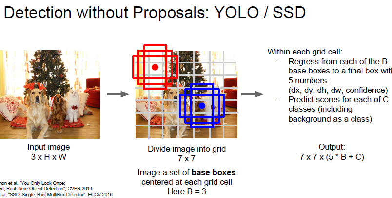
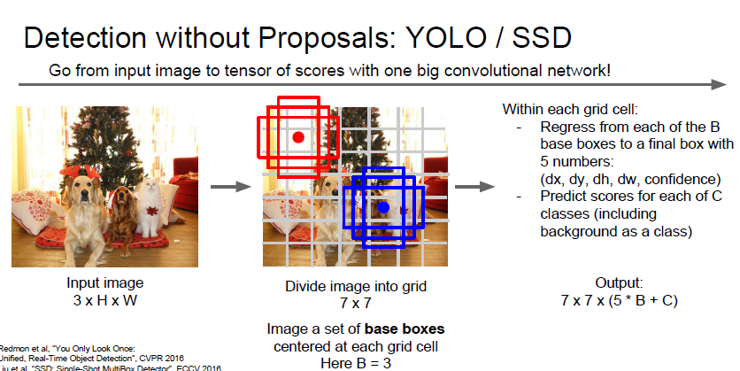
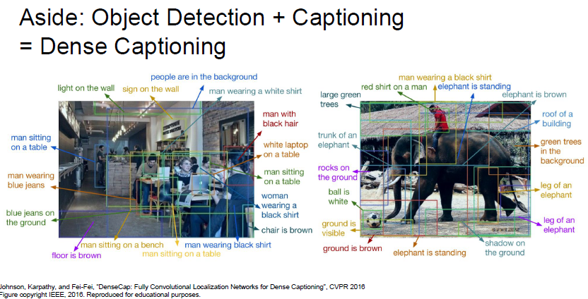
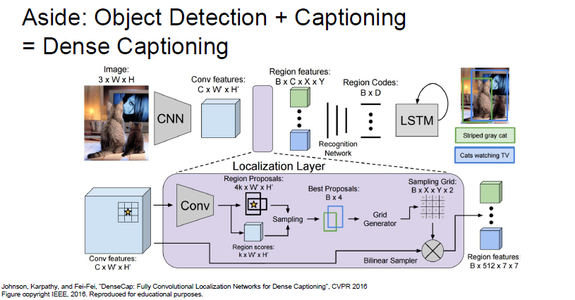
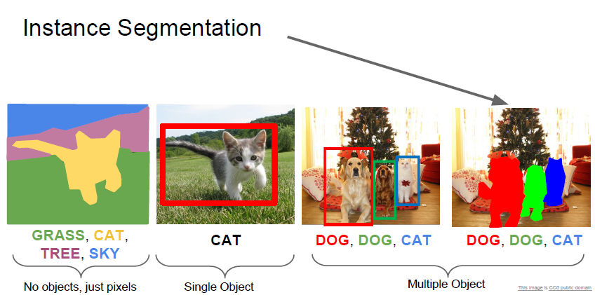
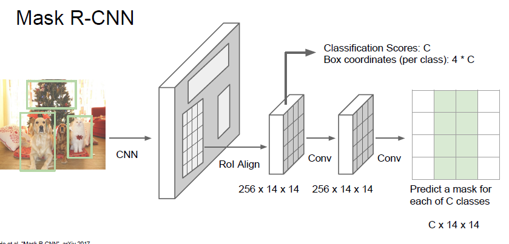
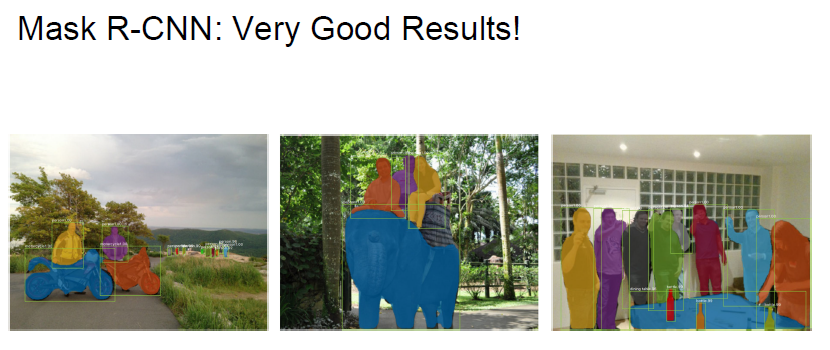
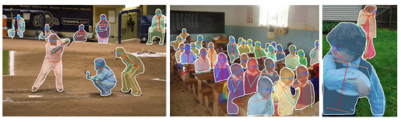

# cs231n Lecture 11-5 Detection and Segmentation

그리고 Region 을 사용하지 않는 모델들 도 있습니다. 

YOLO 와 SSD 는 Regression 을 사용하여 Object Detection 을 해보자! 로 시작한 모델들 입니다.

Region 을 구하지 않고, Grid cell 을 사용한다고 하는데요 해당 cell 들에 위와같이 base box 를 배치하게 됩니다.

base box 의 개수는 정할 수있는거같고... 위의 이미지는 3개의 base box 를 사용한것입니다

base box 가 최종 box 로 얼마나 움직이고 변형되어야 하는지를 구하는 Regression 이라고 합니다.

predict score 는 각 C 개의 Class 들의 classification score 라고 합니다.

Regression 모델의 특징은, 한번의 거대한 forward pass 로 문제를 풀 수있다는 것입니다.

따라소 single shot method 라고 불립니다.

single shot method 와 Region base Method 의 차이는

속도 : single shot > Region base

정확도 : single shot < Region base

라고 합니다.

Object Detection 과 Captioning 문제를 섞으면 위와같은 Dense Captioning 을 할 수 있다고 합니다.

음...너무 복잡하네요 나중에 다시 봐야할꺼같습니다. 강의에서도 크게 다루지 않습니다.

마지막으로 instance segmentation 을 학습해봅시다

instance segmentation 은 object detection과 semantic segmentation 을 합친것입니다.

Mask R-CNN 이라는 모델을 사용한다고 합니다.

Faster R-CNN 과 매우 유사하다고 합니다.

자세한 공부는 faster R-CNN 을 공부하고 다시 학습해야할것같습니다. 강의에서 자세하게 알려주진 않네요.

위와같은 어썸한 결과를 가져올 수 있다고 합니다.. 대박

