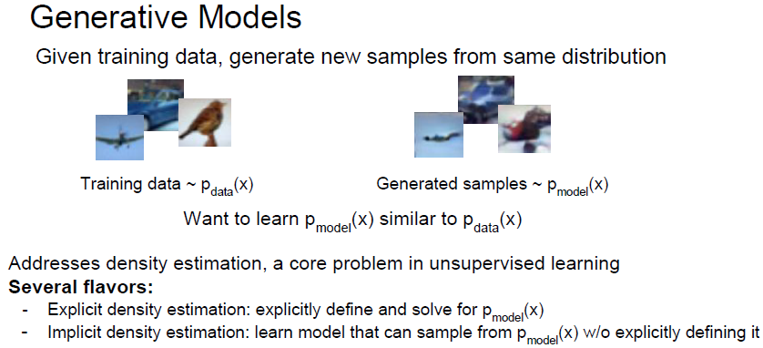

# cs231n Lecture 13-1 Generative Models

### 주의! 

이번 강의에 나오는 확통 지식중에 틀린 지식이 있을 가능성이 있습니다.

제가 공부하면서 정리한 내용이라 틀릴 수 있으므로, 참고했던 링크를 같이 첨부했습니다.

기존의 supervised learning 은 label 이 필요했고, Classification, regression 등의 간단한 테스크들부터, object detection, semanticsegmentation, image captioning 등 고차원적인 테스크도 가능했다.

unsupervised learning 은 label 이 필요없고, data 의 구조를 파악하는 테스크들이 주로 있었다, clustering, dimensionality reduction, feature learning 등등.. -> understand structure of visual world

Generative model 은 training data 를 기반으로 비슷한 distribution 에 있는 비슷한 sample data 를 만들어주는 모델을 의미한다.

말 그대로 무언가를 `만들어주는` 모델이다.

P_model(x) 와 P_data(x) 가 유사하도록 학습한다.

여기서 P_model 은 Generative model 이 만들어낸 generated sample들의 분포이고 P_data 는 Training data, 즉 real world 의 데이터들의 분포이다.

두 가지 대분류가 있는데,

- Explicit density estimation

  - P_model 을 확실히 정의한다.

- Implicit density

  - model 을 정의하지 않고 P_model 에서 sample 을 생성한다.

  

Generative model 은 Real world 의 data 로 부터 비슷한 fake data 를 생성할 수 있다.

time-series data 등은 generative model 에서 simulation 이나 planning 에 사용 가능하다. 강화학습에도 가능한거같다.

generative model 을 학습하는것은 우리가 모르는 유용한 general feature 들을 찾을 수 있다.

다양한 Generative Model 들이 있다. 이번 강의에서는

PixelRNN/CNN, Variational Autoencoder, GAN 을 학습한다.

