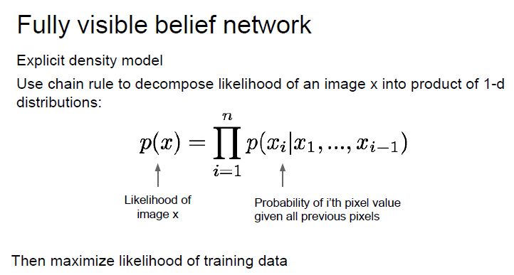
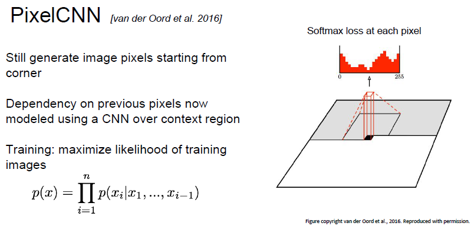
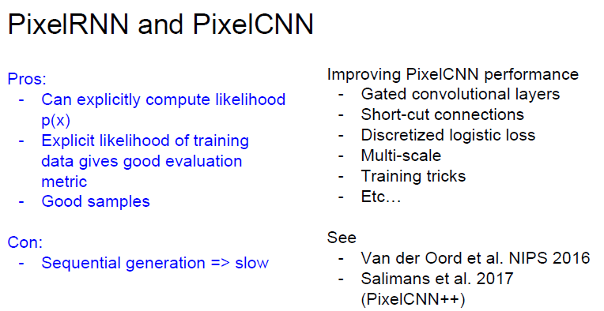

# cs231n Lecture 13-2 Generative Models

## PixelRNN, PixelCNN

PixelRNN 은 앞의 모든 pixel 이 존재할때 자신의 pixel 이 존재할 확률 분포를 통해 새로운 image x 를 생성하는 모델입니다.

1-d image 의 likelihood를 decompose 하기위해 chain rule 를 사용합니다.

training data 의 likelihood 를 최대화함.

corner 부터 시작하여 sequentially generate 한다.

LSTM 을 사용하여 이전 픽셀의 dependency 문제(likelihood 를 계산할때, x_i given x_1 to x_i-1 이 필요하기 때문)를 해결한다.

하지만 순차적으로 이미지를 생성하기 때문에 매우 느림.

pixel CNN 은 pixelRNN 과 동일하게 corner 부터 이미지를 sequentially generate함.

위에서 이전 픽셀의 dependency 문제를 lstm 으로 끌고 왔는데, 이번에는 CNN 으로 crop 하여 사용함.

lstm 보단 빨라졌지만, 근본적인 학습방법이 동일하고, sequentially generate 이므로 속도가 느린건 똑같음.

