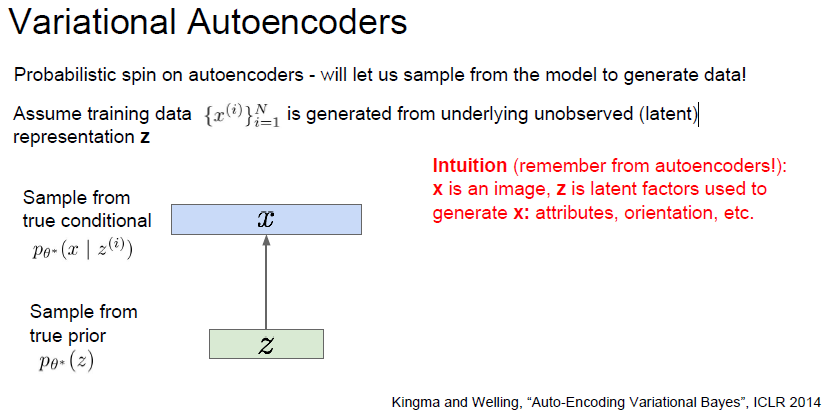

# cs231n Lecture 13-3 Generative Models

## VAE(Variational Autoencoder)

Pixel 단위 generate 모델들은 tractable density function 을 미리 define 해두고, traning data 의 likelihood 를 optimize 하는 방향으로 학습했다.

VAE 는 intractable density function 을 define 한다. 여기서 latent Z 라는 parameter 가 필요한데, 한국어로는 `잠재 변수` 라고 부른다. 이 잠재 변수는 training data distribution 의 feature 이다.

사람의 얼굴이 모여있는 데이터라면, 사람이 웃고있는지, 고개 방향이 왼쪽인지 오른쪽인지 등의 feature 들의 각 분류마다 하나의 잠재변수, latent variable 을 가지고 있게 된다.

VAE 의 밀도함수는 정확하게 optimize 할 수 없다. 근사할 수 밖에 없는 조건들이 나오는데, 이 조건들 때문에 lower bound 를 사용하여 근사하여 optimize 하게 된다.

일단, VAE 의 근간이 되는 autoencoder 에 대해 학습해보자.

Autoencoder 는 unlabeled training data를 encoding 하여 저차원의 feature 들을 만들어내는것이다.

다시 말해, 이미지를 dimensionality reduction 하여 feature들이 보이게 representation 하는것이다.

dimensionality reduction 하는 이유는, training data 에서 만들어진 feature 들이 의미있는 다양한 factor 들을 데이터에서 뽑기 위해서 이다.

여기서 뽑힌 feature Z 를 다시 decoder 에 태워 새로운 이미지 X 를 만들어 낸다.

decoder 가 해주는 역활은, feature 를 기반으로 최대한 원본 이미지와 비슷한 이미지를 재생성하는것이다.

결국, encoding 을 잘해주면 된다. 그래서 이름에 decode 가 아니라 encode 가 들어간건지는 잘 모르겠다 ㅎ..

학습하는 방식은, L2 loss 를 원본 이미지와 생성된 이미지에 건다. 해당 loss 를 통해 encoder 와 decoder 를 학습하게된다.

만들어진 encoder 는 supervised model 에 들어갈 수 있으며, auto encoder 로 미리 initialize 한 encoder를 사용하는 classifier 를 만들거나, 이걸 기반으로 fine-tuning 할 수 있다.

세타* 이라는 parameter 를 estimate 하고싶음.

prior p(z) 는 간단한 문제임. 가우시안을 사용함.

prior p(z) 로 부터  likelihood 를 구하는 문제는 어려움. feature 에서 새로운 이미지를 만들어 내는것. 따라서 neural network 를 사용하고, 이 상황에서는 decoder network 를 사용함.

MLE(최대우도추정) 방식으로 training data를 기반으로  VAE 모델의 파라미터를 추정해야합니다.

저 식이 유도된것은 VAE 논문을 더 공부해야 할 수 있을거같습니다.

아직은 MLE 방식을 사용하기 위해 log p(x) 를 최대화 하는거같은데.. 확률과 통계 지식이 너무 많이 필요하네요 엉엉..

