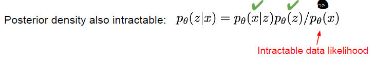
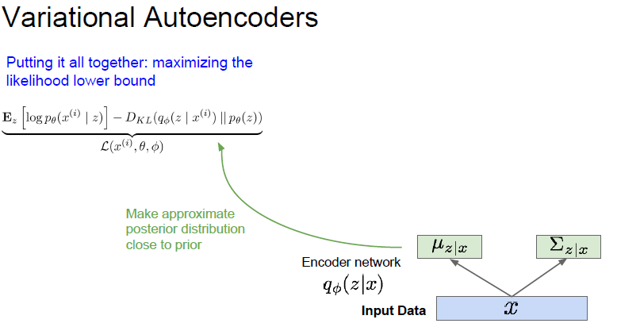
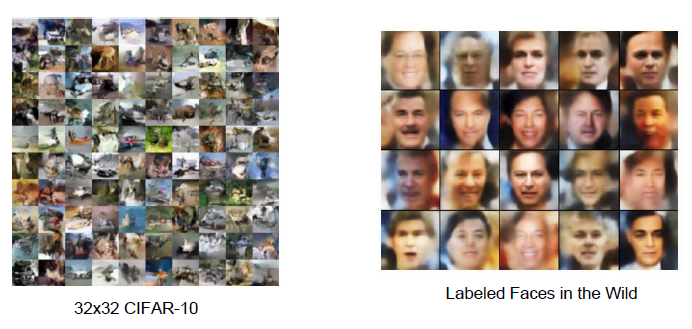

# cs231n Lecture 13-4 Generative Models

data likelihood 에서, p_세타(z) 의 경우 gaussian prior 으로 구할 수 있습니다.

뒤에있는 P_세타(x|z), decoder network 로 부터 얻을 수 있는 likelihood 입니다.

특정 latent variable 에 대해서는 알 수 있을것입니다.

하지만 모든 latent variable을 알 수 없습니다. 우리가 고양이를 판단할때, 의식적으로 생각하는 feature 들 보다, 무의식적으로 processing 되는 feature 들이 훨씬 많을듯이, 그 feature 들을 우리는 알 수 없다는것이 문제입니다.

이렇게 되면 prosterior, 사후 분포 또한 알 수 없습니다. 애초에 data likelihood 를 위의 이유로 알 수 없기때문입니다.

따라서!  를 근사하기위한 방식이 필요합니다. 

additional encoder network 를 통해서  를 만들고, 이것을 통해  를 근사하게됩니다.

Kullback-leibler divergence : <https://ko.wikipedia.org/wiki/%EC%BF%A8%EB%B0%B1-%EB%9D%BC%EC%9D%B4%EB%B8%94%EB%9F%AC_%EB%B0%9C%EC%82%B0>

두 분포가 얼마나 가까운가? 를 계산해주는 것

z 가 무수히 많을 수 있으므로, 가능한 모든 z 를 고려하여 MLE 를 적용해야 합니다. 이때 사용하는것이 variational inference(변수추론) 입니다.

이제 왜 VAE 의 이름이 variational autoencoder 인지 알겠네요.

수식을 전개하면  인 evidence 가  으로 정리되는것을 알 수 있습니다.

여기서 3번째항을 보면, 우리가 구하지 못하는 구간인,  더 자세히 보면  이 빨강색 박스 부분을 알지 못하기 때문에 구하지 못합니다.

그런데, Kullback-leibler divergence 는 무조건 0 이거나, 양수 입니다.

따라서 이 부분을 빼면 나머지 식은, evidence 의 ELBO, 즉 하한값, Lower bound 라는것이죠.

이런식으로 lower bound 를 maximize 하게 되면,  또한 최대화 될것입니다.

참고

<https://taeoh-kim.github.io/blog/%EB%A8%B8%EC%8B%A0%EB%9F%AC%EB%8B%9D%EC%97%90%EC%84%9C%EC%9D%98-%ED%99%95%EB%A5%A0-%EB%B6%84%ED%8F%AC-%EB%9E%9C%EB%8D%A4-%EB%B3%80%EC%88%98-%EA%B7%B8%EB%A6%AC%EA%B3%A0-maximum-likelihood/>

<https://ratsgo.github.io/generative%20model/2018/01/27/VAE/>

드디어 optimize 할 수 있는 식이 완성되었습니다.

수식을 조금 더 보면, tractable lower bound 부분에서  이 부분은 latent variable 에 속한 input data 의 distribution, 해당 z 에 대한 likelihood 를 뜻합니다.

 의 경우,  Kullback-leibler divergence 에 의해, encoder로 생성된  와 기존 z 의 prior  를 최대한 비슷하게 만듭니다.

자! 드디어 수식 정리가 끝났고, 수식을 input data를 통해서 latent variable, neural network 에서 부를때는 feature 를 `근사` 하여 뽑게 됩니다. neural network 에서 뽑히는 latent variable 이 모든 변수는 아니지만, 일부를 뽑아 근사하기 때문에 괜찮은거같습니다.

그 후 Z 를 통해서 decoder network 로 sample image 를 만들게 되고, 복원된 이미지의 복원 오차를 구하게됩니다.

이 사진에서 degree of smile 과 head pose 라는 latent variable 2개가 나옵니다.

이 Z 값이 잘 학습이 된다면 ,저렇게 값을 조절하면 다양한 이미지가 생성될 수 있습니다.

VAE 는 안정적으로 학습할 수 있고, 평가의 기준이 매우 명확합니다. 또한 데이터의 latent variable 을 같이 학습할 수 있다는 장점도 있습니다.

하지만 출력이 평균값으로 근사되어 나오는 경향이 있고, 이 때문에 이미지에 블러가 많이 껴있는듯한 느낌이 많이 들 수 있습니다. 또한 이렇게 모델을 수식으로 정해두기 때문에, 적용할 수 없는 경우도 있을 수 있다 합니다.

