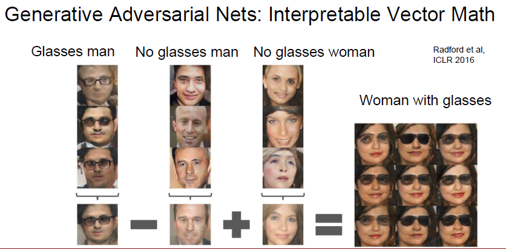

# cs231n Lecture 13-5 Generative Models

## GAN

VAE에서 엄청난 수식 계산을 해야했던건, 미리 모델을 만들고, 해당 모델이 input 의 distribution 을 기반으로 MLE 를 해야 했기 때문입니다.

GAN 은 명시적으로 밀도함수를 모델링 하지 않고, 게임 이론으로 문제를 해결하려합니다.

simple distribution 을 하나 만들고 그 distribution 을 training distribution 으로 transformation 하는 것을 학습하는것입니다.

Generator 와 Discriminator 라는 두 가지 network 가 존재합니다.

Generator 는 simple random noise 에서 fake image 를 만드는 network 이고

Discriminator 는 fake image 와 real image 를 판별합니다.

 는 1에 가까워야 하며 도 1에 가까워야 합니다.

즉, generator 는 최대한 원본과 비슷한 이미지를 생성해야합니다. 즉 discriminator 를 속여야하는것이죠.

discriminator 는 최대한 real 과 fake 를 구분해야합니다.

오른쪽 그림을 보면, generator 가 fake 일때 많이 움직여 real 에 가까워 저야 하는데, gradient 가 flat 한것을 알 수 있습니다. 학습이 잘 안되겠죠.

따라서 discriminator 가 틀릴 likelihood 를 maximize 하는 방향으로 반전시킵니다.

이렇게되면 fake 일때 급격한 학습이 발생하고, real 에 가까워질수록 stable 해질 수 있습니다.

GAN 은 특이하게도 iteration 을 1번만 돌릴 경우에 학습이 잘 되는 경우가 있다고 합니다.

최종적으로 학습이 끝났을때, Generator Network 를 통해 새로운 이미지를 생성할 수 있습니다.

아래 그림처럼 CNN 을 사용하면 GAN 의 학습을 도와줄 수 있다고 합니다.

위의 guideline 을 적용하면 더 stable 하게 학습할 수 있다고 합니다.

GAN 이 학습한 데이터의 경우, latent variable 들인 Z 는 벡터의 특성을 가진다고 합니다.

따라서 벡터 연산이 가능하다고합니다.

------

나중에 한번 정독해보기

<https://taeoh-kim.github.io/blog/%EB%A8%B8%EC%8B%A0%EB%9F%AC%EB%8B%9D%EC%97%90%EC%84%9C%EC%9D%98-%ED%99%95%EB%A5%A0-%EB%B6%84%ED%8F%AC-%EB%9E%9C%EB%8D%A4-%EB%B3%80%EC%88%98-%EA%B7%B8%EB%A6%AC%EA%B3%A0-maximum-likelihood/>

