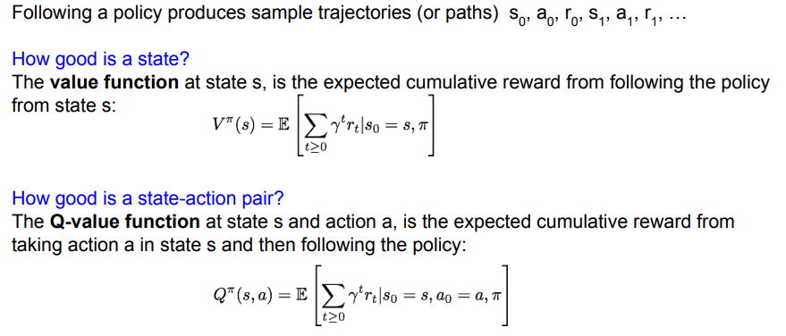
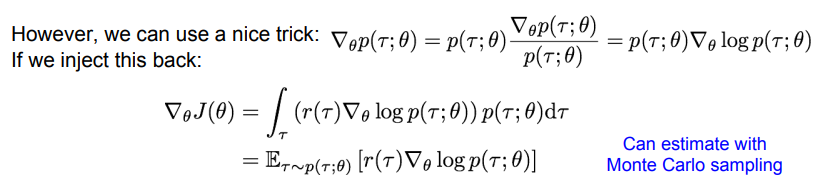
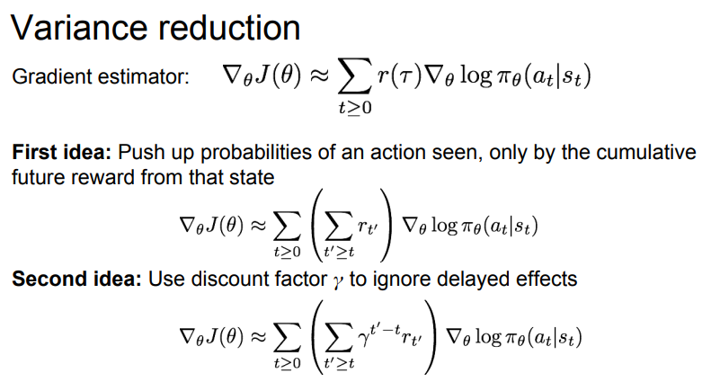

# cs231n Lecture 14 - Reinforcement Learning

14강은 강화학습에 대한 내용을 다룹니다.

강화학습에 대해 아무것도 모르는 상태에서 강의를 수강하였고, 아래 블로그와 slide 를 보충하여 학습하였습니다.

참조 링크

<https://dhznsdl.tistory.com/5?category=731324>

<https://www.slideshare.net/WoongwonLee/rlcode-a3c>

강화학습은 Env(Environment) 와 Agent 간의 상호작용에서 학습이 이루어집니다. 

Agent 는 초기 상태에서 특정 Aciton을 하면, reward와 다음 state 를 얻게 되고, 다음 action 을 하게 됩니다.

### Markov Decision Process

Markov Property: 이전 state 와 상관 없이, 과거와 미래 state 는 현재 state 와 완전히 independent 하고, 현재 state 에서 다음 state 로 갈 확률은 항상 같다 라는 성질.

- state
  - agent 가 관찰 가능한 상태의 집합.
  - 예) 2차원 grid world 라면, 가능한 모든 (x, y) 좌표

- action
  - agent 가 특정 state 에서 행동할 수 있는 action의 집합
  - 예) 2차원 grid world 라면, 상 하 좌 우 이동

- reward 
  - (state, action) pair 에 따라 env 가 agent 에게 주는 유일한 정보

- state transition probability
  - (state, action) pair 에 의해 agent 가 특정 state 로 변경 되야 했지만, env 에 의해 다른 state 로 변경될 확률

- discount factor
  - agent 가 받는 reward 중, 현재에 가까운 reward 를 더 비싸게, 현재에 먼 reward 를 더 싸게 해주는 factor.
  - 당장 현재에 있는 reward 가 더 비싸다.

MDP 는 다음과 같이 학습하게된다.

- t=0 인 first step, env 는 S_0 를 sampling 하여 initializing 한다.
- 그 후, 해당 game 이 끝날때 까지 반복한다
  - agent 가 Action_t 를 고른다
  - env 가 (S_t, A_t) pair 에 state transition probability 를 적용하여 reward 를 sampling 한다.
  - env 는 state_t+1 를 sampling 한다.
  - agent 는 env 로 부터 reward_t, state_t+1 를 받는다.

여기서 말하는 policy Pi 는,  특정 state 에서 agent 가 어떤 aciton 을 결정할지에 대한 일종의 판단 함수 이다.

함수로 생각하면 다음과 같다. *Input State -> policy function -> Output action*

결국, 우리가 학습해야하는것은 이 policy pi 인것이고, 감가율을 적용하여 agent 가 얻을 전체 reward 를 더했을때 가장 큰 reward 의 합()을 주는 action 을 고르게 학습해야한다.

## Value function and Q-funciton

특정 Policy pi 는 흔적(path?) 를 남기게 된다(s, a ,r 의 조합으로)

Value function 은 이 흔적들을 기반으로 미래에 받을 reward 들의 기댓값을 구한다.

이때,현재의 reward 가 미래의 reward 보다 중요하므로, 미래의 reward 에 대해서는 감가율이 적용된다.

이 식을 Bellman Expectation Equation, 벨만 기대 방정식이라고 한다. 

벨만 기대 방정식은 현재 상태의 value function 과 다음 상태의 value function 간의 관계를 말해주는 방정식이다.

Q-value function 은 위의 벨만 기대 방정식에 action 이라는 factor 가 추가된 버전이다.  state s  에서 action a 를 행동했을때, reward 의 기댓값을 나타낸다.

## Bellman equation

optimal Q-function 을 얻기 위해서는 reward 의 기댓값이 최대가 되야 합니다.

Q'-funciton 을 분해해보면, 지금 당장 얻을 reward 와 미래에 얻을 reward 로 나눌 수 있다.

살짝 동적계획법의 점화식을 만들고있는 느낌이 들긴 한다.

아무튼! 이렇게 점화식 비슷하게 만들면 이 식은 현재 상태의 value function 과 다음 상태의 value function 간의 관계를 나타낼 수 있다.

이 방정식을 Bellman expectation equation, 벨만 기대 방정식 이라고 한다.

i 를 무한대로 발산 시킨다면, 위 식이 Q' 에 수렴하게 된다.

하지만 너무 무겁다! 각 state-action pair 마다 이 연산을 수행한다 생각하면, 끔찍하다!(마치 Brute-force..)

위와같이 복잡한 function 들은 대부분 neural network 를 통해서 근사시키기 때문에, neural network 로 가보자!

## Q-learning

Q-function 을 근사시키기 위해, deep neural network 를 사용해보자.

우리의 목표는, bellman equation 을 만족하는 Q-funciton을 찾는것이다.

이 부분은 잘 이해가 가지 않는데...

loss function 에서 target function 과 현재 구한 q-function 의 L2 loss 를 통해 학습하게된다. 

근데 여기서 target function이 Bellman equation 이라고 한다. 

따라서, Bellman Equation 을 이용하여 Q-function을 근사시키는데, 여기서 근사시키는 방식이 neural network 이니 loss function 이 필요하고, loss 를 구해야하니 L2 loss 를 사용했다! 라는 느낌인거같다.

근데 일단 머리속에서는 엄청난 혼란이다.(이 정리 글을 쓰면서 이 부분에서 1시간째 멈춰있다...)

엄청난 혼란속에서 강의는 이 부분을 몇 초 설명하고 훌쩍 넘어가버린다.

아니 무엇?! 하고 찾아보니.. 이게 그 유명한 DQN 이더라...

<https://poqw.github.io/DQN/>

식을 잘 살펴보니... target 에서 bellman equation 에서 사용하는 Q funciton <- 이 부분이 현재까지의 실제 값 이고, Q(s, a) 부분이 예측한 기댓값이여서 이걸 기반으로 Q(s, a) 를 학습하고, 10000 step 마다 target 에서 사용하는 Q-funciton 을 Q(s, a) 에서 사용하는 값으로 덮어쓰기를 한다는데...

이 부분은 나중에 Deepmine 의 DQN 논문을 다시 읽어봐야겠다.....

게임 내 pixel 정보를 전처리해서 가져와서, 4 픽셀을 묶어 (-1, -1, 4) shape 의 input 을 forward 시킨다.

마지막 FC layer 의 output 은 action 의 수 만큼 나온다.

한 번의 Forward 를 통해서 현재 state 의 모든 action 에 대한 Q-value 가 계산되게 network 를 학습시킨다.

이를 위해 위에서 나왔던 target function 인 bellman equation 과 비슷해지도록 학습시켜야한다.

이 이후, target function 과 Q funciton 의 관계에 대해 더 자세한 설명이 없어 나중에 DQN 을 공부할 일이 생기면 그 때 공부해야겠다.

### Experience Replay

학습이 진행되면서 얻은 새로운 experience 들을 곧바로 다시 학습에 사용하지 않고, 특정 memory 에 저장한 후, mini batch 형태로 random sampling 하여 학습합니다.

이렇게 학습하는 이유는, 데이터간의 상관관계가 생기면 학습이 효율적이지 못하기 때문입니다.

network 가 그저 특정 action 이후에 어떤 action 을 할지 예측하는 model 이 될 수 있기 때문에 데이터간의 상관관계를 깨는 작업이 필요했고, 그 작업을 위해 새로운 experience 들을 mini batch 형태에서 random sampling 하여 사용합니다.

이렇게 학습하게되면, 각 experience 들이 여러번 학습에 활용될 수 있어 network를 효율적으로 학습할 수 있습니다.

다음은 지금까지 학습했던 deep Q-learning 을 sudo code 로 표현한 것 입니다.

## Policy Gradient

지금까지 학습한 Q-learning 은 DNN 을 통해 Q-function 을 target 에 근사 시켜 나온 Q-function 을 통해 Policy 를 얻었습니다.

하지만 high-demension state 이라면, 각 state-action pair 에 대한 최적의 Policy 를 찾기는 매우 어려울것입니다.

그럼 DNN 을 통해서 최적의  Policy 를 찾으면 어떨까? 에서 시작한것이 바로 Policy Gradient 입니다.

각 정책에 대해서, 최적의 reward 를 얻는 policy 를 얻으면 될것이다. 그럼 어떻게 학습할까?

여기서 세타가 바로 neural network 의 weight 를 말하는데, 이 weight 를 잘 업데이트 시켜서 목적함수인 J 가 최대값이 되면 될것이다. 맞다 바로 gradient descent(ascent) 를 사용하면 된다.

특정 Policy 인 세타 가 정해지면 state, action과 그 에 대한 reward가 나올것이다. 이를 흔적(trajectory) 라고 하고 object function 은 흔적을 기반으로 reward 를 측정하게된다.

목적 함수는 기댓값의 합으로 구성되게 되는데, 보통 기댓값은 `확률 * 그 확률일때 값  `이다.  여기서 기댓값은 특정 Policy 일때 (state, action) pair 일 확률이 존재할 것이고, 그 확률일때 reward 가 존재하므로, 두 값을 곱하면 된다.

목적함수의 경우 특정 Policy 일 때 모든 reward 의 합을 알아야 하므로 모든 기댓값을 합해야 하므로 위와같은 수식이 나오게 된다.

문제는, gradient 를 계산하기 위해서, 여기서 미분을 해야한다............. 투 매니 수학!

기댓값을 미분하는 식에 있어서 intractable 하다.  r 에 대한 적분을 해야하는데 p 가 theta에 대한 미분에 종속되어있기 때문에 미분하기 어렵다한다.

따라서 수식을 조금 변경해준다.

이 수식 유도에 대해서는 아래 글에서 엄청 자세한 설명이 있다.

<https://medium.com/@aminamollaysa/policy-gradients-and-log-derivative-trick-4aad962e43e0>

이제 log(p)에 대한 gradient를 모든 경로 r 에 대한 확률과 곱하는 꼴이 되었고, 이를 r 에 대한 적분 으로 나타내고있다. 따라서 이 형식을 경로 r 에 대한 기댓값의 형식으로 변환할 수 있다.

최종적으로 기댓값의 gradient 에 대한 식을 경로 r 에 대한 기댓값 형식으로 변환하였다.

따라서 경로를 기반으로 gradient 를 구할 수 있게 되었다. 

강화학습에서는 보통 기댓값을 Monte Carlo sampling 을 통하여 계산한다고한다.

자 그럼 경로 r 에 대한 확률은 어떻게 구할 수 있을까?

각 time 에서는 transaction probability 와 정책 Pi 로 s_t 에서 a_t 를 행동할 확률이 있을것이다. 

결국 다음 state 는 두 확률의 곱 형태로 진행될 것이고, 경로에 대한 확률은 이 모든 확률의 곱 으로 이루어질것이다.

이 값에 log 를 취한 후 미분을 해보면, transaction probability  에는 theta 가 영향을 주지 않는것을 알 수 있다.

따라서 경로를 기반으로 object function 의 gradient 를 구한다 하더라도, transaction probability 를 고려하지 않아도 무방하다.

마침내, 여러 경로를 샘플링하여, object function 의 gradient 를 근사할 수 있게 되었다.

다시 돌이켜 생각해보면, 특정 경로에 대한 보상이 크다면 해당 action 에 대한 확률을 높이고, 아니라면 해당 action 에 대한 확률을 낮추는것이다.

하지만 문제가 있다. 분산이 매우 높다는것이다.

한 경로가 좋은 보상을 준다 하더라도, 내부 action 들이 하나 하나가 다 좋은 aciton인 것은 아닐것이다. 평균에 매몰된 결과가 나올 수 있다는것이다.

구체적으로 어떤 행동이 좋았는지 알 수 있는 길이 없고, 이 단계에서는 결국 수많은 sampling 을 통해서 밖에 해결할수 없을것이다.

### Variance reduction

Policy gradient 에서 gradient 를 구하기 위해 sampling 하는 과정에서 큰 분산이 큰 문제가 되었다.

조금 더 적은 샘플링으로 낮은 분산을 얻기 위한 방법들을 배워보자.

첫 번째 아이디어는, 미래의 reward 만 사용하는것이다. 경로 내 에서 모든 reward 를 사용하는것이 아닌, 현재의 time step 에서 부터 종료 시점까지 얻을 수 있는 보상의 합을 사용하는것이다. 

이 방법은 특정 행동이 발생했을 때 미래의 보상이 얼마나 큰지를 고려하겠다는 의도이다.

두 번째는 감가율을 적용시키는것이다.

세 번째 방식은 Baseline 이라는 idea 인데, reward 의 기준을 0 으로 두는게 아닌, 우리가 설정하는 임의의 baseline 을 중심으로 reward 가 baseline 보다 크면 양수, 아니면 음수로 처리하는것이다.

가장 간단한 baseline은, 지금까지 경험했던 보상들에 대한 이동평균을 사용하는것이다. 에피소드를 수행하면서 학습과정에서 경험했던 모든 경로들에 대해서 보상이 어땟는지 평균을 내어 평가하는것입니다.

이 baseline 을 통해 현재 보상이 지금까지의 보상과 대비해 좋았는지 나빴는지를 파악할 수 있습니다.

할인율과 simple baseline 을 통해 만든 위 수식을 vanilla reinforce 라고 부른다 합니다.

그럼 좋은 baseline 은 무엇일까요?

해당 state 에서 action 을 취했을때 얻을 수 있는 누적 보상들이 해당 state 에서의 보상들의 누적합 보다 크다면, 충분히 의미있는 경험이였다고 할 수 있을겁니다.

다시 직관적으로 생각해보면, 특정 state 에서 aciton 상관 없이, 보통 얼마만큼의 누적 보상을 얻는다 라는 정의가 있고, 그 state 에서 특정 action 을 취했을때 보통 얻는 누적 보상보다 더 많은 보상을 얻는다면, 분명 의미있는 aciton 일 것입니다.

여기서 해당 state 에서 보통 얻는 누적 보상이 value function 이고, 해당 state 에서 특정 action 을 했을때 얻는 누적 보상이 Q-function 이므로, Q-funciton 이 Value-function 보다 큰 경우가 좋은 상황이겠죠?

이 생각을 object funciton 의 gradient 식으로 넘겨와서 생각해보면 다음과같은 baseline 을 만들 수 있습니다.

위 방식을 Actor-Critic algorithm 이라고 부릅니다.

여기서 Actor 는 Policy 이고, critic 은 Q-funciton 입니다.

Actor 가 특정 행동을 하고, Critic 은 그 행동을 평가합니다.

물론 Critic 의 Q-function 또한 학습이 같이 진행되야 하지만, DQN 에서 처럼 모든 학습을 책임지지 않습니다.

DQN 에서 모든 state 에 대한 모든 action 을 학습을 진행했다면, Actor-Critic algorithm 에서는 Policy 가 넘겨주는 state-action pair 에 대해서만 학습을 진행하면 됩니다.

물론 DQN 때 사용하던 experience replay 등의 좋은 skill 들은 모두 사용할 수 있습니다.

Actor-Critic Algorithm 의 sudo code 는 다음과같습니다.

잠시 attension 이야기가 나옵니다.

image classification 을 할때, image 전체를 processing 하는것이 아닌, 사람이 image processing 하는 방식처럼 일부분만 보고 판단하게 하자 입니다.

이미지를 지역적으로 보게 되면 computational resource 를 아낄 수 있고, 이미지 내의 필요없는 부분을 제거하고 사용할 수 있게 됩니다.

이 attension 을 강화학습에 적용해봅시다.

state 는 attension 을 통해 glimpse seen 한 영역 입니다.

action 은 다음에 어떤 영역을 볼 지 에 대한 선택 입니다.

reward 는 1, 0 으로 final timestep 에서 올바르게 classification 했으면 1, 아니면 0 입니다.

