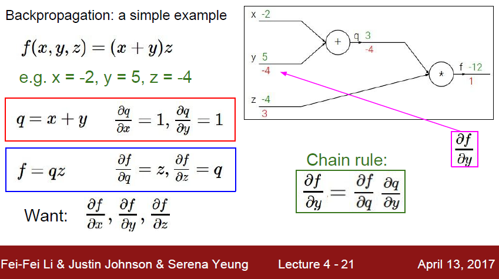

# cs231n Lecture 4 - 1 Backpropagation and Neural networks

lecture 3 에서 배웠던 Analytics Gradient 를 복잡한 함수, 복잡한 모델에서 진행하는 방식을 학습해보자.

수식을 그래프로 바꿔서 생각해보자.

어디서 많이 들어본 발상이다.

바로 Tensorflow 에서 사용하는 모든 수식을 그래프로 만들어 처리하는 바로 그 방식이다.

그럼 왜 수식을 이렇게 표현할까?

바로 Back Propagation이 가능하기 때문이다.

우리는 x라는 input 을 까지고, W 라는 parameter 를 가진다. 그럼 parameter 를 바꿔줘야 x 에 대한 최적의 값을 얻을수 있다.

근데 parameter 가 존재하는 위치가 어딜까? 단순하게 지역적으로 보면 Loss 의 입장에서 보면 맨 뒤이다.

전체적으로 보면 중간 단계에 엄청나게 많은 Weight 들을 Loss에 대해서 바꿔줘야 한다.

Loss 입장에서는 맨 뒤 까지 Loss를 미분한 gradient 가 흘러 들어 가서 update 를 해줘야하는것이다.

이 '맨 뒤' 와 'gradient' 가 수학적으로 잘 섞여서 만들어진것이 바로 'Back Propagation'  이다.

초기에 맨 앞, Loss 에서 gradient 가 계산되어온다.

여기서 뒤쪽으로 어떻게 미분값을 넘길수 있을까?

바로 Chain rule 이다. 미분식을 잘 생각해보면 답이 보인다.

y입장에서 보면, y의 미분값은 중간에 분자 분모에 q를 끼워넣으면

f를 q에대해 미분한것과 q를 y에 대해 미분한것으로 나눌 수 있다.

여기서 중요한것은, 뒤의 미분값을 지역적으로 구할 수 있다는것이다.

back propagation 이 진행되면서 그래프상 뒤로 움직이면서,

각 노드에 지역적으로 밑의 그림의 오퍼레이션이 진행된다.

local gradient 를 계산하기 위해, 이전에 forward 에서 output이였던 z 는

Loss에 대한 z 의 미분값을 가져온다.

그럼 노드에서는 Loss 에 대한 x 와 y 에 대한 미분값을 구하기 위해서

z에  대한 x 와 y 의 미분값을 알면 chain rule 에 의해 loss 에 대한 x 와 y 의 미분값을 알게 된다.

이 행동을 각 노드마다 계속 뒤로 전파하면서 반복하면, 결국 input 까지 Weight 가 update 될것이다!

각 미분에 대해서 최대한 간단하게 나눠서도 chain rule 에 의해 복잡한 미분이 간단하게 가능하게된다

수식에서 미분가능한 영역을 잡아서 묶어버릴수도 있다. 계산이 훨씬 간단해지는 효과가 있다.

그럼 수식이 아닌 Max gate는 어떻게 될까?

Max gate 는 연결된 element 중 가장 큰곳으로 gradient 를 흘려주는 router 역활을 하게 된다.