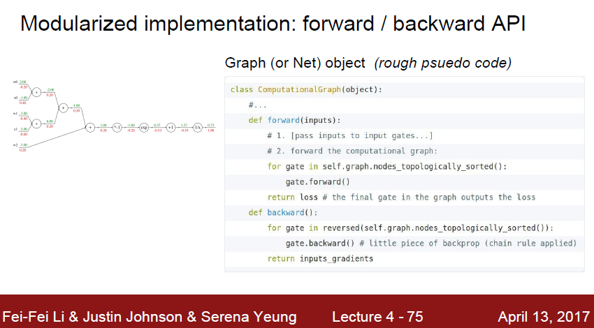
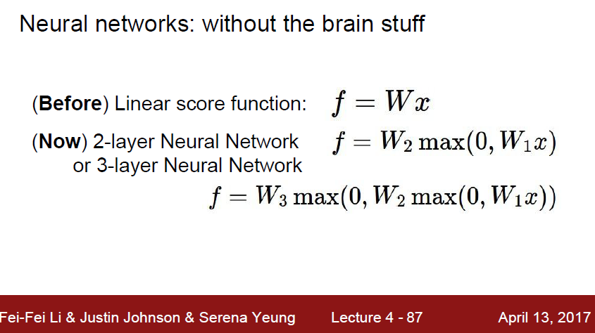

# cs231n Lecture 4 - 2 Backpropagation and Neural networks

앞에 까진 scalar 에 대해서 Back propagation 에 대해 알아보았다.

이제 vector에 대해 알아보자.

vector 일때도 chain rule 이 똑같이 적용된다.

Jacobian matrix 에 대한 설명은 공돌이의 수학정리노트 에 있는 설명을 보면 좋을거같다. 정말 잘 설명되있다!

[공돌이의 수학정리노트](https://wikidocs.net/4053)

정리를 하자면, Jacobian matrix는, 다른 축의 좌표계로 변환될때 변위들의 관계속에서,

원래 변위와 변화될 변위의 관계를 설명하는 matrix 이다.

뭔가 수학적으로 어려워 보이지만, 그냥 z에 대한 x 의 미분값이 Jacobian matrix가 되는것이다.

그동안 우리가 분수를 분자 분모에 똑같은 값을 줘서 하나더 생성했던 그것! 그 행동이 곧 Chain rule 이고 거기서 발생하는 변위의 다름의 정도를 표현해주는 vector 버전의 고오오급 스러운말이 바로 Jacobian matrix 라는것이다.

Jacobian matrix 의 크기는 m x n

m 은 결과가 될 vector 의 크기, n 은 원래 backward 로 들어왔던 z vector 의 크기 이다.

거기에 더해, mini batch 를 사용하고 그 크기가 100 이라면?

무려 100^2 배 matrix 크기가 증가하는것을 볼 수 있다.

matrix 계산이 되면서 신경써야할게 조금 더 늘긴했지만,

기본적인 원리는 모두 동일하다.

Back propagation 에 대해 정리해보자면,

수많은 parameter 들을 일일이 찾아서 업데이트 시켜주는것은 매우 고된일일것이다.

우리가 최적화 기법을 생각할때 많이 떠오르는게 바로 tree 이다.

tree 중에서 segment tree 라는 tree 가 있는데,

tree 의 leaf 에 input parameter 가 있고, input 들에 대한 특정 operation 을 진행한것이 트리에 쌓이게 된다.

여기서 값을 업데이트 하는것은, 맨 위의 root 에서 update 를 흘려, tree를 타고 맨 밑까지 propagation 시키는것이다.

나는 back propagation 에서 굉장히 segment tree와 생각하는것이 비슷하다 라는걸 느꼇고, 그렇게 되면 얻는게 무엇일까? 라고 생각해 봤을떄,

수많은 parameter 들을 만들어진 그래프 라는 규칙에 의해 빠르고 정확하게 update 할 수 있게 된다는것이고,

그 수학적 기반인 chain rule 이 매우 탄탄하다 라는것이였다.

이걸 간단하게 수도 코드로 파이썬으로 살펴보자.

forward 의 경우 그래프를 따라 앞으로 가겠고,

backward 는 그래프의 역방향을 타고 흐를것이다.

각 node 에서는 input, local gradient 을 cache 해두고 back ward 에서 사용하게 된다.

## Neural network

지금까지 배웠던 linear regression 이

드디어 한 layer 증가하게 되었다!

여기서 max 가 사용된 이유가 무엇일까?

max 는 일종의 'activation function' 역활을 하게 된다.

실제 뉴런의 역활에서는, `역치` 를 넘어야 다음 뉴런으로 값이 흘러가게된다.

이를 수식적으로 구현한게 바로 activation function 이다. neural network 에서 하나의 node 의 결과가 나오기 전에, 그 결과를 하나의 activation function에 넣어서 역치가 넘는지 안넘는지 채크하는 것이다.

여기서는 activation function 의 역활을 non linear function 들이 하게 된다.

그럼 왜 non linear function 이여야 할까?

`밑바닥 부터 시작하는 딥러닝` 이라는 책의 글을 인용하면 다음과 같다.

> 선형함수인 h(x)=cxh(x)=cx를 활성화함수로 사용한 3층 네트워크를 떠올려 보세요. 이를 식으로 나타내면 y(x)=h(h(h(x)))y(x)=h(h(h(x)))가 됩니다. 이는 실은 y(x)=axy(x)=ax와 똑같은 식입니다. a=c3a=c3이라고만 하면 끝이죠. 즉, 은닉층이 없는 네트워크로 표현할 수 있습니다. 뉴럴네트워크에서 층을 쌓는 혜택을 얻고 싶다면 활성화함수로는 반드시 비선형 함수를 사용해야 합니다.

activation function은 다음과같이 여러가지 비선형 함수들이 있다.

이렇게 만드는 node 를 여러 layer 를 연결하게되면 비로소 Neural network 가 완성되게 된다!