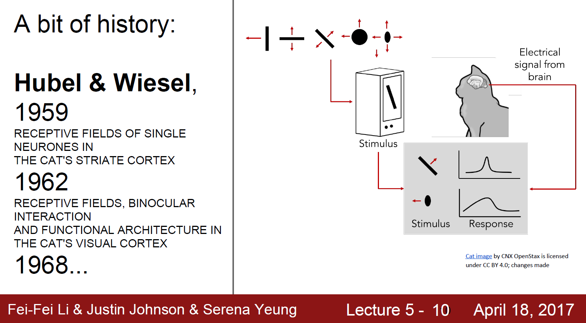
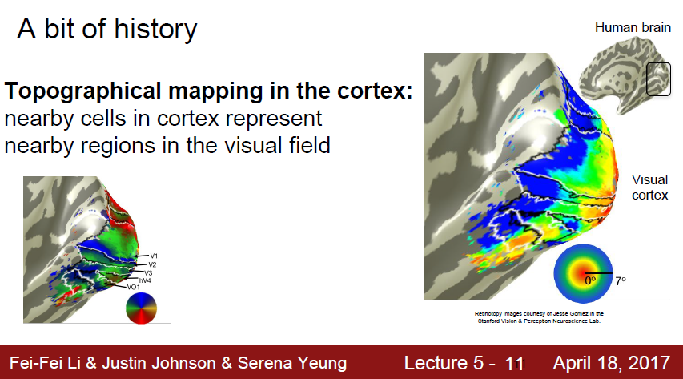
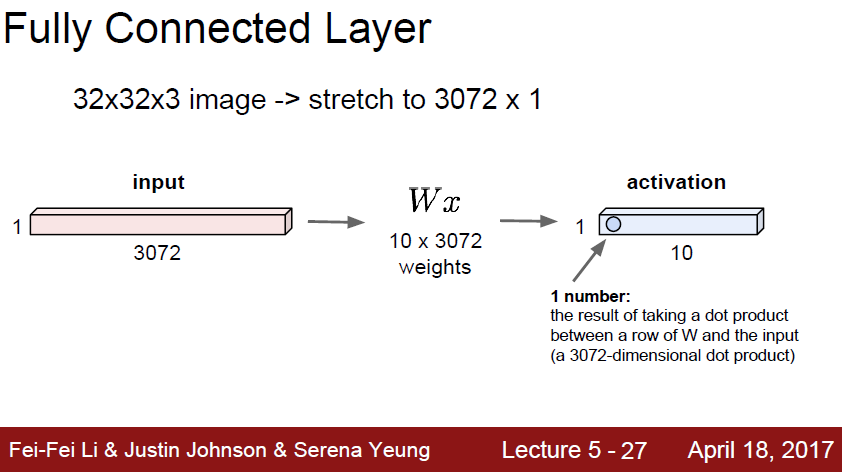
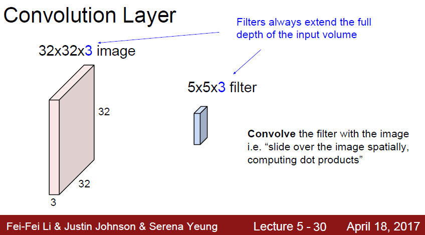
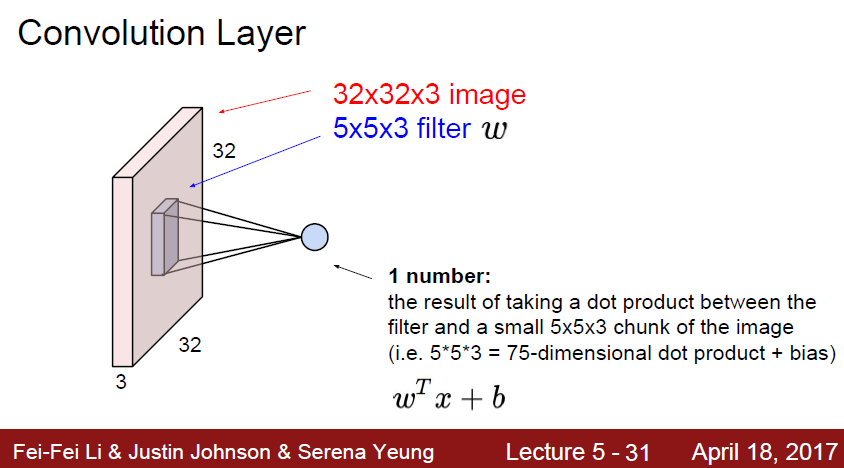
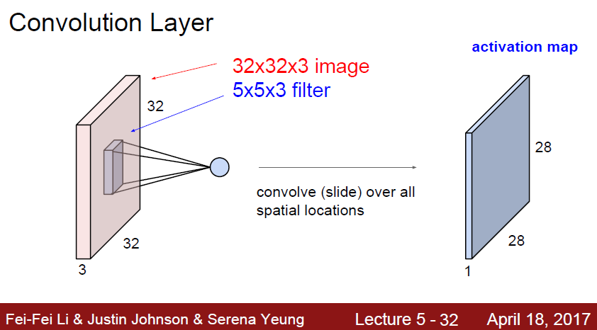
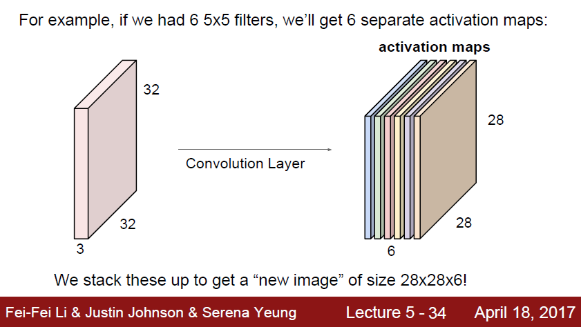
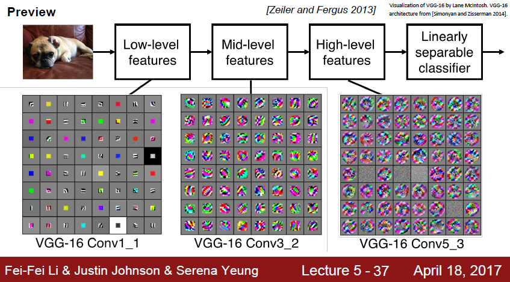
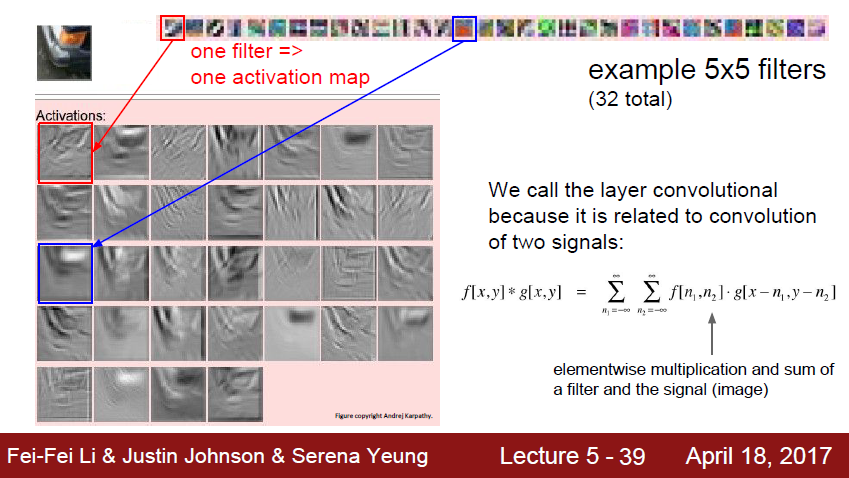
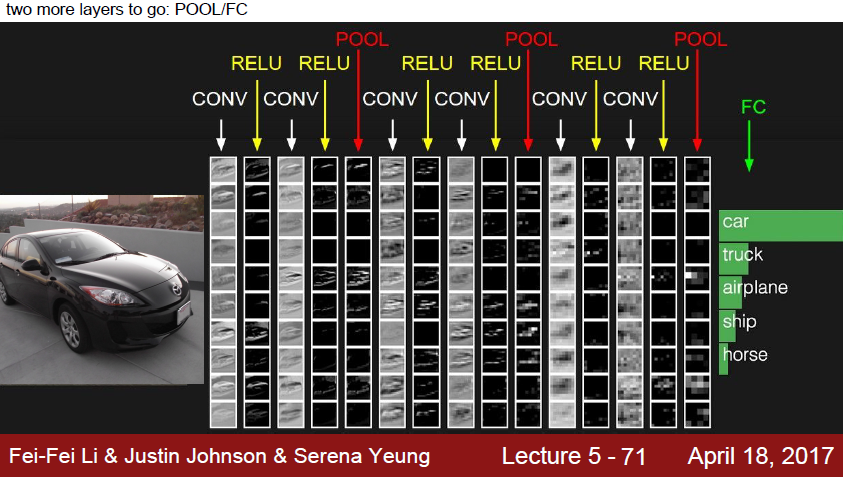

# cs231n Lecture 5-1 Convolutional Neural Networks

고양이가 사물을 인식할때, 도형의 모양에 따라서 동작이 발생하는 뉴런이 다름을 알 수 있었다.

또한 Locality 에 따라 동작하는 뉴런이 다름을 알 수 있다.

사람의 두뇌도 비슷하게 작동한다.

모양에따라 작동하는 뉴런이 다르다. 여기서 착안하게 바로 Convolutional Neural Network 이다.

기존 FC Layer 는 input 을 하나의 긴 vector 로 변환해서 한번에 모든 데이터를 처리했다.

Convolution Layer 는 Filter 라는게 있는데 이 filter는 쉽게 말해서 이미지를 바라볼 '관점' 이다.

filter 는 이미지를 sliding 하면서 원본 image 와 dot product 연산을 하게 된다.

dot product 를 하게 되면 하나의 값이 나오게 된다. 이거를 슬라이딩하면서 계속 진행한다.

그럼 filter 라는 관점으로 image 를 바라본 하나의 다른 이미지가 나온다.

이를 activation map 이라고 부른다.

filter 는 여러개 일수 있고, filter 의 개수에 따라 activation map 의 개수가 결정된다.

위 사진은 Conv Layer 가 어떻게 feature 를 저장하고있는지 시각화 한 사진이다.

처음 filter는 Locality가 높게 정보들을 모은다.

이 정보들을 다시 다음 Conv Layer 가 수집하여 각 feature 를 통합하게되고

그 다음 레이어도 다시 통합하게된다.

feature extraction 에서 hirachy 한 특성을 얻게 된다.

밑에 하얀색 부분이 해당 filter 가 image에서 잡아낸 feature 를 의미한다.

지역적으로 feature 를 잡아내는것을 알 수 있다.

