# cs231n Lecture 5-2 Convolutional Neural Networks

보통 Conv Neural network 는 Conv->Relu 로 layer 를 구성하고 Pool layer 를 넣게된다.

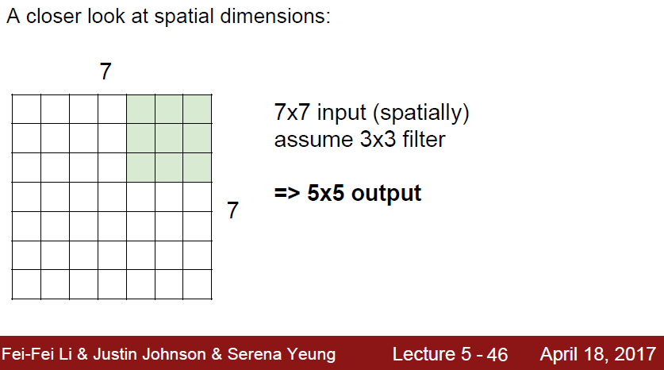

그럼 실제로 filter 가 어떻게 image 에 적용이 될까?

filter 는 image 를 stride 만큼 이동하면서 dot product 를 진행한다.

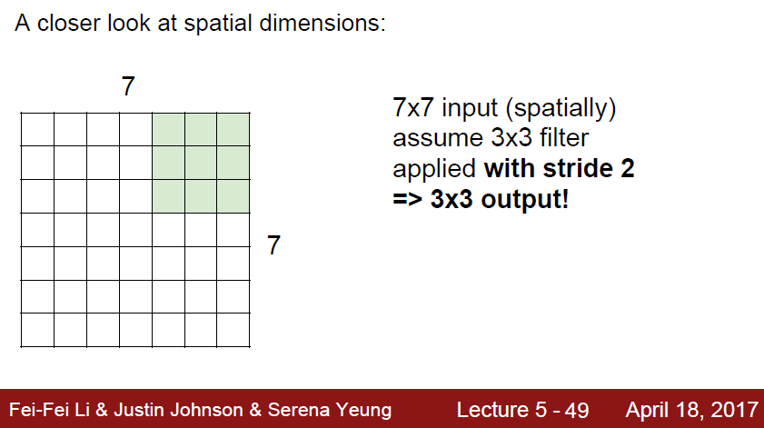

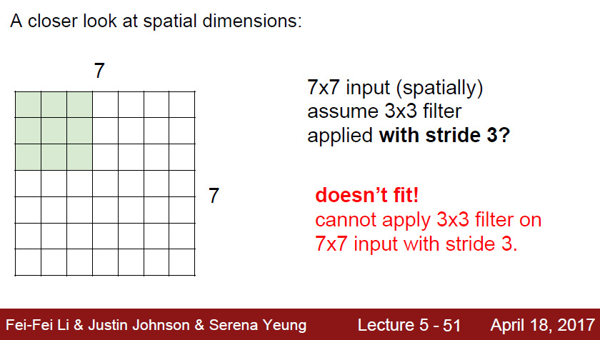

하지만 filter의 size와 slide의 관계에서 한 image 를 정확하게 다 보지 못하는 경우가 생길 수 있다.

이런것을 해결해주는게 바로 Padding 이다.

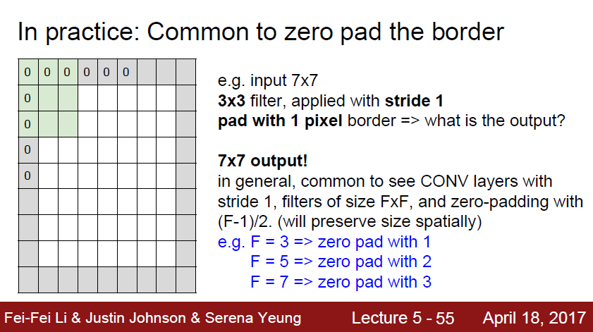

대표적인 padding 은 zero padding 으로, iamge의 가장자리에 0 을 채워넣는 방식이다.

부족한 수 만큼 zero padding 을 넣어주면 된다.

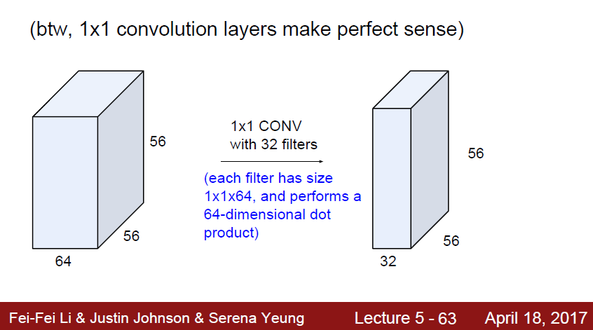

filter 의 크기가 1*1, stride 1 이라면?

filter 의 개수에 따라 output depth 는 달라지지만, 가로 세로 사이즈는 동일하게 유지됨.

1*1 layer 는 한 차원의 차원 축소를 해주는 역활이 된다.

(filter 수가 input 보다 작을때)

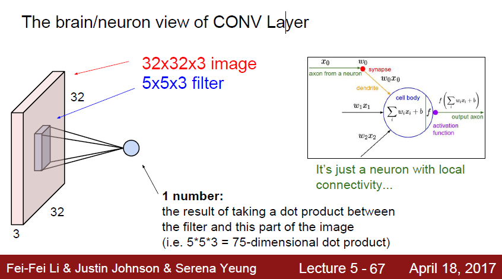

뉴런의 입장에서 봤을때, 이 뉴런은 Local Connectivity 가 존재한다.

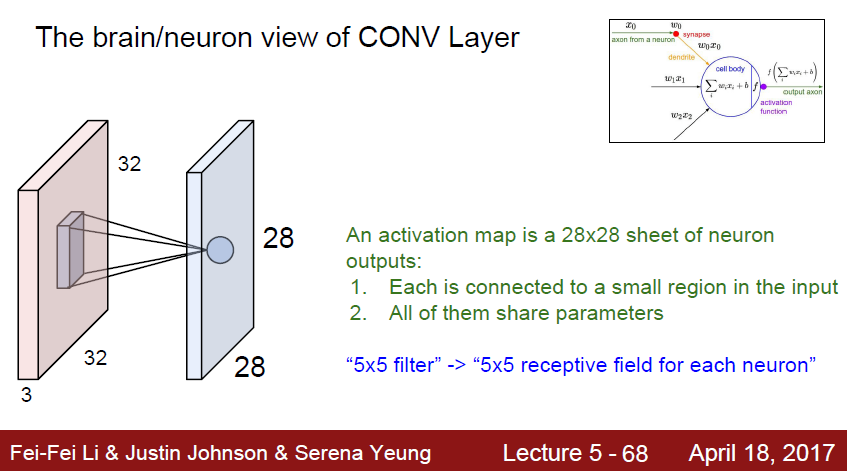

 filter들은 하나의 input 에서 다른 output 들을 도출하게 된다.

또한 모두 같은 parameter를 공유한다.

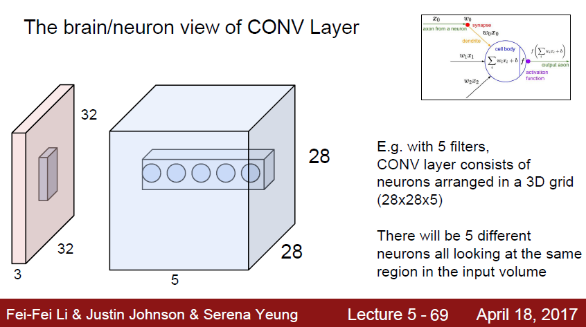

만약 filter 가 5개라면? 하나의 input 에 대해서 다른 관점으로 본 5개의 결과가 누적되게 되는것이다.

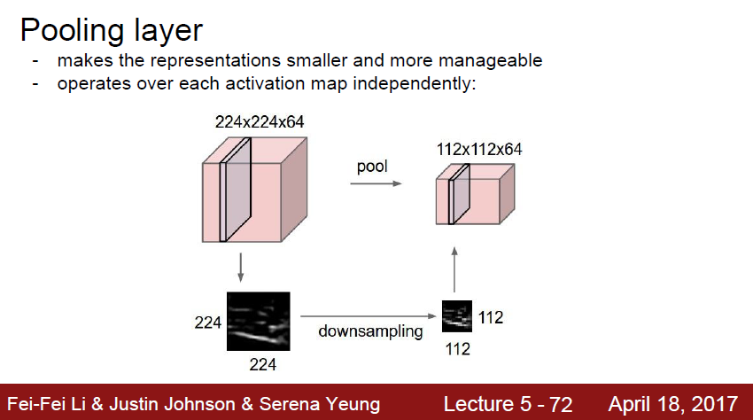

Pooling 이란, 특정한 Down sampling 이다.

Conv Layer 로 부터 발생한 대표 feature 를 다시한번 size 를 줄여주는 역활을 한다.

여러가지 역활을 하지만, 대표적인 max pooling 의 경우 해당 feature 에서 가장 중요한 local feature 를 뽑아주는 역활을 하게 된다.

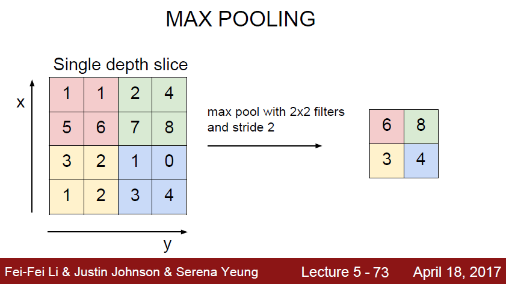

max pooling 은 특정 영역에서 가장 높은 수를 뽑아서 하나의 다른 image 를 만드는 것이다.

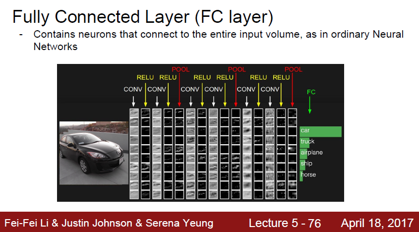

이렇게 Conv-Relu + Pooling 으로 큰 이미지를 feature 별로 나눠서 하나의 긴 column vector 를 만들면,

그 이후에는 FC Layer 에 태우게 되어 Softmax 등의 Classification process 를 진행하게 된다.

