# cs231n Lecture 8-1 Deep Learning Software

lecture 8 에서는 tensorflow, pytorch, caffe 등의 소프트웨어들을 알아봅시다.

CPU 와 GPU 중에서 Deep learning에서 gpu가 더 좋은 이유는 뭘까요?

아래 그림을 보면, GPU가 월등히 더 많은 코어의 수를 가지고 있습니다. Clock speed는 더 낮지만 core수는 훨씬 많죠.

따라서 gpu는 cpu보다 병렬 작업에 훨씬 유리합니다.

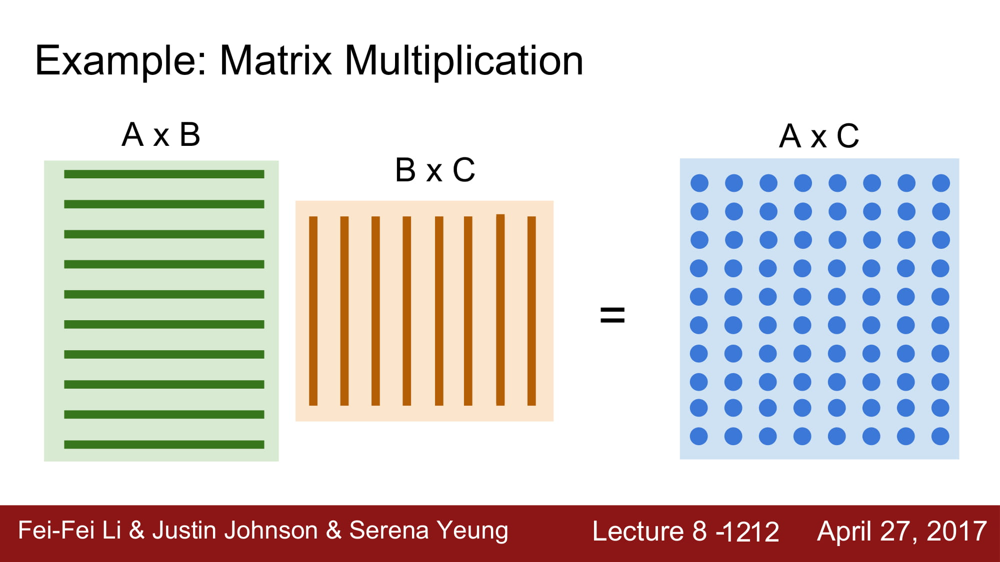

딥러닝에서는 기본적으로 행렬 연산이 많습니다. 이 행렬 연산을 GPU는 병렬처리를 통해 매우 빠른 속도로 처리할 수 있습니다.

GPU는 CUDA 라는 언어로 컨트롤 합니다.

하지만 우리가 CUDA code를 직접 코딩할 일은 거의 없습니다.

이 CUDA를 사용하지 않게 해주는게 바로 Deep learning software들이기 때문이죠.

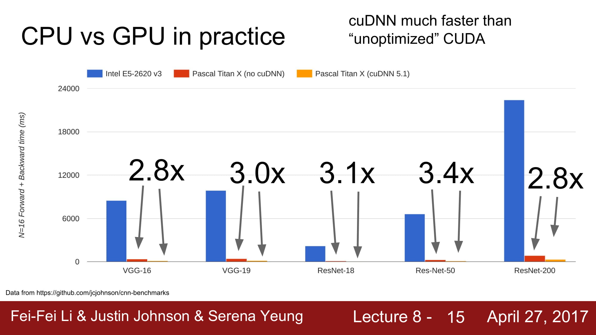

CPU와 GPU의 속도차이는 엄청나게 많이 납니다.

CUDA를 최대한 활용하면 3배정도의 성능 향상을 볼 수 있지만.

하지만 CPU 와 GPU의 차이는 엄청납니다. 거의 60~70배 정도의 성능 차이를 보인다고 합니다.

하지만 gpu가 아무리 빨라도 hdd가 disk에서 읽는 속도의 차이도 있습니다. 

이 병목을 처리하기 위해서 데이터를 RAM에 올려두고나 cache처리를 해두는 경우가 많습니다.

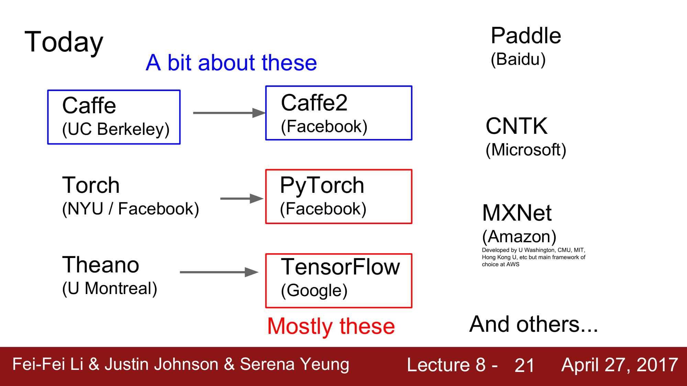

현재 Deep learning framework는 tensorflow, pyTorch 를 가장 많이 쓴다고 합니다.

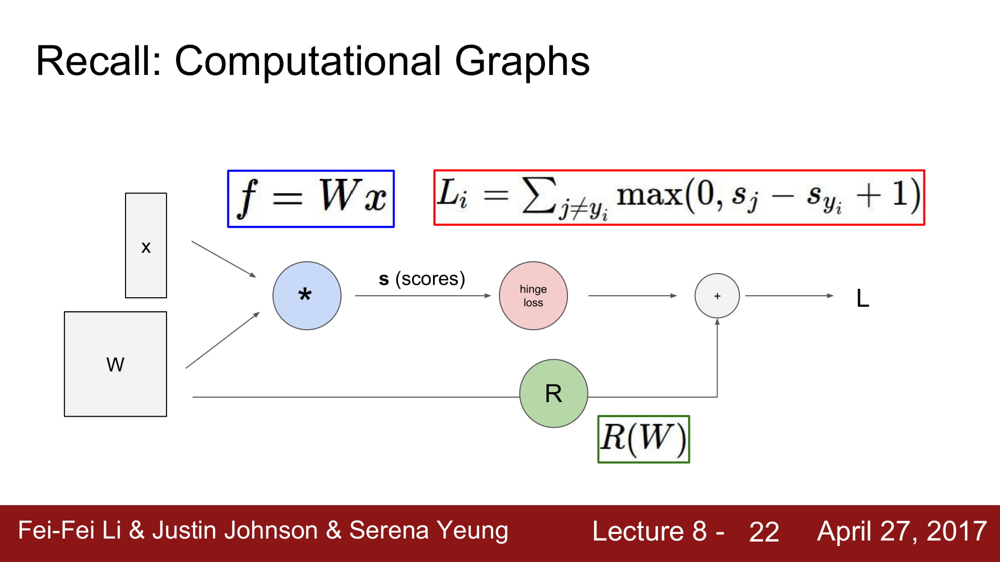

이러한 그래프들은 지금은 간단해서 numpy로 충분히 구현할 수 있지만,

아래와 같은 그래프를 직접 구현하려면 정말 많은 노력이 필요할 것입니다.

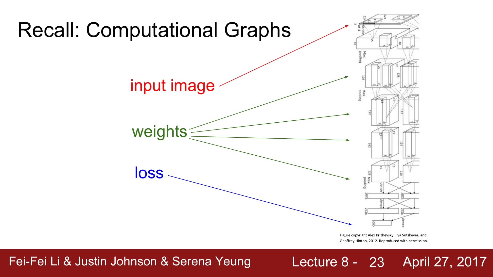

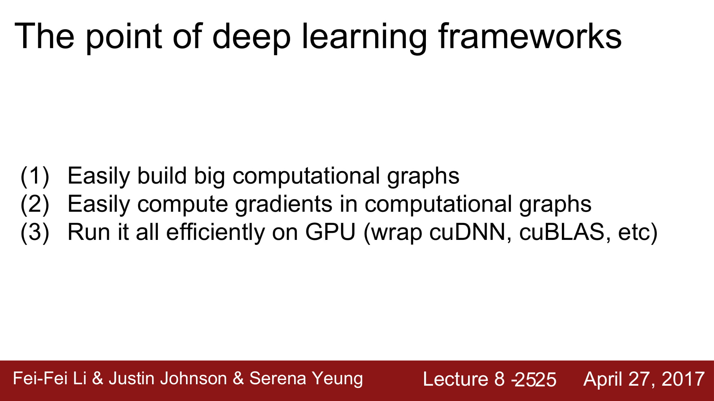

따라서 Deep learning framework 들의 핵심은, 쉽게 큰 그래프를 만들 수 있어야하고, computational graphs 안에서 쉽게 gradient을 계산할 수 있어야하며, GPU 환경에서 사용할 수 있어야 합니다. 

간단한 그래프를 numpy로 구현했다고 합시다.

이 그래프의 문제는 GPU 환경에서 돌아가지 않고, gradient를 손수 계산해줘야합니다.

매우 불편하죠… 과제하면서 직접 gradient를 계산하니..너무 어려웠습니다 ㅠㅠ..

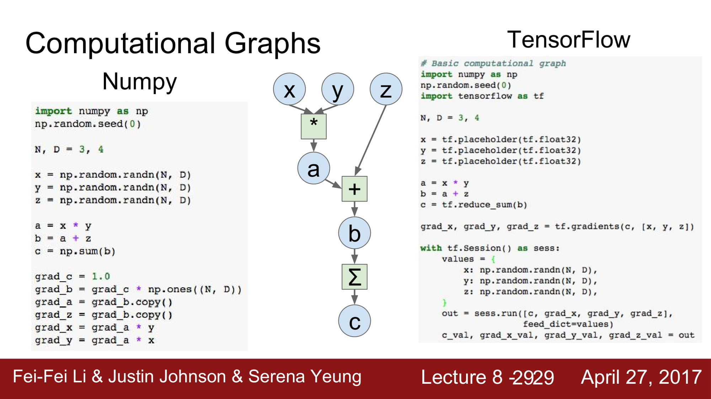

numpy code를 tensorflow로 구현하면, gradeint를 직접 계산할 필요가 없어집니다.

tf.gradients를 하면 되니까요!

tensorflow는 특이하게, 그래프를 만들고 run 하기 전에는 그래프가 실행되지 않습니다.

static graph를 먼저 만들고 run 하는 형태입니다.

### tensorflow 2.0 에서는 dynamic graph를 지원하기위해 session이 없어진다고합니다

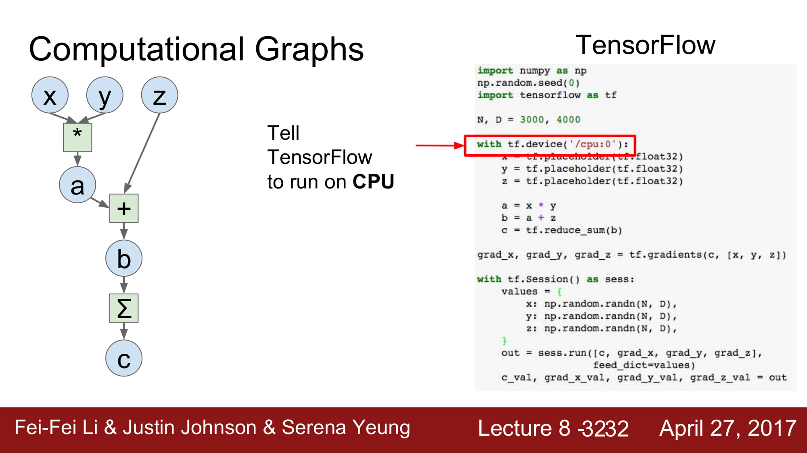

tensorflow는 cpu, gpu환경에서 둘다 돌아갈 수 있습니다.

cpu 에서 돌릴지, gpu 에서 돌릴지 선언 할 수 있습니다.

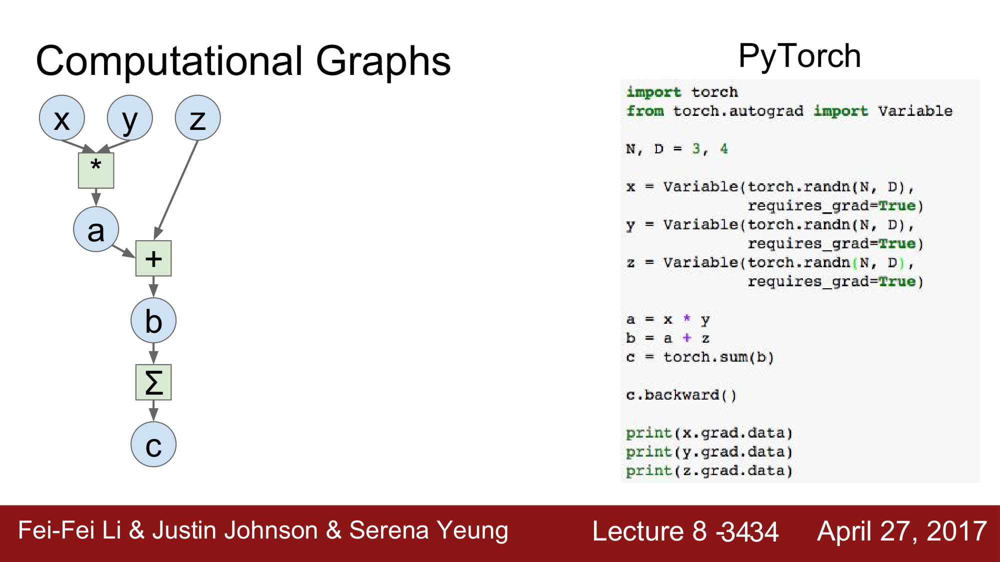

pyTorch는 위와 같은 방법으로 구현합니다.

c.backward()를 통해 back prop을 진행하게 됩니다.

각 변수에 gradient가 저장되게 됩니다.

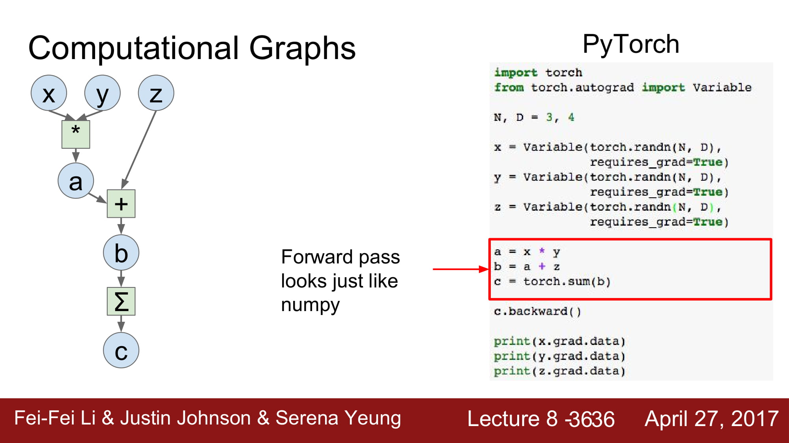

numpy처럼 model을 구현 할 수 있습니다.

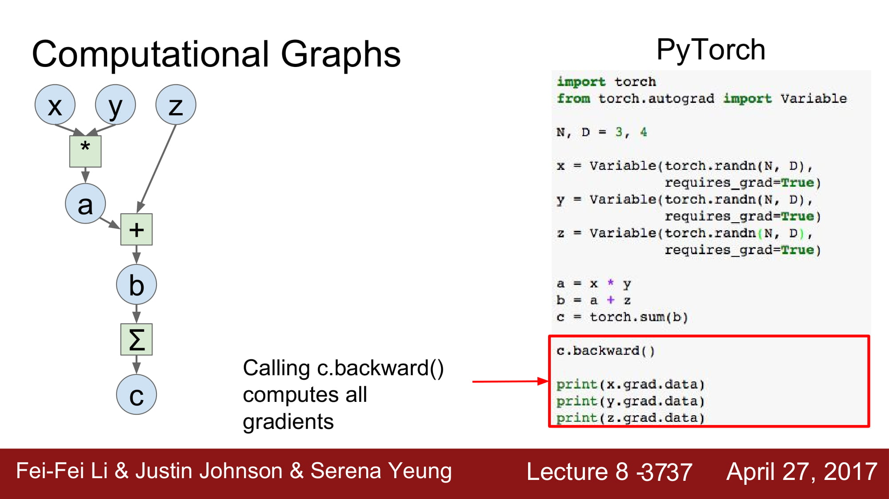

tensorflow 에서 tf.gradient로 구현하던것은 pytorch에서는 output.backward()로 할 수 있습니다

pytorch에서 gpu를 이용할려면, node 변수 뒤에 .cuda() 를 붙여주면됩니다.

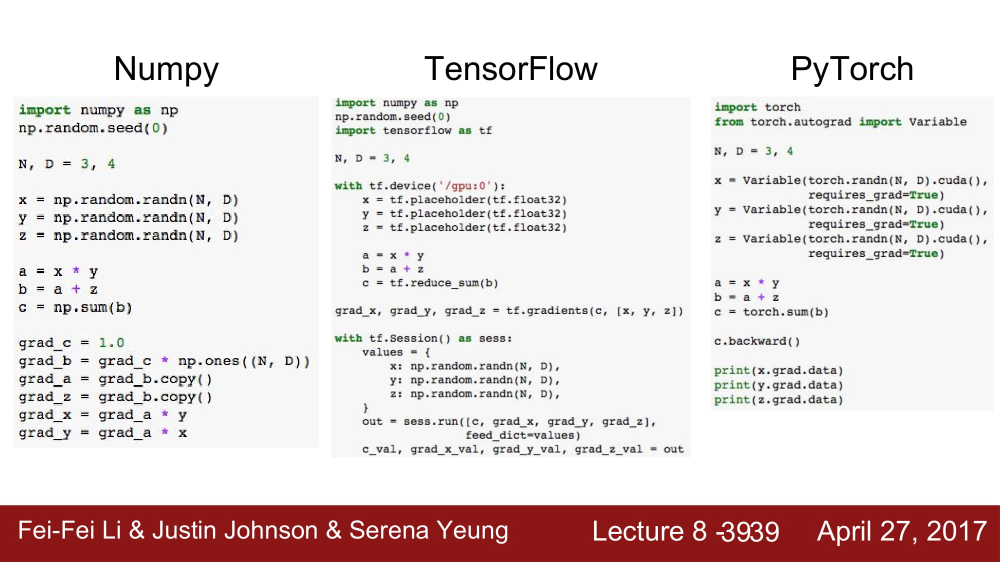

