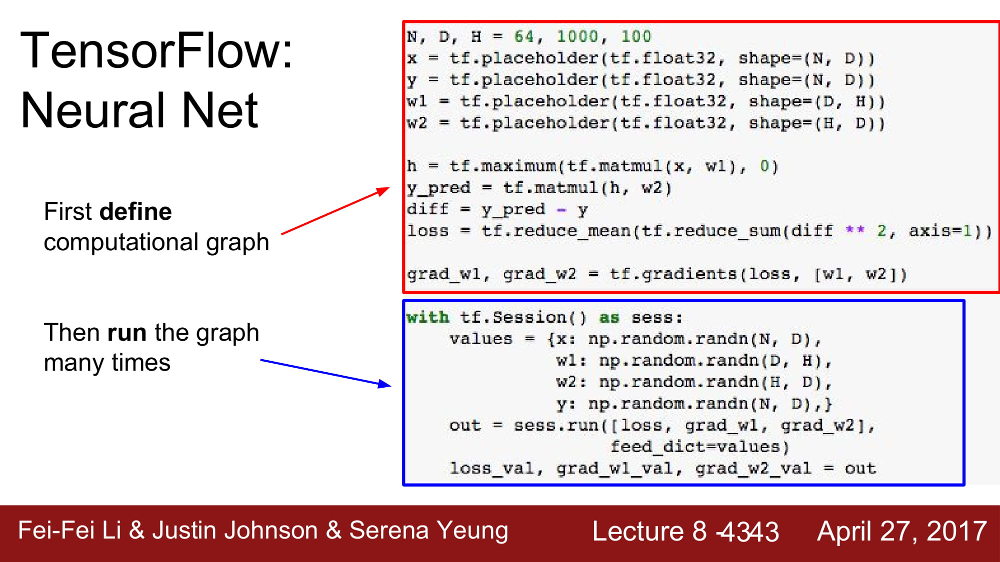
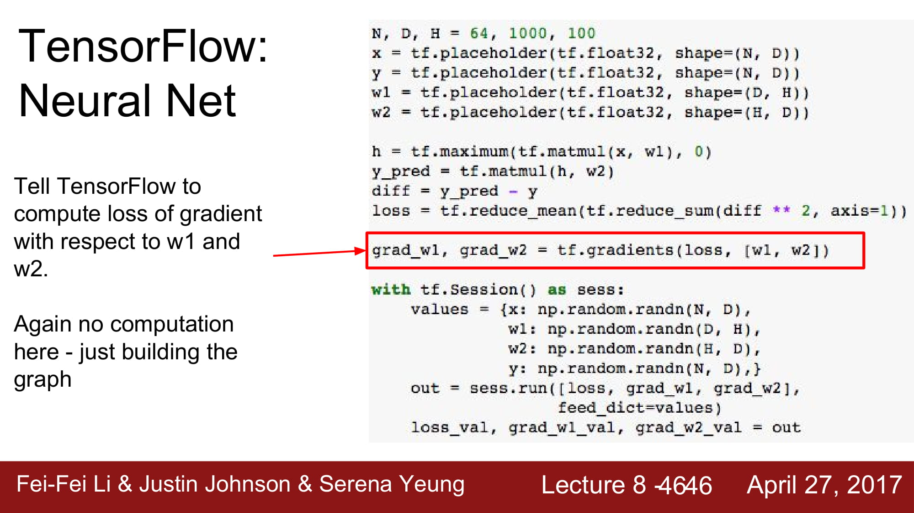
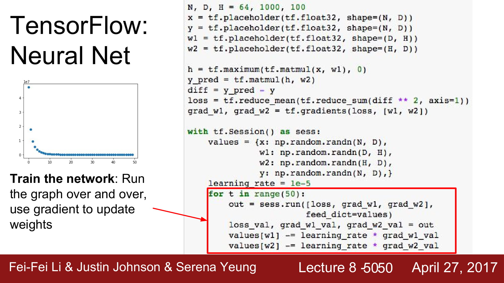
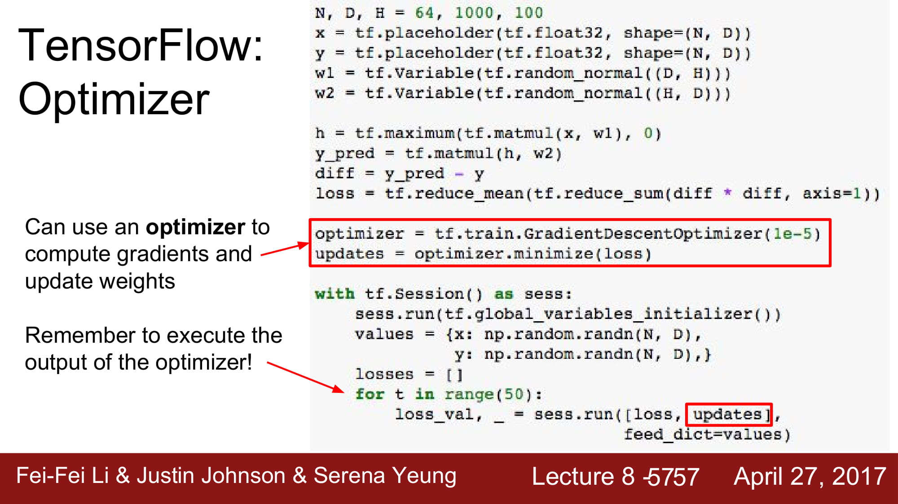
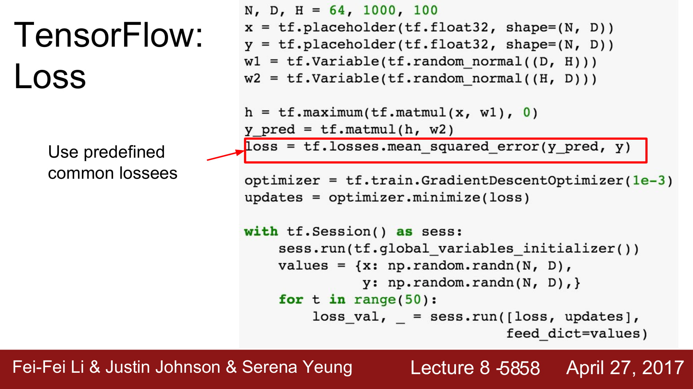
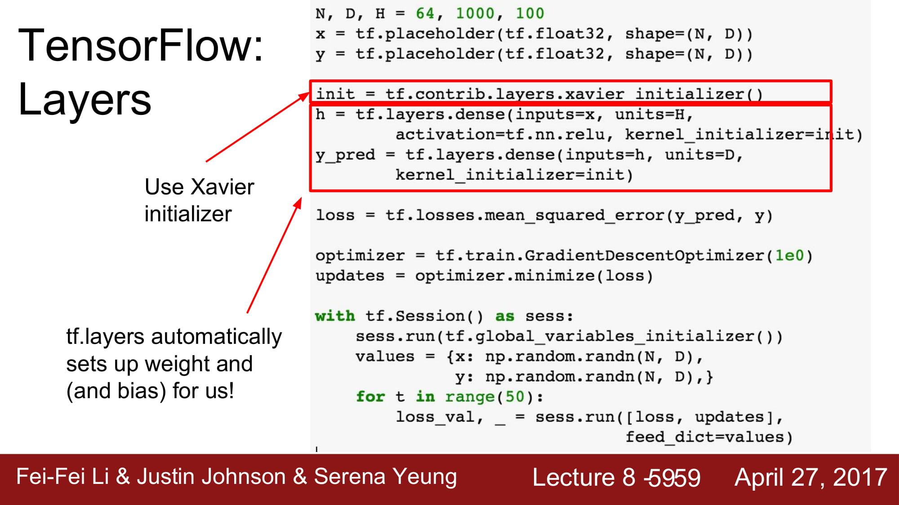
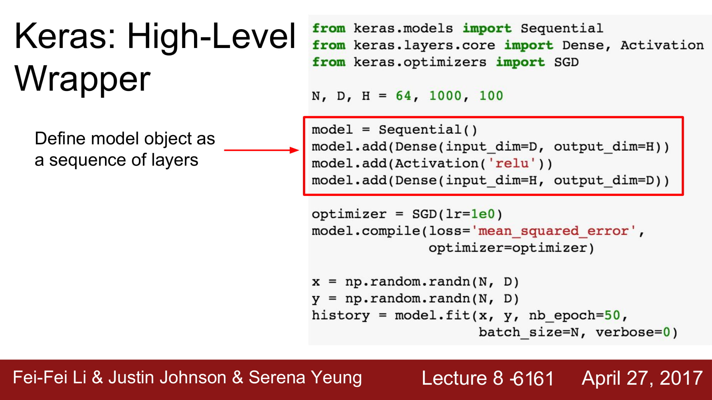

# cs231n Lecture 8-2 Deep Learning Software -2

이제 tensorflow 에 대해 더 자세히 알아봅시다.

tensorflow 는 'define & run' 입니다.

static graph를 먼저 define해둔 후, session 에서 run하는 구조 입니다.

### tensorflow 2.0 에서는 dynamic graph를 지원하기 위해서 session이 사라집니다.

입력값을 저장하고, 변수를 저장하기 위해서는 tf.placeholder를 사용합니다.

변수의 type, shape등을 선언합니다.

그 후 forward pass 를 지정하비다.

static graph 를 만드는겁니다!

gradient를 계산하기 위해서는 tf.gradients 를 사용합니다.

중요한점은! Session 으로 run 하기 전까지는 실행하지 않는다는것입니다.

define & run !!

앞에 define 단계에서 만들어둔 graph를 실행하는 단계인 tf.Session() 입니다.

placeholder에 들어갈 data 를 numpy 형으로 넣어줍니다.

이제 graph를 실행해봅시다. session.run 을 통해서 graph를 실행하고, 입력값은 feed_dict parameter를 통해 입력합니다.

session.run 의 output 은 위에 선언해둔대로 loss, gradient들을 가져옵니다.

자 50번의 학습을 한다고 가정해봅시다.

우리가 학습하는 대상은 W 입니다.

session.run 의 output은 gradient이므로, learning rate을 곱한 후 대입해봅시다.

하지만 이 방식은 overhead가 많습니다.

graph 에서 w값을 뺀 후, 외부 변수에 다시 넣고, 다시 graph로 대입하는 연산이 update 할 때마다 있기 때문입니다.

tf.Variable을 사용하면 이런 문제를 해결할 수 있습니다!

외부 데이터를 input으로 가지는것이 아닌, model의 parameter들인 W 와 b 는 따로 밖으로 빼서 input 으로써 update 할 필요 없이 graph 내부에서update 하면 됩니다.

tf.Variable은 이를 지원합니다.

assign operation을 통해서 w 를 update할 수 있습니다.

W가 variable로 바뀌면서, graph가 시작되면서 초기화를 해야할 문제가 생겼습니다.

tensorflow는 sess.run 을 할때 tf.global_variables_initializer() 를 통해서 W, b 등의 tf.variable들을 초기화 할 수 있습니다.

하지만 학습이 안됩니다! 이게 무슨일이지??!?

update를 sess update를 parameter로 넣어줘야합니다.

이전 시간에서 배웠던 optimizer도 사용할 수 있습니다.

update를 optimizer.minimize(loss) 로 바꿔주면 됩니다.

loss 또한 평소에 많이 사용되는 common loss를 지정할 수 있습니다.

방금 살짝 나왔었지만, global_variables_initializer를 할때, Xavier initializer를 사용할 수 있습니다.

이는 tf.contrib.layers.xavier_initializer를 해주면 됩니다.

tf.layers 는 유명한 layer들을 알아서 설정해집니다. W, b등의 설정, loss, graph등 필요한것을 모두 모아둔것입니다.

Keras는 high-level wrapper 입니다.

조금 더 상위 개념에서 tensorflow를 사용할 수 있는 다른 라이브러리 입니다.

model 은 sequential object 에 layer 를 add 하는 형식으로 구현합니다.

keras 또한 optimzer를 지원합니다.

loss function의 경우 model.compiledmf 통해 구현됩니다.

최종적으로, model을 학습하는것은 model.fit을 통해 학습하게됩니다.

tensorboard는 model을 학습할 때 데이터, model의 상태를 볼 수 있습니다.

