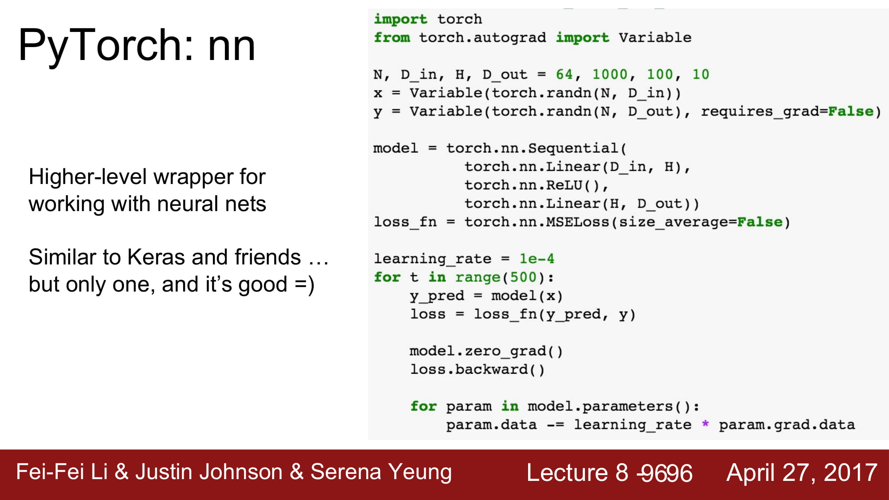
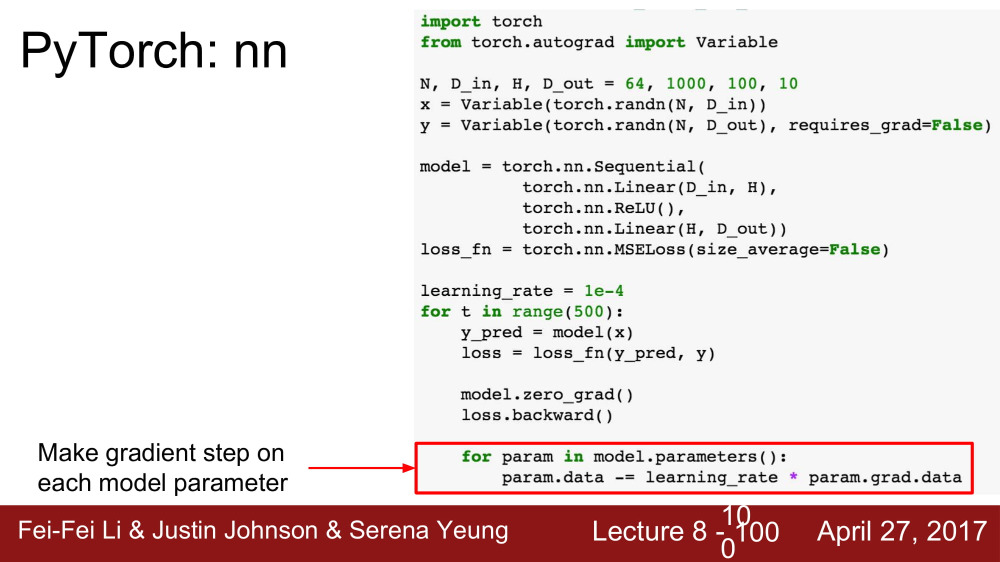
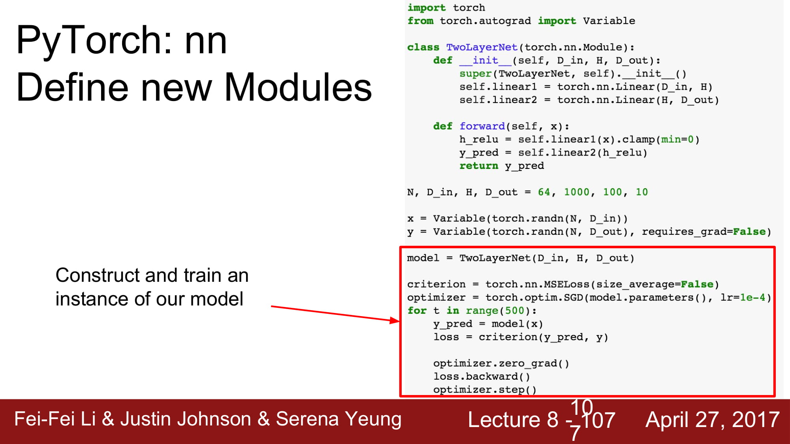

# cs231n Lecture 8-3 Deep Learning Software

pytorch에는 3가지 abstraction 이 있습니다.

- tensor : ndarray로, gpu에서 돌아갑니다.

- variable : computatinal graph 안에 있는 node 입니다. data 와 gradient를 가집니다

- module : layer입니다. learnable weight들을 가지거나 state 를 저장합니다.

tensor는 일종의 array이고, gpu에서 돌아갈 수 있게 해둔 특별한 array 입니다.

gpu 에서 돌게 하려면, tensor의 type에 cuda datatype을 넣어주기만 하며 됩니다.

Variable은 tensorflow와 동일하게 node 내부의 data 입니다. 대표적으로 W와b가 있습니다.

Variable은 data 와 grad를 가집니다. 둘의 shape은 같습니다.

x.grad.data 는 tensor의 gradient입니다.

gradient가 필요한 구간인지 아닌지를 지정할 수 있습니다.

tensor 를 쓸때와 모두 동일한 구조를 가지지만, Autograd를 사용할 때는 모두 variable들입니다.

gradient는 variable.grad.data에 있습니다.

위와같이 gradient를 사용하여 weight을 update할 수 있습니다.

autograd는 위와같이 class를 사용하는것이 더 깔끔합니다.

새로 정의된것은 forward, backword를 overridding 해서 사용할 수 있습니다.

torch에는 nn 에 layer들이 모여있습니다.

tf.layers와 같은 역활입니다.

model을 적용하고, forward시킵니다. 그 output을 통해 loss 를 계산합니다

그 후 loss.backward() 를 통해 back prop을 진행하여 gradient update합니다.

gradient를 얻었으니, data 를 gradient를통해 업데이트 합니다.

tensorflow에 있던 optimzer도 존재합니다.

torch.optim.Adam으로 Adam optimizer 가 존재합니다.

optimizer.step() 을 통해서 data를 update 합니다.

우리의 새로운 module을 만들 수 있습니다.

먼저 super를 호출한 후, weight, 이나 다른 module들을 포함할 수 있습니다.

module은 forward method 를 override해야합니다.

backward는 define 할 필요 없다. autograd가 알아서 handle할 것이다.

다음부터는 위에서 배운것 처럼 model을 생성하고, loss, optimizer 를 정의하고, backward, optimizer.step()등을 진행합니다.

pytorch는 dataloader을 지원합니다.

큰 데이터에 대해서 lazy하게 loading하는것으로 ,minibatching, shuffling, multithreading등을 지원합니다

loader에 대해 iteration을 돌면, loader는 tensor형태로 데이터를 제공합니다.

variable을 사용하고싶으면 variable로 wrapping해줘야합니다.

pytorch 는 alexnet, vgg, resnet등의 pre-trained model을 제공합니다.

torchvision이라는 라이브러리에서 받을 수 있습니다.

visdom은 tensorflow 의 tensorboard와 유사합니다.

많은 visualizer들을 지원하지만, computational graph structure는 아직 지원하지 않습니다.

staic graph 와 dynamic graph 의 차이는

define & run 이면 static graph 이고

running time에 dynamic 하게 graph 를 바꿀 수 있으면 dynamic graph이다.

static graph의 장점은 deep learning framework의 layer optimization을 받을 수 있다는것이다.

compile 언어와 script언어의 특성의 차이와 비슷하다.

static graph는 한번 model이 정해진다면, build code 없이 model 을 사용할 수 있다는 장점이 있고,

Dynamic graph의 장점은 runtime에서 graph의 변형이 쉽다는것이다.

dynamic graph의 장점은 매우 쉽게 코드 단에서 graph를 변형시기킬 수 있다는것이다.

하지만 static graph는 이 모든 조건을 미리 graph에 넣어두어야한다.

또한 dynamic graph는 iteration 에 강하다.

일반적으로 for문으로 로직을 짜는거같이 graph를 사용할 수 있는 dynamic graph와 달리,

static graph는 functional programming처럼 미리 기능에 대한 선언을 함수로 해두어야 한다.

Dynamic graph는 Recurrent Network를 구현하는데 유용하다.

또한 module 로 구성된 network를 쉽게 유동적으로 컨트롤 할 수 있다는 장점이 있다.

