# cs231n Lecture 8-4 Deep Learning Software

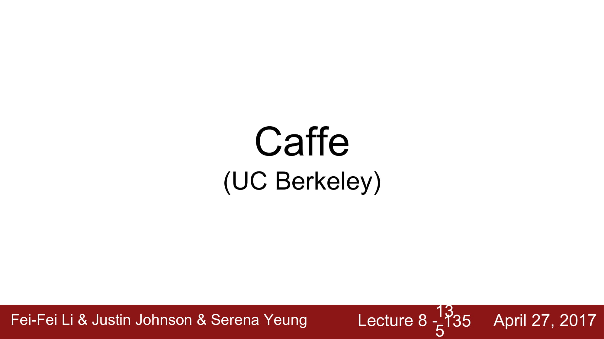

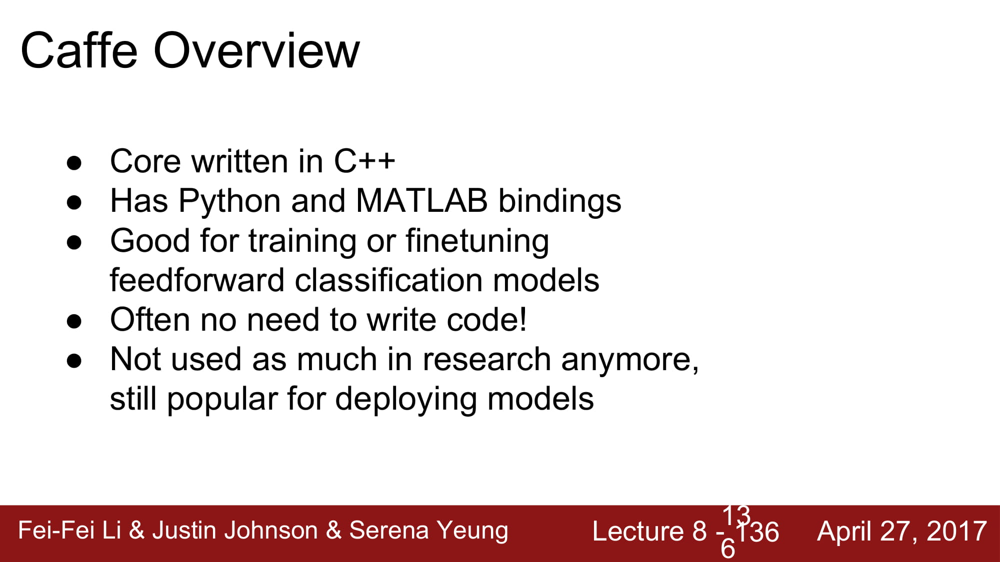

Caffe 는 c++로 만들어진 deep learning software 이다.

Python, Matlab binding이 존재하고, finetuning, feedforward classification모델에 좋다고 한다.

보통 model deploy용으로 많이 사용된다고 한다.

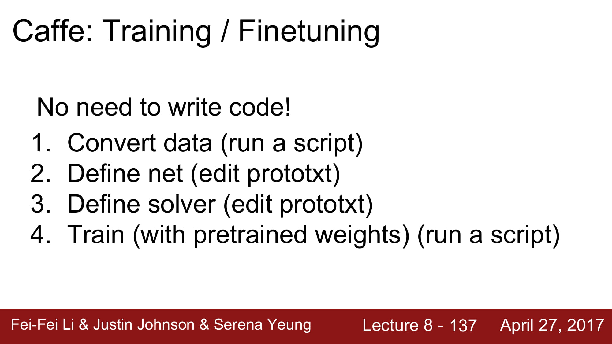

Caffe의 특징은, prototxt이다.

코드를 거의 작성하지 않고, json 처럼 생긴 prototxt로 model 을 define하고 해당 script를 실행시키는 형식으로  model을 train시킨다.

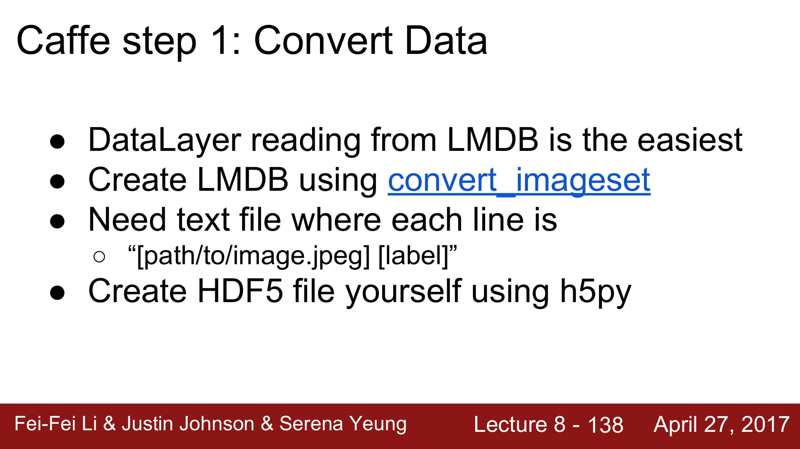

데이터는 caffe가 원하는 형식으로 converting 해줘야한다.

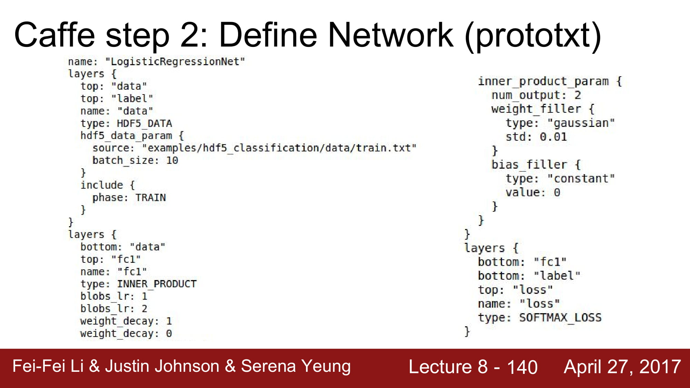

caffe는 위와같이 prototxt라는 json 형식의 파일로 model 을 define한다.

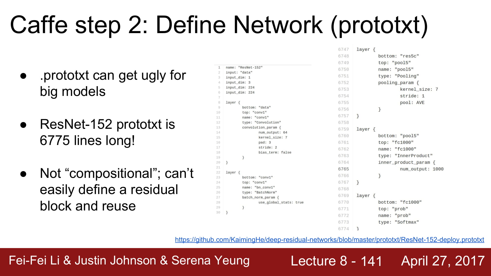

하지만 매우 ugly하다.

ResNet-152의 경우 6775 line이나 된다.

compositional 하지 않다.

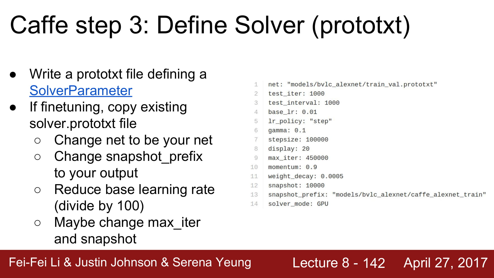

3단계로, solver를 정의한다. 만약 fine tuning 이라면 이미 존재하는 solver.prototxt를 copy하도 수정한다.

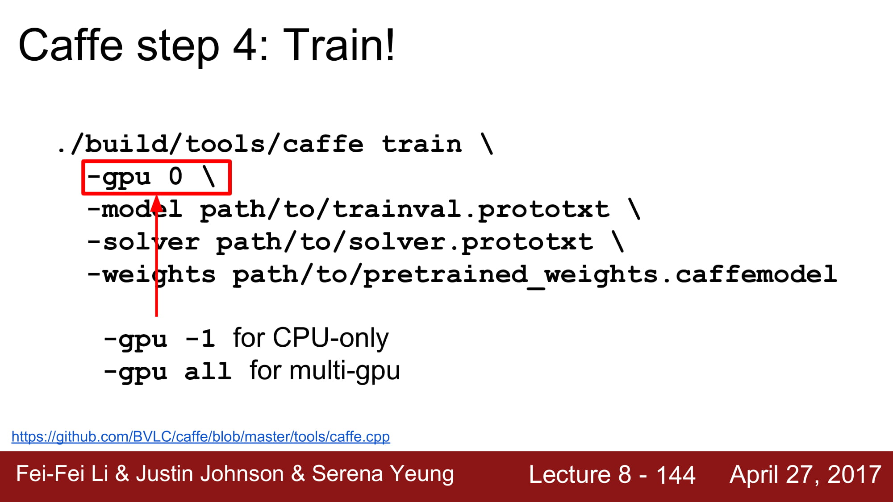

위와같이 script를 실행해서 train한다.

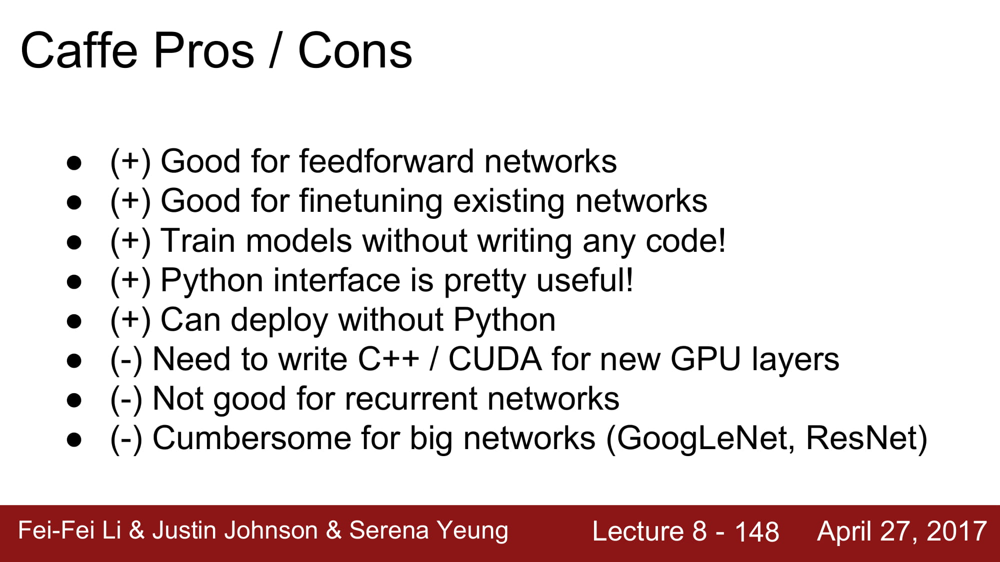

Caffe는 C++ 코드를 읽어야한다는 큰 부담이 있고, CUDA를 위해서는 GPU layer가 필요하다는 단점이 있다.

또한 recurrent layer들을 사용하기에는 부적합하다.

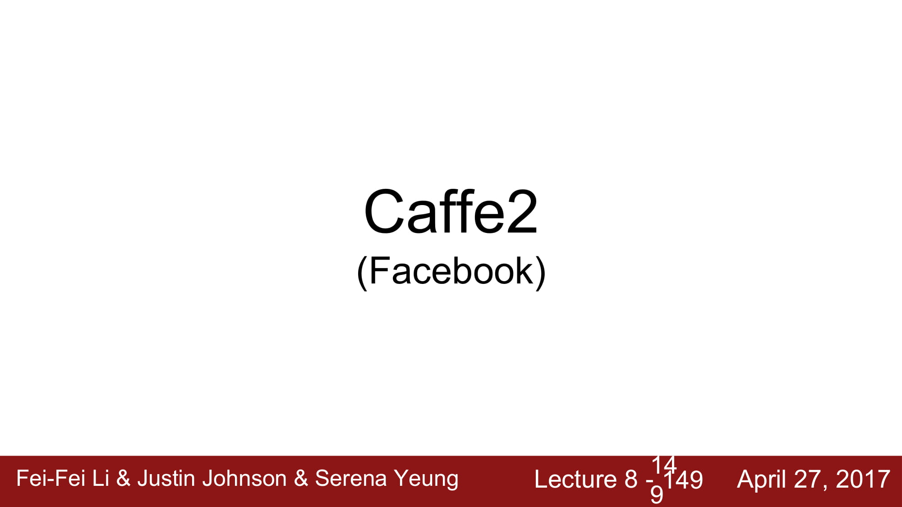

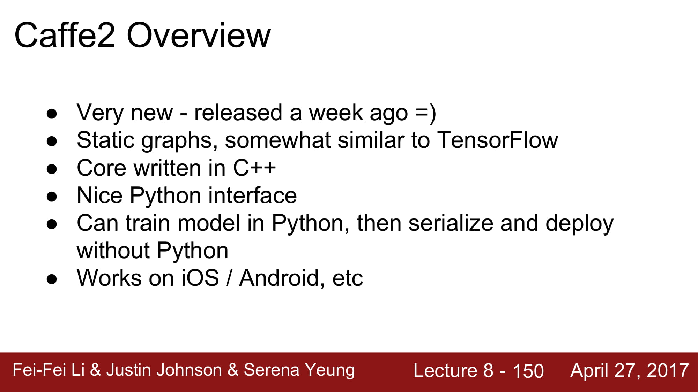

static graph를 가지고, tensorflow와 유사하다. core는 c++로 구현되어있다.

python interface를 가지고, iOS, android에서도 작동할 수 있다.

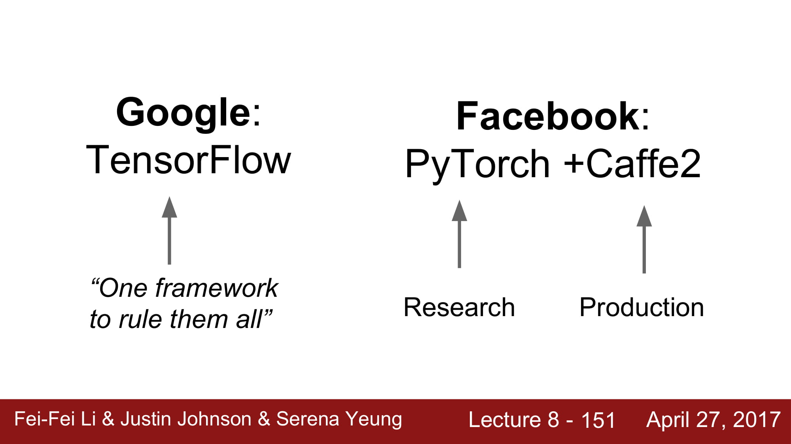

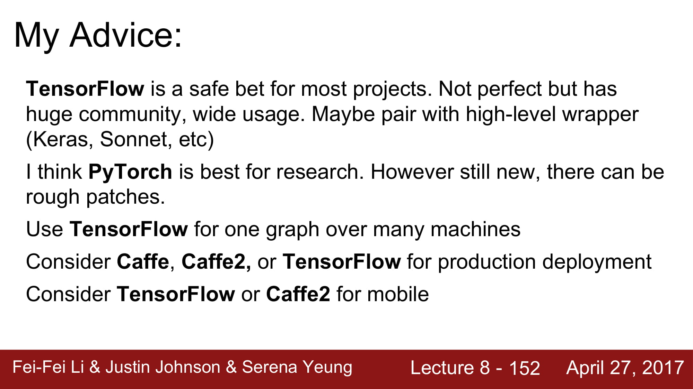

최종적으로는, static graph라는 단점이 tensorflow의 최대 단점이다. 

tensorflow의 장점은, research, production모두 커버 가능하다는 것이다.

pytorch는 research용으로는 좋지만, production용으론 별로다.

따라서 tensorflow 2.0을 배우면 될거같다.