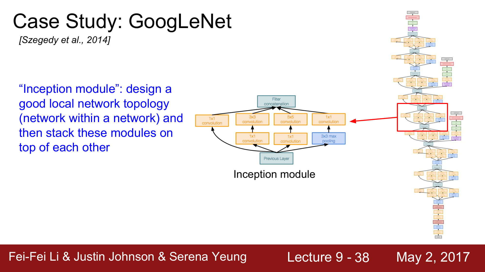

# cs231n Lecture 9-1 CNN Architectures

9강에서는 여러가지 CNN Architecture들에 대해 공부합니다.

AlexNet은 Conv layer -> Max pooling -> normalization  순서로 되어있습니다.
이 Normalization은 지금은 잘 사용하지않는 방식입니다.

Input image 가 227 x 227 x 3이라면,
Conv1 의 parameter수는 몇 일까요?

일단 output size 를 계산해보면 (input size - filterSize)/stride + 1 이므로 55가 됩니다.

자 원래 input 이 3차원이였고, filter 의 수 는 96 개 였으니, 최종 output size 는 [55 x 55 x 96] 이 됩니다

그럼 parameter 의 수 는 몇 게 일까요?
11 *11 * 3 이라는 filter 가 96 개 있으므로 34848.. 대략 35k 정도 됩니다.

Pooling layer 는 stride 가 2  이고 filter size 가 3*3 이였으므로 output volume size 는 27이 됩니다.

그럼 Pooling layer의 parameter 수 는 몇게 일까요?

놀랍게도 0개 입니다. Pooling 의 경우 단순히 큰 값을 뽑는 연산이기 때문에 학습할 parameter가 필요 없는것이죠.

이와같은 방식을 계속 진행하면 해당 layer 가 얼마만큼 메모리를 먹는지, 얼마나 사이즈가 큰지, Parameter가 몇게인지 등을 계산할 수 있습니다.

AlexNet의 특징은
	- ReLu의 첫 사용
	- 특이한 Normalization layer
	- data augmentation을 많이 사용함
	- drop out 사용
	- mini-batch 방식 사용
	- Optimizer는 SGD 방식에 Momentum을 사용함
	- learning rate 는 1e-2 로 하였고, val accuracy 가 증가하지 않는 지점에서 점차 줄임
	- L2 Weight decay방식을 사용
	- 7 개의 CNN 을 앙상블함

이 당시 사용헀던 그래픽 카드가 gtx950 라서 절반을 나눠서 다른 gpu에서 학습한다고 한다.

1.2.4,5 layer는 각각 gpu에서만 입력을 받습니다. Feature map을 공유하지않기 때문이죠.

하지만 3,6,7,8 layer는 feature map을 공유하기때문에 gpu끼리 통신이 필요합니다.

AlexNet은 처음으로 CNN base 을 image net 에 적용한 모델입니다.

# cs231n Lecture 9-2 CNN Architectures

더 깊은 network 들인 VGG. GoogleNet에 대해 알아봅시다.

VGG 는 작은 filter 를 적용하고, 더 많은 layer를 사용하였습니다.

그럼 왜 작은 filter 를 사용했을까요?

3x3 conv (stride 1) 을 사용하게되면 7x7 conv layer를 사용한것과 같은 효과가 난다고 합니다.
3x3 을 한번 conv 에 태운 결과에 3x3 을 한번 더, 그 결과에 한번 더 3x3을 또 태우면
7x7 conv layer에 태운 결과와 같다고 한다.

그럼 왜 이렇게 작은 레이어를 겹쳐서 큰 레이어의 효과를 얻게 하려는 것일까?
바로 계산량이 더 적기 때문이다. 결과는 똑같은데!

단순 계산을 보면 엄청난 양의 메모리와 파라미터가 필요하다는 것을 알 수 있다.
또한 오직 forward만 고려한것이고, 첫 FC layer의 parameter가 1억개 인것도 놀랍다.

문제는 forward만 96M 의 메모리를 필요하고, 이 메모리가 `이미지 1개` 당 96M가 필요하다 라는것이 단점이다.

대부분의 Memory는 초기 Conv layer가 차지하고
대부분의 parameter 는 후반부의 FC layer가 차지하고있는 구조이다.

# cs231n Lecture 9-3 CNN Architectures

다음은 GoogleNet이다.
5M 개의 엄청나게 적은 파라미터 수 를 자랑하고, Deep 한 layer 수(22개) 를 자랑한다.
파라미터수를 줄이기 위해서 FC layer가 없습니다,

Inception Module을 사용했다.
Network 내부에 network를 넣는 구조라 해서 inception module이라고 부른다 합니다.

4가지 컨셉을 concat 합니다. 이렇게 되면 4가지의 local 한 정보들을 모두 파악할 수 있스비다.
병렬 처리를 한다면 매우 좋겟죠.

하지만 이것은 Naive한 방식입니다.
이 방식의 문제는 `계산량이 너무 많다` 입니다.

1x1	conv 는 일종의 `dense layer`역활을 하게 됩니다.
dense layer 는 차원 축소를 해주는 좋은 기능을 가지고 있죠. 차원 축소는 데이터를 거의 손실없이 필요한 데이터만 남겨주는 좋은 기술입니다.

만약 dense layer 의 크기가 N 이라면, 1x1 conv layer로 치면 filter 가 N개인 1x1 conv layer 와 같은 역활을 합니다.

자 그럼 dense layer 와 어떤것이 다를까요?
저도 자세하게는 모르겠지만, 주변 분들의 말에 따르면 dense layer는 1차원으로 펴줘야 가능하지만
3d 환경이 많은 곳에서 바로 적용할 수 있는게 바로 1x1 conv layer라고 합니다.

3x3, 5x5 layer는 zero padding 을 사용하여 shape 이 변경되지 않고, depth만 변경됩니다.
Pooling layer는 1 stride를 사용해서 같은 shape으로 나옵니다. 이 padding은 주변 영역에서 가장 좋은 것들만 뽑아주는 역활을 하게 됩니다. 일종의 Blur가 생긴다고 합니다.

최종 concatenation을 하면 depth 는 256 에서 672로 증가하였습니다.
Local net을 많이 태우면 태울수록 점점 size 가 커지는 결과가 나옵니다.

Conv layer의 계산량은 854M… 너무 거대합니다.
Layer 가 깊어질수록 계속 증가할것입니다.

여기서 다시 1x1 conv layer를 사용합니다.
Bottleneck layer라고 해서, 입력에서 conv layer로 가기 전에, 한번 차원축소를 거치고 나서 conv layer로 들어가는것입니다.

Inception module 의 차원축소 는 위와같이 이루어집니다.

빨강색 박스로 보이는 layer 들이 bottleneck layer들이고, 1x1 conv layer로 이루어져있습니다.

계산량을 다시 계산해보면 358M 로 엄청 줄었습니다!

초기의 stem network 는 평범한 Conv - pool - conv - pool layer 입니다.

그 이후에는 위의 inception layer를 쌓아올리는것입니다.

마지막에는 FC layer 대신 global average pooling 을 하게 됩니다.
최종적으로 28x28x1000 만큼으로 데이터가 왔다면, 각각 차원들에 대해서 average pooling 을 해서 1x1x1000으로 만드는것이다.
[Global Average Pooling Layers for Object Localization](https://alexisbcook.github.io/2017/global-average-pooling-layers-for-object-localization/)

FC layer가 가지는 태생적인 문제점인, 파라미터를 너무 많이 차지하고, 위치 정보가 사라지며, 오버피팅이 일어나며, input 차원이 하나로 고정된다는것이
모두 해결된다. 또한 오버피팅 또한 줄어들게된다.

하지만 global average pooling을 사용할때는 google net처럼 feature extraction을 이미 앞단에서 효과적으로 진행 하였다는 가정이 있어야만한다.
FC layer가 해주던 최종 feature extraction가 없으니 CNN이 일을 그만큼 더 해줘야한다는것이다.

이 옆으로 튀어나와있는 친구들은 Auxiliary classification 이라고 합니다.
Avg pooling - 1x1 conv - FC layer - FC layer - Softmax 를 걸쳐서 자체적으로 분류를 한번 하고, Loss 까지 구합니다.

여기서 Loss 를 구한다는건 어떤 의미일까요?
바로 여기서 `back propagation`이 한번 더 흐르기 시작한다는것이 됩니다.
왜 back prop을 network의 맨 뒤에서만 흘리는게 아니라 중간에서도 흐르게 만드는걸까요?

답은 `Network가 너무 깊어서` 입니다.

gradient가 너무 깊은 네트워크를 타고 내려오면서 gradient vanishing 할가능성이 있으므로, 중간에서 추가 gradient를 흘려주는것입니다.
학습을 도와주게되죠.

최종적으로 정리해보자면
22 layer이고 inception module을 가지며 FC layer 가 없다.
gradient vanishing 을 막기 위해 중간에 추가 gradient 를 생성해주는 장치가 있다.

# cs231n Lecture 9-4 CNN Architectures

다음에는 그 유명한 ResNet을 살펴봅시다.

ResNet은 무려 `152 layer` 를 가진 network 입니다.
이게 어떻게 가능하지? `gradient vanishing` 이 무조건 발생할꺼같은데? 라고 생각하시면 맞습니다. 평범한 layer라면 무조건 그러겠죠.
그래서 ResNet은 `residual connection`을 사용합니다.

layer가 깊게 쌓인다 해서 무조건 좋게 학습이 되는것은 아닙니다.

일반적으로 layer가 깊이 쌓일수록 over fitting이 많이 일어난다고 합니다.
근데 보면 training error도 높습니다. 그냥 성능이 안좋은거네요.

최적화의 문제 라고 가설을 새워봅시다. 깊은 모델은 최적화 하기 힘드니 학습이 힘듭니다.

`그러나 적어도 깊은 network 는 얕은 network 보단 성능이 좋거나 같아야 하지 않을까요?` 
적어도 layer를 그대로 카피하면서 똑같은 레이어를 붙이면서 깊게 만들면, 같은 성능이 나와야 하지 않을까?
라는 생각에서 resnet은 시작됩니다.

몇가지 layer 뒤로 입력값을 그대로 보내는 identity mapping 을 하는것입니다.

Residual mapping을 통해 기존 H(x) 와 x 의 차이가 최소한으로 되게 학습하는게 F(x)의 역활이 됩니다.
솔직히 ResNet한번에 이해 못하겠고 다음주에 다시 공부해봐야할꺼같습니다. ㅠㅠ…

전체 아키텍쳐는 2개의 3x3 conv layer를 포함하는 Residual block을 쌓는것입니다. 

주기적으로 conv layer의 filter 수를 2배씩 늘려준다고 합니다.

맨 처음에 추가적인 Conv layer가 존재한다고 합니다.

최종적으로는 FC layer는 없고 global average pooling 을 하게 됩니다. FC layer 1000은 output class 를 위한것이라 합니다.

GoogleNet과 마찬가지로 더 Deeper 해지기 위해 1x1 Conv layer 인 bottleneck layer 를 추가했습니다.

차원을 축소시킨뒤 operation 을 진행하고 다시 같은 크기로 늘립니다.
적은 차원에서 효율적으로 정보를 파악하기 위함, 비선형 함수를 효과적으로 만들기 위함등의 효과가 있을거같은데
자세하게는 ResNet을 공부하면서 다시 파악해야할꺼같습니다.

실제 ResNet은 각 Conv layer뒤에는 batch normalization이 있고, drop out을 사용하지 않았다고 합니다.
뒤에 성능 비교가 나오는데 이미 오래전것(2017) 버전이라 스킵하겠습니다. 
ResNet과 inception을 동시에 사용하면 성능이 좋아진다 정도 알면 될거같습니다.

# cs231n Lecture 9-5 CNN Architectures

Forward pass time & power consumption에 대한 그래프인데,
FC layer가 크게 있을 수록 안좋은 결과를 보여줍니다.

다른 network들을 잠시 훑어봅시다.

Inception layer 와 같은 개념입니다. network는 작은 network의 집합으로 구성된다 정도로 이해하면되겠네요. GoogleNet과 유사합니다.

2016 ResNet에 변화가 생겼습니다.
ReLu를 태우고 보내지 않고, F(x) 단에서 모든 operation을 담당하게 구조가 바뀌었습니다.
이로써 propagation을 할때 direct path하게 정보를 내려줄 수 있게 되었다 합니다.

기존 ResNet은 더 깊게 깊게 가기 위해 노력했다면, Wide ResNet은 더 넓게 가보는 실험이였습니다.
하나 하나의 Residual 을 학습하는데 더 노력하겠다 로 이해하면 될거같네요.
실제로 더 적은 layer로 학습이 가능하다는것, 이로인해 병렬처리가 쉬워진다는 장점이 있다고 합니다.

나머지 network들은… 추후에 다시 정리해보도록 하겠습니다.

최종적으로, 여러가지 관점이 있었지만, 이 관점들이 풀고자 했던 핵심적인 이야기는
	- 어떻게 효과적으로 좋은 비선형 함수를 만들 수 있을까?
	- 어떻게 하면 gradient vanishing 을 해결할까?
정도로 정리될 수 있을꺼같습니다.

#study/cs231n

