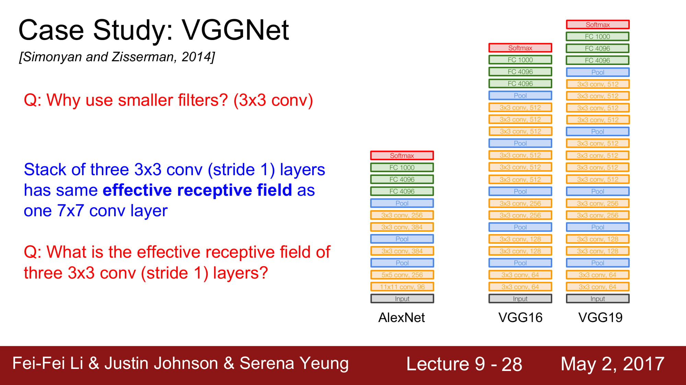
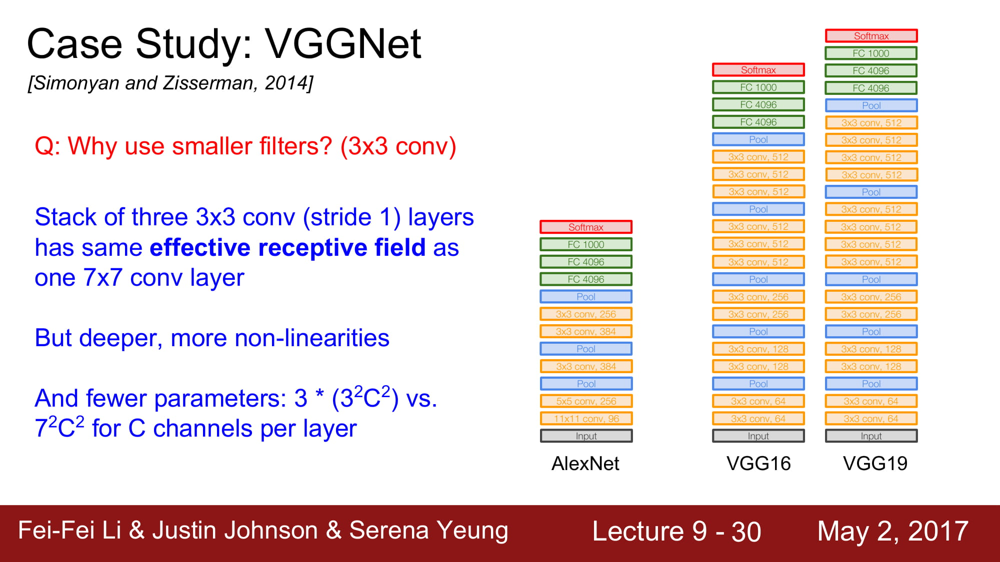
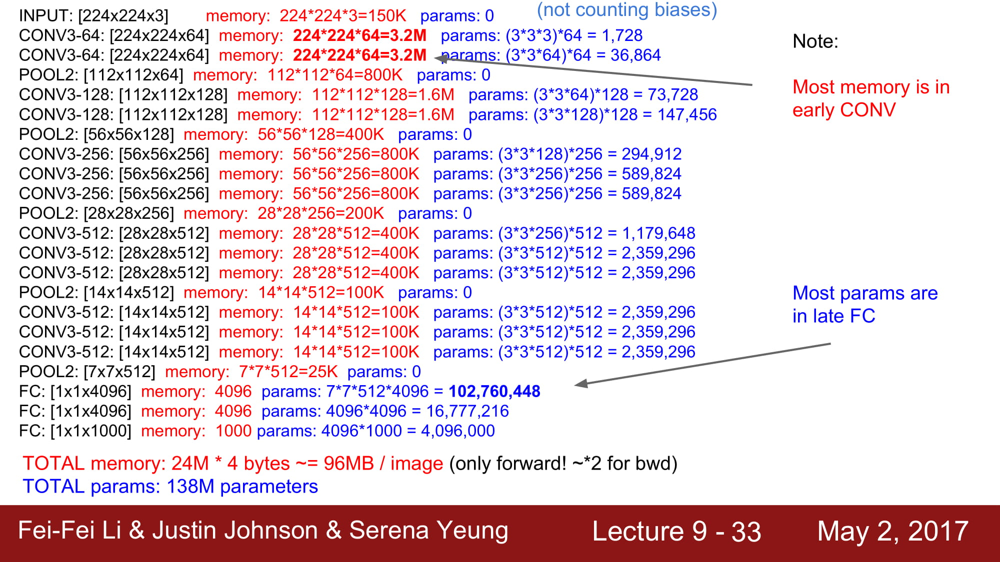

# cs231n Lecture 9-2 CNN Architectures

더 깊은 network 들인 VGG. GoogleNet에 대해 알아봅시다.

VGG 는 작은 filter 를 적용하고, 더 많은 layer를 사용하였습니다.

그럼 왜 작은 filter 를 사용했을까요?

3x3 conv (stride 1) 을 사용하게되면 7x7 conv layer를 사용한것과 같은 효과가 난다고 합니다.
3x3 을 한번 conv 에 태운 결과에 3x3 을 한번 더, 그 결과에 한번 더 3x3을 또 태우면
7x7 conv layer에 태운 결과와 같다고 한다.

그럼 왜 이렇게 작은 레이어를 겹쳐서 큰 레이어의 효과를 얻게 하려는 것일까?
바로 계산량이 더 적기 때문이다. 결과는 똑같은데!

단순 계산을 보면 엄청난 양의 메모리와 파라미터가 필요하다는 것을 알 수 있다.
또한 오직 forward만 고려한것이고, 첫 FC layer의 parameter가 1억개 인것도 놀랍다.

문제는 forward만 96M 의 메모리를 필요하고, 이 메모리가 `이미지 1개` 당 96M가 필요하다 라는것이 단점이다.

대부분의 Memory는 초기 Conv layer가 차지하고
대부분의 parameter 는 후반부의 FC layer가 차지하고있는 구조이다.

