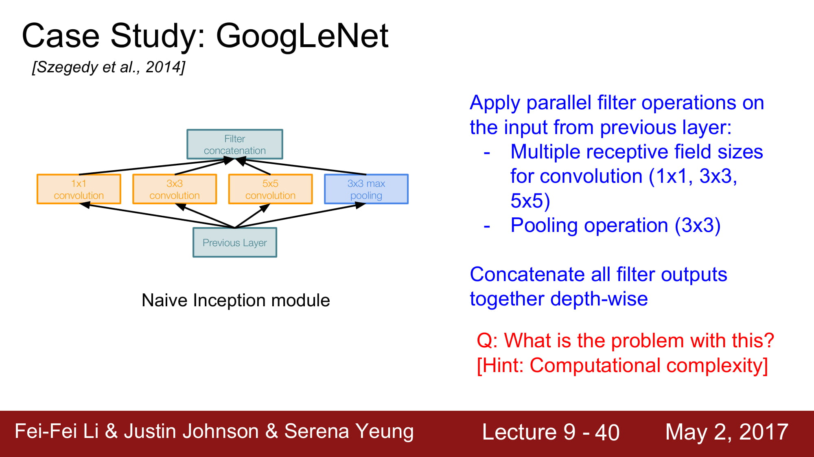
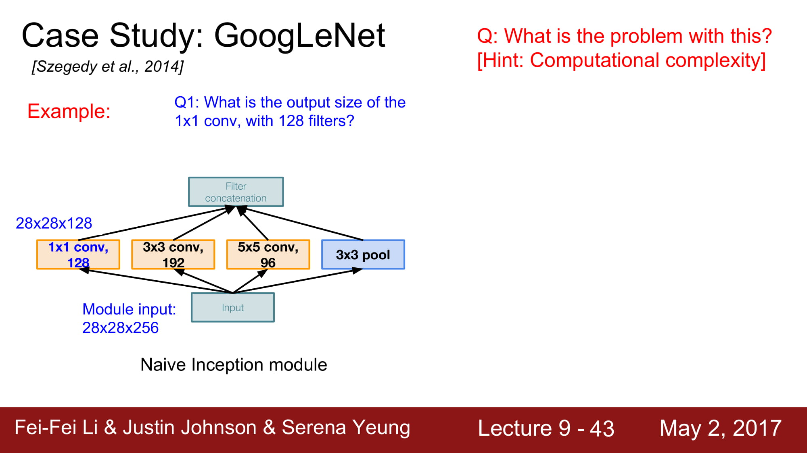
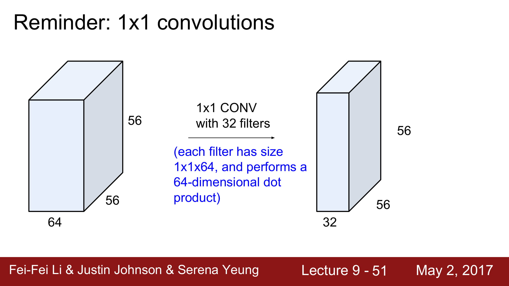
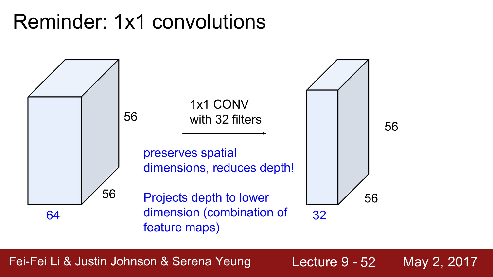
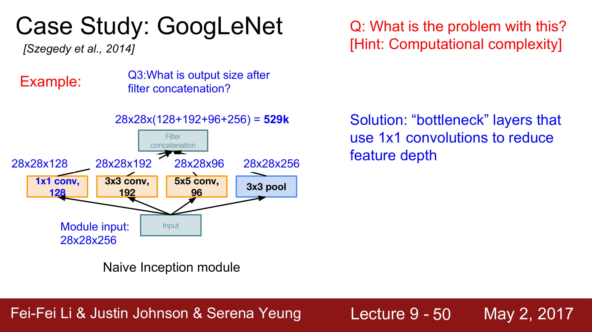
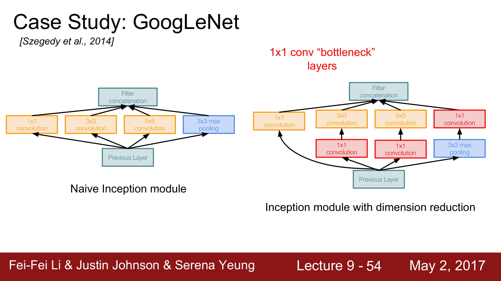
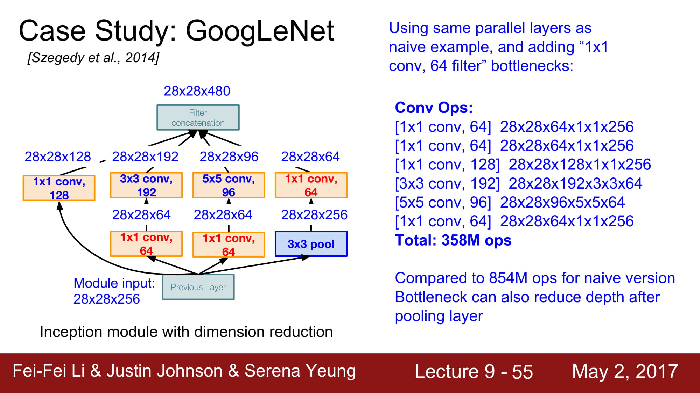
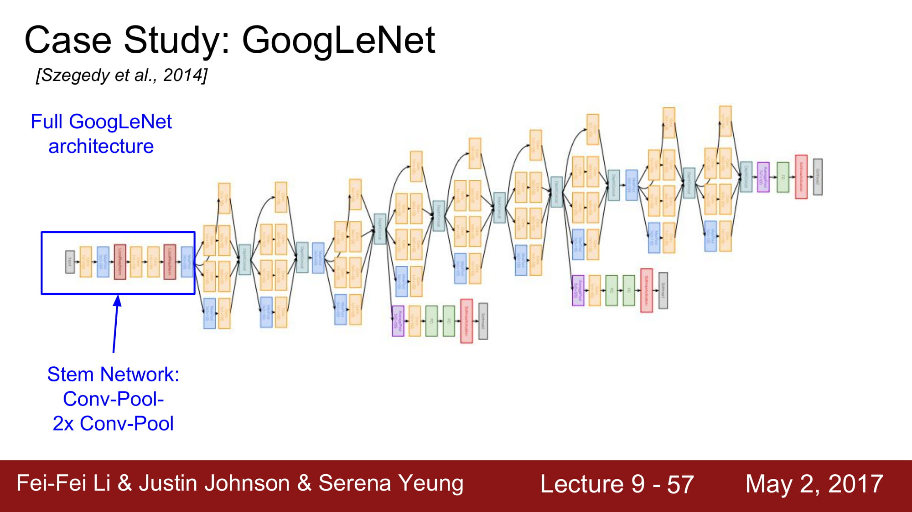
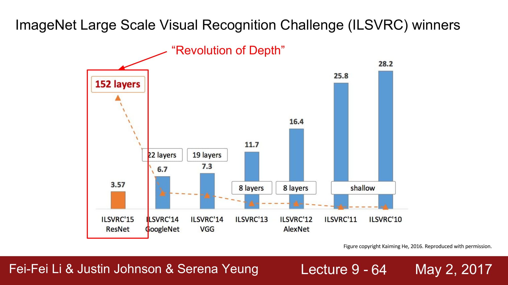

# cs231n Lecture 9-3 CNN Architectures

다음은 GoogleNet이다.
5M 개의 엄청나게 적은 파라미터 수 를 자랑하고, Deep 한 layer 수(22개) 를 자랑한다.
파라미터수를 줄이기 위해서 FC layer가 없습니다,

Inception Module을 사용했다.
Network 내부에 network를 넣는 구조라 해서 inception module이라고 부른다 합니다.

4가지 컨셉을 concat 합니다. 이렇게 되면 4가지의 local 한 정보들을 모두 파악할 수 있스비다.
병렬 처리를 한다면 매우 좋겟죠.

하지만 이것은 Naive한 방식입니다.
이 방식의 문제는 `계산량이 너무 많다` 입니다.

1x1	conv 는 일종의 `dense layer`역활을 하게 됩니다.
dense layer 는 차원 축소를 해주는 좋은 기능을 가지고 있죠. 차원 축소는 데이터를 거의 손실없이 필요한 데이터만 남겨주는 좋은 기술입니다.

만약 dense layer 의 크기가 N 이라면, 1x1 conv layer로 치면 filter 가 N개인 1x1 conv layer 와 같은 역활을 합니다.

자 그럼 dense layer 와 어떤것이 다를까요?
저도 자세하게는 모르겠지만, 주변 분들의 말에 따르면 dense layer는 1차원으로 펴줘야 가능하지만
3d 환경이 많은 곳에서 바로 적용할 수 있는게 바로 1x1 conv layer라고 합니다.

3x3, 5x5 layer는 zero padding 을 사용하여 shape 이 변경되지 않고, depth만 변경됩니다.
Pooling layer는 1 stride를 사용해서 같은 shape으로 나옵니다. 이 padding은 주변 영역에서 가장 좋은 것들만 뽑아주는 역활을 하게 됩니다. 일종의 Blur가 생긴다고 합니다.

최종 concatenation을 하면 depth 는 256 에서 672로 증가하였습니다.
Local net을 많이 태우면 태울수록 점점 size 가 커지는 결과가 나옵니다.

Conv layer의 계산량은 854M… 너무 거대합니다.
Layer 가 깊어질수록 계속 증가할것입니다.

여기서 다시 1x1 conv layer를 사용합니다.
Bottleneck layer라고 해서, 입력에서 conv layer로 가기 전에, 한번 차원축소를 거치고 나서 conv layer로 들어가는것입니다.

Inception module 의 차원축소 는 위와같이 이루어집니다.

빨강색 박스로 보이는 layer 들이 bottleneck layer들이고, 1x1 conv layer로 이루어져있습니다.

계산량을 다시 계산해보면 358M 로 엄청 줄었습니다!

초기의 stem network 는 평범한 Conv - pool - conv - pool layer 입니다.

그 이후에는 위의 inception layer를 쌓아올리는것입니다.

마지막에는 FC layer 대신 global average pooling 을 하게 됩니다.
최종적으로 28x28x1000 만큼으로 데이터가 왔다면, 각각 차원들에 대해서 average pooling 을 해서 1x1x1000으로 만드는것이다.
[Global Average Pooling Layers for Object Localization](https://alexisbcook.github.io/2017/global-average-pooling-layers-for-object-localization/)

FC layer가 가지는 태생적인 문제점인, 파라미터를 너무 많이 차지하고, 위치 정보가 사라지며, 오버피팅이 일어나며, input 차원이 하나로 고정된다는것이
모두 해결된다. 또한 오버피팅 또한 줄어들게된다.

하지만 global average pooling을 사용할때는 google net처럼 feature extraction을 이미 앞단에서 효과적으로 진행 하였다는 가정이 있어야만한다.
FC layer가 해주던 최종 feature extraction가 없으니 CNN이 일을 그만큼 더 해줘야한다는것이다.

이 옆으로 튀어나와있는 친구들은 Auxiliary classification 이라고 합니다.
Avg pooling - 1x1 conv - FC layer - FC layer - Softmax 를 걸쳐서 자체적으로 분류를 한번 하고, Loss 까지 구합니다.

여기서 Loss 를 구한다는건 어떤 의미일까요?
바로 여기서 `back propagation`이 한번 더 흐르기 시작한다는것이 됩니다.
왜 back prop을 network의 맨 뒤에서만 흘리는게 아니라 중간에서도 흐르게 만드는걸까요?

답은 `Network가 너무 깊어서` 입니다.

gradient가 너무 깊은 네트워크를 타고 내려오면서 gradient vanishing 할가능성이 있으므로, 중간에서 추가 gradient를 흘려주는것입니다.
학습을 도와주게되죠.

최종적으로 정리해보자면
22 layer이고 inception module을 가지며 FC layer 가 없다.
gradient vanishing 을 막기 위해 중간에 추가 gradient 를 생성해주는 장치가 있다.

