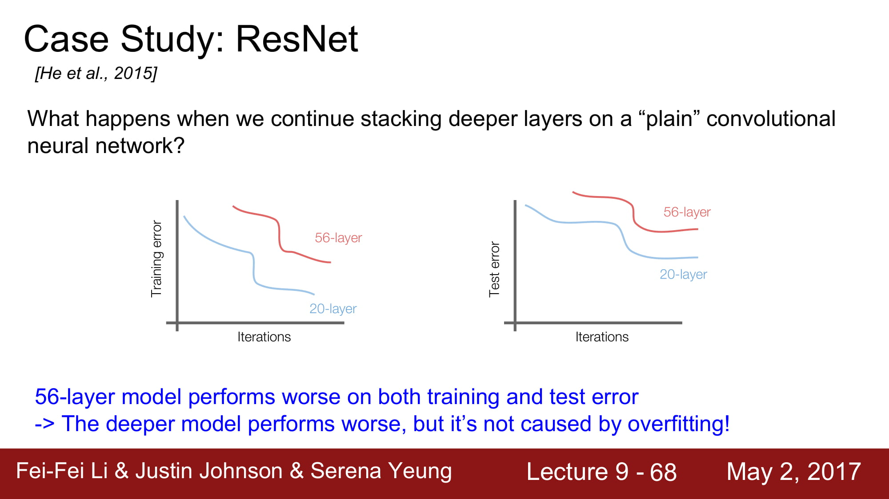
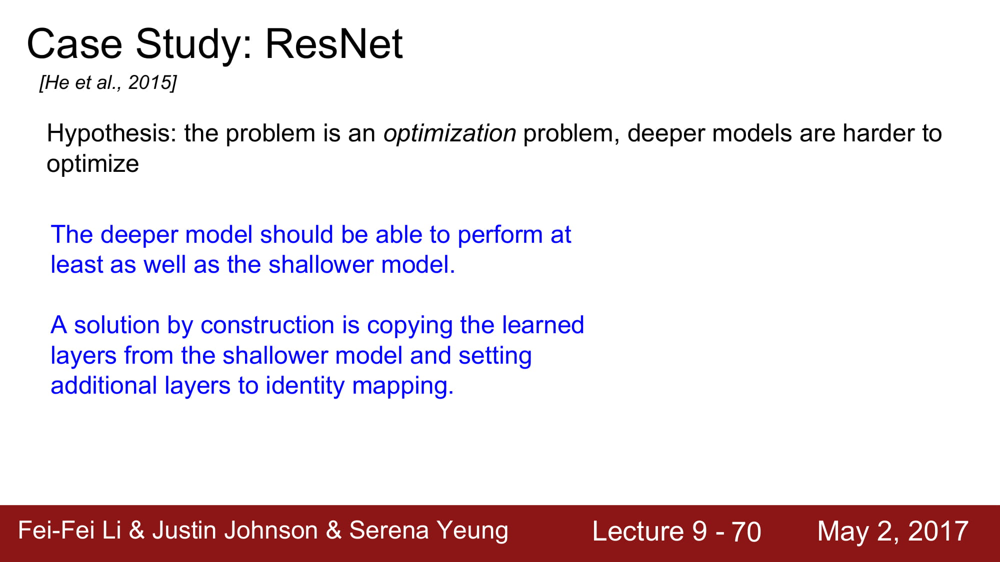
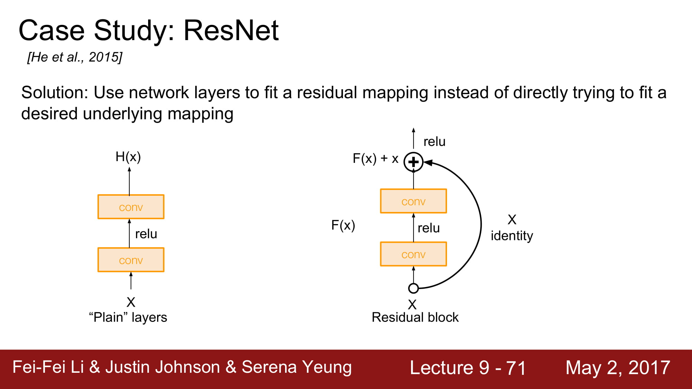
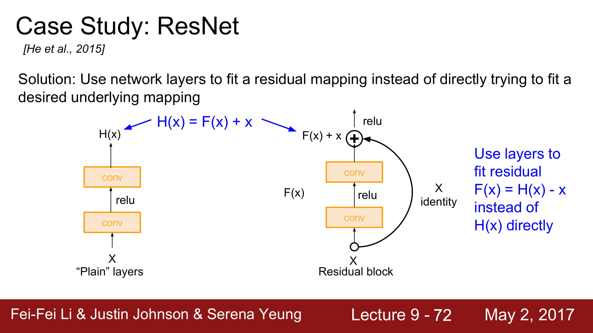
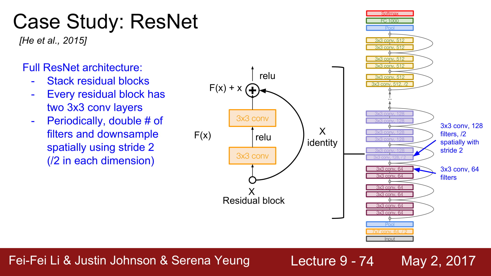
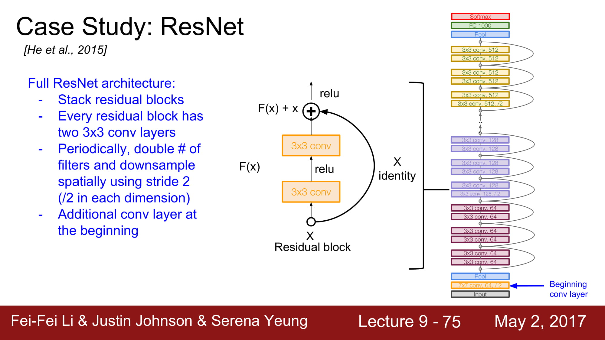
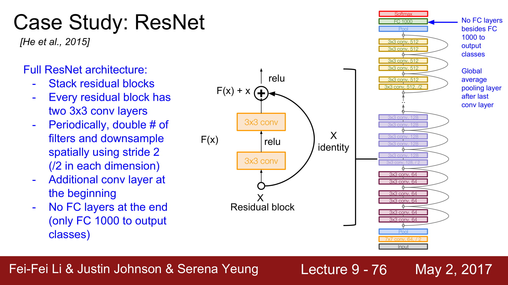
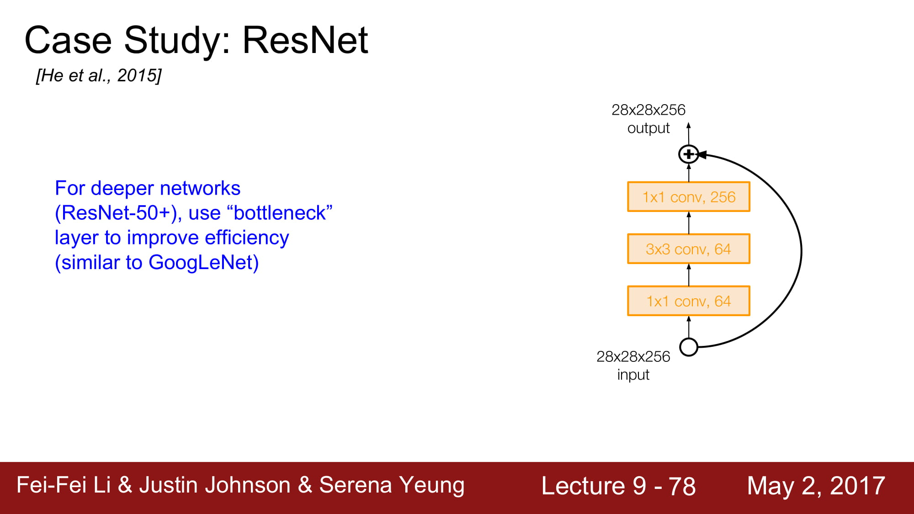

# cs231n Lecture 9-4 CNN Architectures

다음에는 그 유명한 ResNet을 살펴봅시다.

ResNet은 무려 `152 layer` 를 가진 network 입니다.
이게 어떻게 가능하지? `gradient vanishing` 이 무조건 발생할꺼같은데? 라고 생각하시면 맞습니다. 평범한 layer라면 무조건 그러겠죠.
그래서 ResNet은 `residual connection`을 사용합니다.

layer가 깊게 쌓인다 해서 무조건 좋게 학습이 되는것은 아닙니다.

일반적으로 layer가 깊이 쌓일수록 over fitting이 많이 일어난다고 합니다.
근데 보면 training error도 높습니다. 그냥 성능이 안좋은거네요.

최적화의 문제 라고 가설을 새워봅시다. 깊은 모델은 최적화 하기 힘드니 학습이 힘듭니다.

`그러나 적어도 깊은 network 는 얕은 network 보단 성능이 좋거나 같아야 하지 않을까요?` 
적어도 layer를 그대로 카피하면서 똑같은 레이어를 붙이면서 깊게 만들면, 같은 성능이 나와야 하지 않을까?
라는 생각에서 resnet은 시작됩니다.

몇가지 layer 뒤로 입력값을 그대로 보내는 identity mapping 을 하는것입니다.

Residual mapping을 통해 기존 H(x) 와 x 의 차이가 최소한으로 되게 학습하는게 F(x)의 역활이 됩니다.
솔직히 ResNet한번에 이해 못하겠고 다음주에 다시 공부해봐야할꺼같습니다. ㅠㅠ…

전체 아키텍쳐는 2개의 3x3 conv layer를 포함하는 Residual block을 쌓는것입니다. 

주기적으로 conv layer의 filter 수를 2배씩 늘려준다고 합니다.

맨 처음에 추가적인 Conv layer가 존재한다고 합니다.

최종적으로는 FC layer는 없고 global average pooling 을 하게 됩니다. FC layer 1000은 output class 를 위한것이라 합니다.

GoogleNet과 마찬가지로 더 Deeper 해지기 위해 1x1 Conv layer 인 bottleneck layer 를 추가했습니다.

차원을 축소시킨뒤 operation 을 진행하고 다시 같은 크기로 늘립니다.
적은 차원에서 효율적으로 정보를 파악하기 위함, 비선형 함수를 효과적으로 만들기 위함등의 효과가 있을거같은데
자세하게는 ResNet을 공부하면서 다시 파악해야할꺼같습니다.

실제 ResNet은 각 Conv layer뒤에는 batch normalization이 있고, drop out을 사용하지 않았다고 합니다.
뒤에 성능 비교가 나오는데 이미 오래전것(2017) 버전이라 스킵하겠습니다. 
ResNet과 inception을 동시에 사용하면 성능이 좋아진다 정도 알면 될거같습니다.

