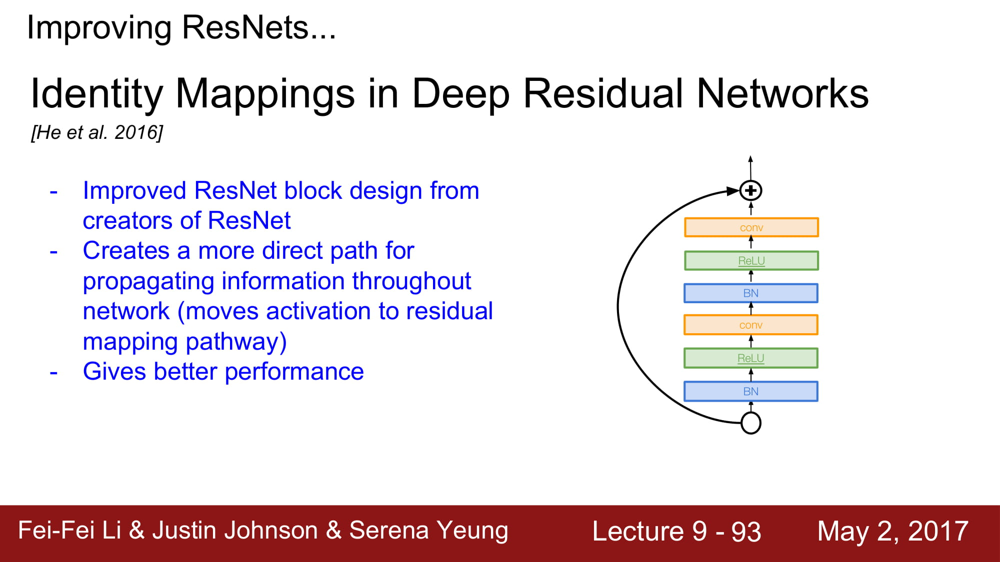
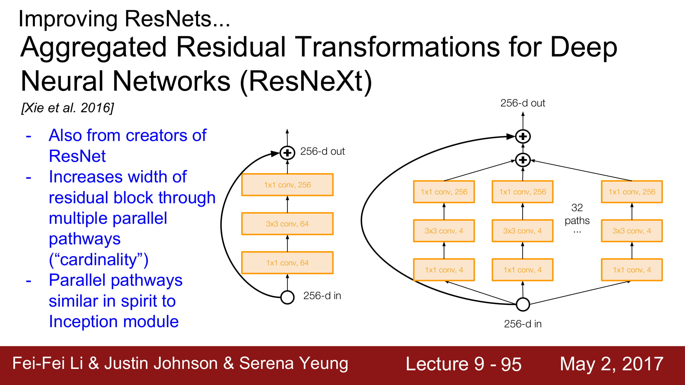
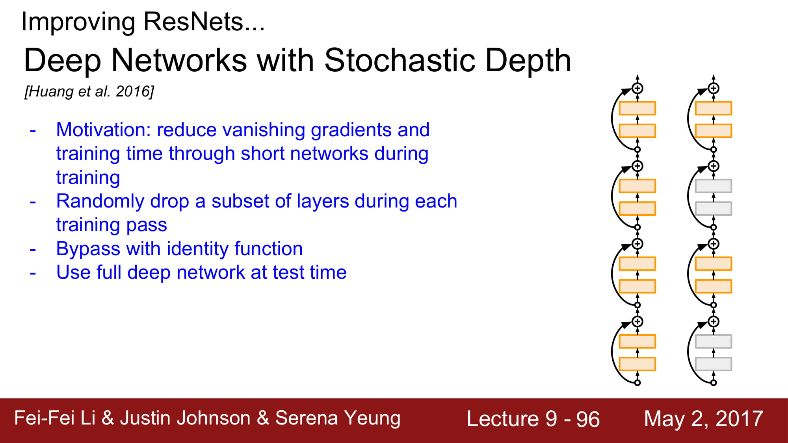
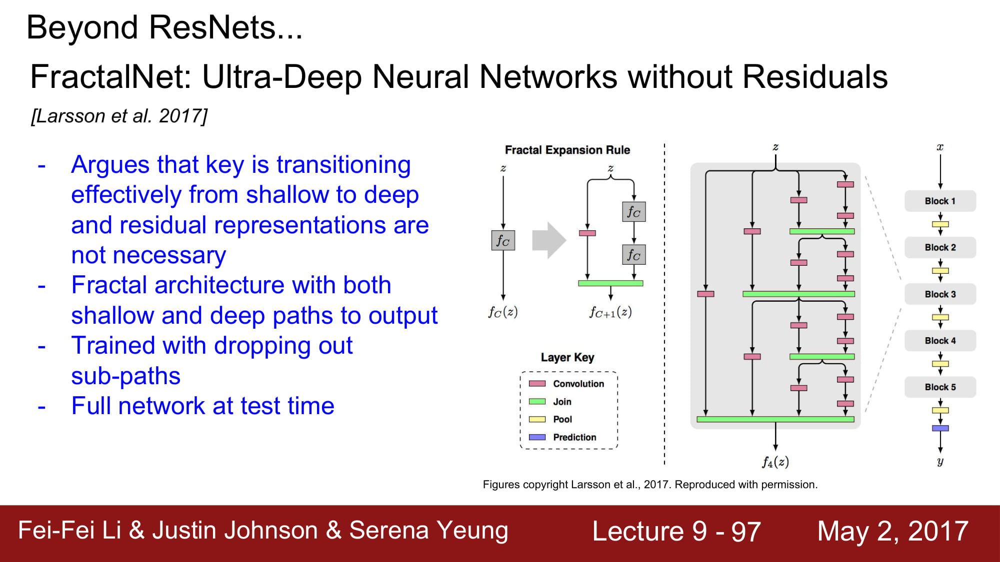
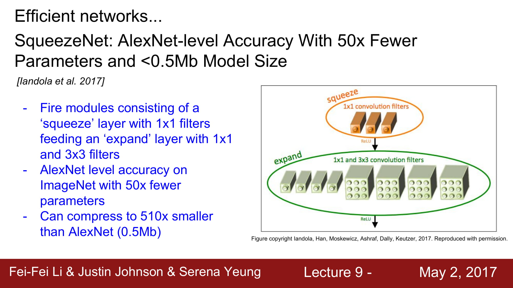

# cs231n Lecture 9-5 CNN Architectures

Forward pass time & power consumption에 대한 그래프인데,
FC layer가 크게 있을 수록 안좋은 결과를 보여줍니다.

다른 network들을 잠시 훑어봅시다.

Inception layer 와 같은 개념입니다. network는 작은 network의 집합으로 구성된다 정도로 이해하면되겠네요. GoogleNet과 유사합니다.

2016 ResNet에 변화가 생겼습니다.
ReLu를 태우고 보내지 않고, F(x) 단에서 모든 operation을 담당하게 구조가 바뀌었습니다.
이로써 propagation을 할때 direct path하게 정보를 내려줄 수 있게 되었다 합니다.

기존 ResNet은 더 깊게 깊게 가기 위해 노력했다면, Wide ResNet은 더 넓게 가보는 실험이였습니다.
하나 하나의 Residual 을 학습하는데 더 노력하겠다 로 이해하면 될거같네요.
실제로 더 적은 layer로 학습이 가능하다는것, 이로인해 병렬처리가 쉬워진다는 장점이 있다고 합니다.

나머지 network들은… 추후에 다시 정리해보도록 하겠습니다.

최종적으로, 여러가지 관점이 있었지만, 이 관점들이 풀고자 했던 핵심적인 이야기는
	- 어떻게 효과적으로 좋은 비선형 함수를 만들 수 있을까?
	- 어떻게 하면 gradient vanishing 을 해결할까?
정도로 정리될 수 있을꺼같습니다.