# cs231n lecture 6-1, Training Neural Networks

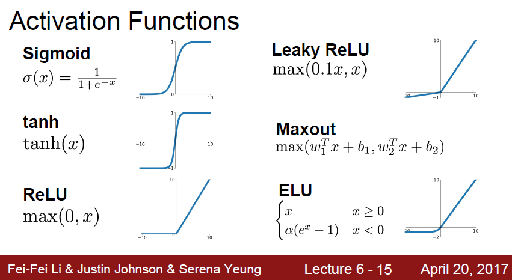


```dmarkdown
Deep learning 에는 여러가지 active function 들이 있다.
이 active function들은 non linear function으로 구성되게 된다.
```


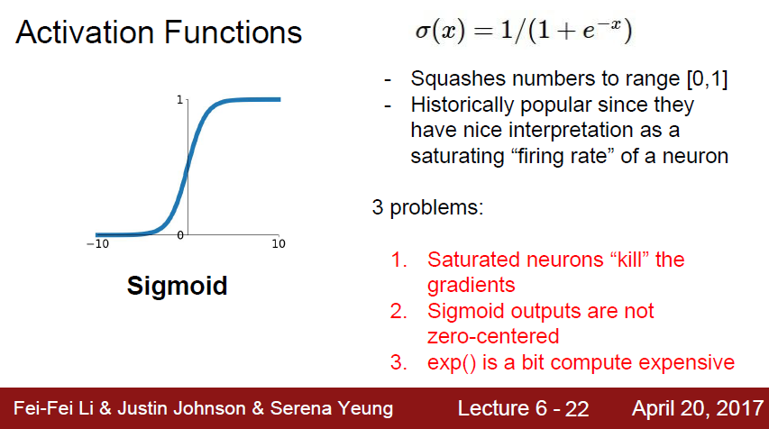


```markdown
예전에는 많이 썻던 sigmoid 함수 이다.
여기는 여러가지 문제가 있다
```


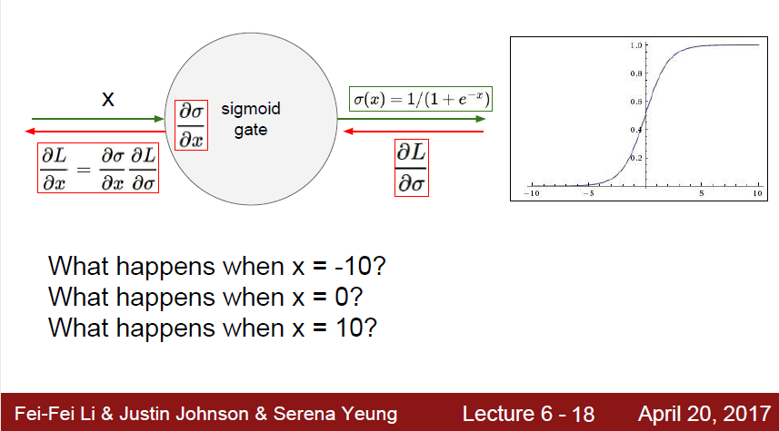


```markdown
첫 번째 문제로, back prop하는 과정에서, gradient 가 죽을 수 있다는것이다.
sigmoid 의 양,음의 극단을 보면 gradient 가 0에 수렴하는것을 볼 수 있다.
작은수에 대해서, 큰수에 대해서 영향력이 없고 뒤로갈수록 gradient 가 0으로 수렴한다는것을 알 수 있다.
또한 chain rule 에 의해 gardient 는 계속 곱해질것인데, 0에 가까운 수가 반복될수록
input 에 대한 gradient 들은 0에 수렴하여 가장 영향력이 큰 첫번째 layer 에 아무런 update 가 없어 learning 이 안될 수 있다.
```


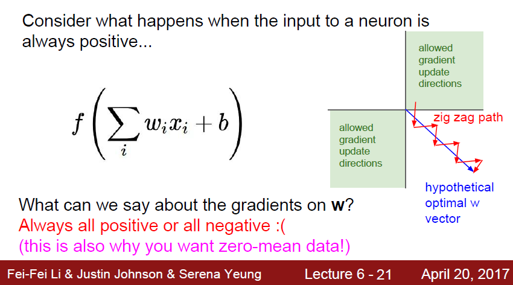


```markdown
두 번째 문제로는 sigmoid 나 zero-centerd function이 아니라는것이다.
w 에 대한 gradient 를 좌표평면에 그려보면, gradient 는 1, 3 사분면이 나오게 된다
이는 input 과 output 이 항상 positive라서 발생하는 문제이다.
여기서 이상적인 움직임이 파랑색 대각선 vector라고 한다면
이 파랑색에 접근하기위해 지그재그로 움직여서 비효율적으로 학습하게 된다.

세 번째 문제로는 exp 연산이 다른 기초 연산들에비해 컴퓨터에서 비싸다 라는것이다.
```


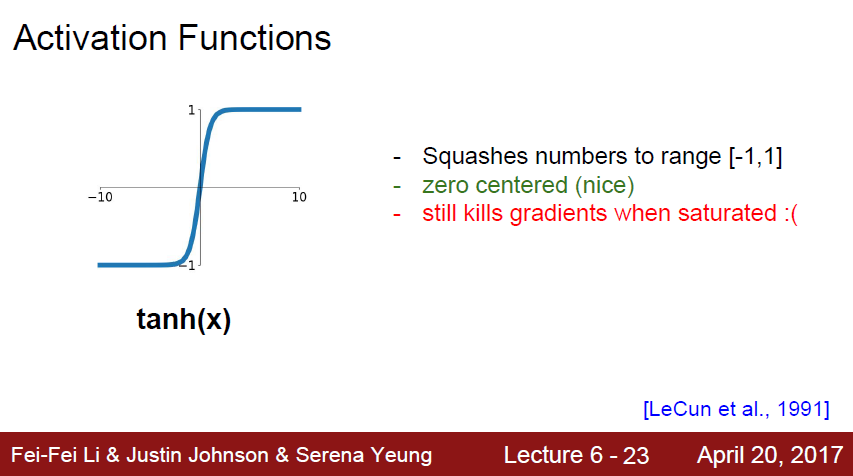


```markdown
sigmoid 의 2번째 문제인 non-linear funciton을 해결한 것이 바로 tanh 함수이다
중앙이 0에 있고 negative, positive가 존재하는것을 알 수 있다.
하지만 여전히 gradient 는 graph 의 모양때문에 0에 수렴하게될것이다(sigmoid 의 1번 문제)
gradient saturation 문제에 대해서는 여기가 잘 설명하고있는것같다.
[https://nittaku.tistory.com/267](https://nittaku.tistory.com/267)
```


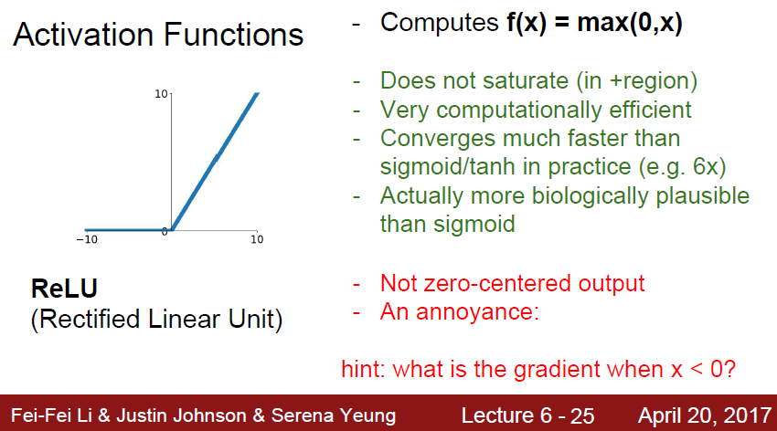


```markdown
ReLu는 f(x) = max(0, x) 꼴로 되어있다
saturate 문제가 발생하지 않고 (1사분면에서 발산!)
exp연산이 없어서 매우 연산량이 적다
이렇게 장점이 많지만
zero-centered output 이 아니다 라는 점이 있다.

```


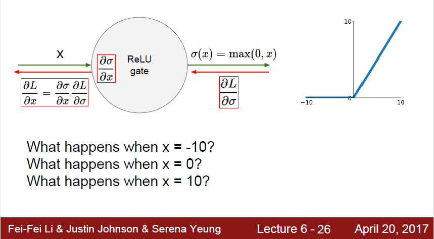


```markdown
음수일때는 gradient 가 퍼지지 않고, 0 이상일때는 saturation 문제 없이 잘 돌아가게된다.
```


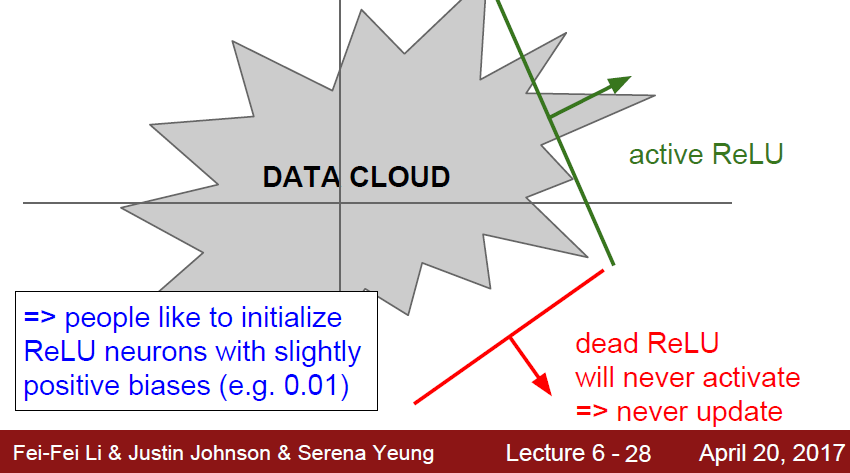


```markdown
위 사진에서도 볼 수 있듯이, 음수 구간은 gardient 가 흐르지 못하기때문에 relu가 절대 active 하지 못한다.
```

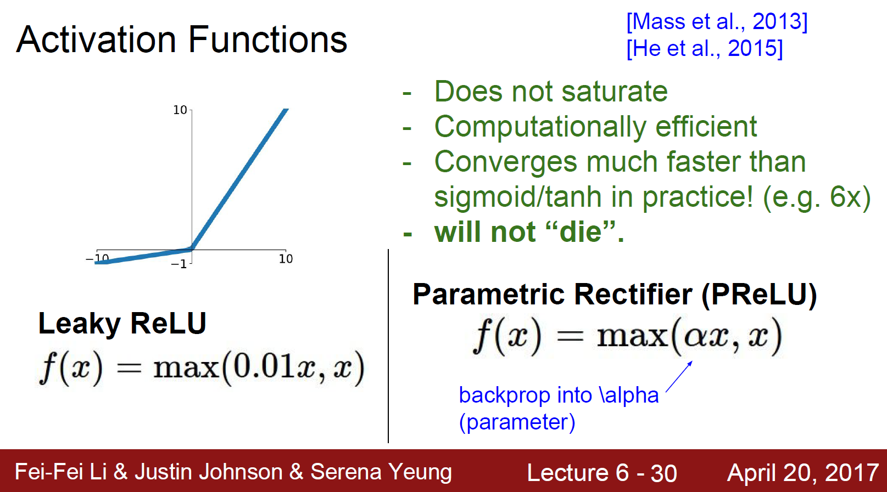


```markdown
Leaky Relu는 음수 구간에서 relu가 죽는 문제를 조금이나마 해결한것이다.
PReLu 에서 붙는 알파 계수는 back prop으로 얼마나 음수 구간에 보내줄것인가 에 대한 계수 이다.
```


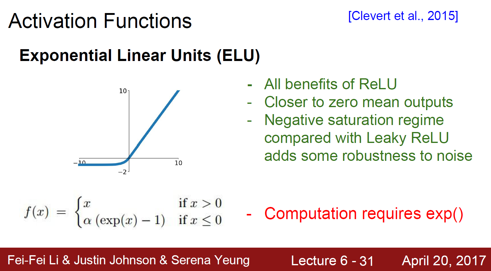


```markdown
ELU 는 ReLu의 모든 장점을 계승한다.
zero mean output을 해결하기위해 나온 Relu의 계승버전이다.
Sigmoid 의 1, 2번문제를 해결하였지만
결정적으로 exp 연산이 들어가게되어 computation cost 가 크다
```


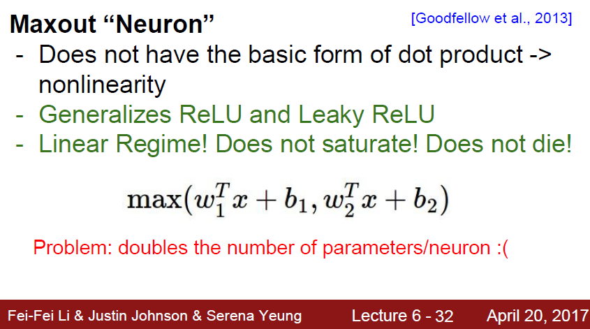


```markdown
Max 를 통해서 2가지 파라미터를 비교후 더 좋은것을 선택하는 방법이지만
연산량이 2배가 되어버려서 잘 사용하지 않는다.
```


