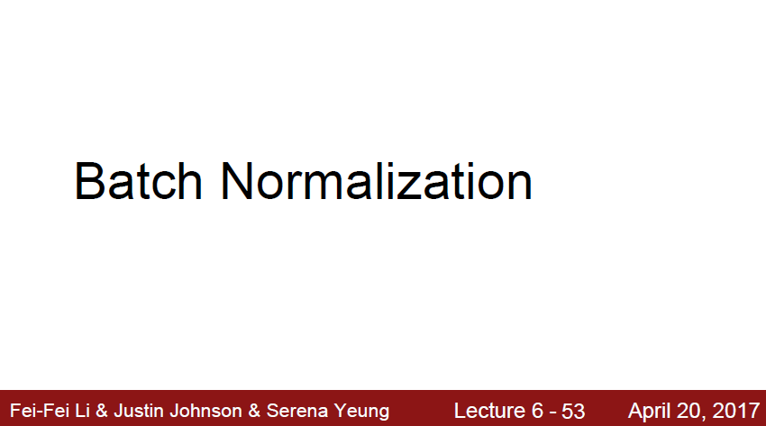
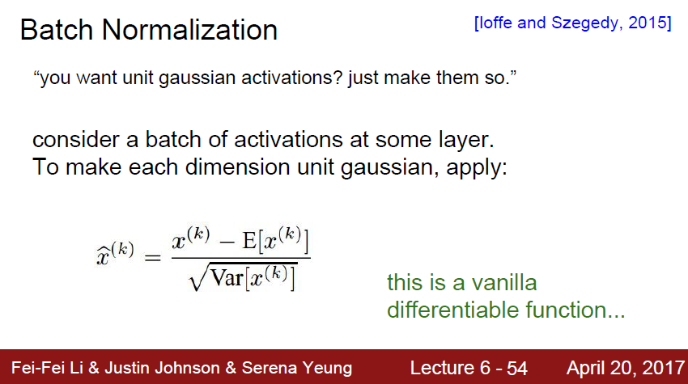
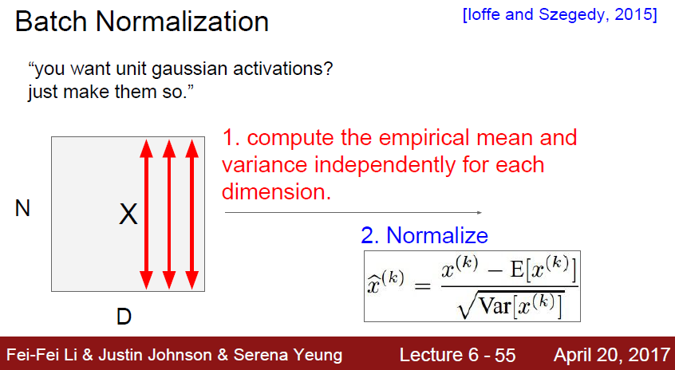
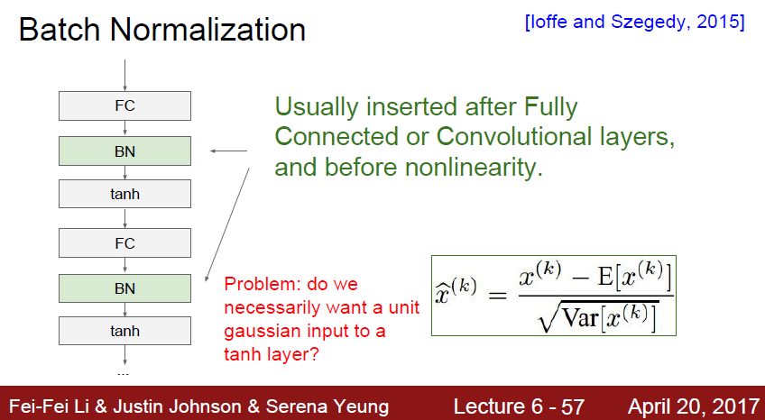
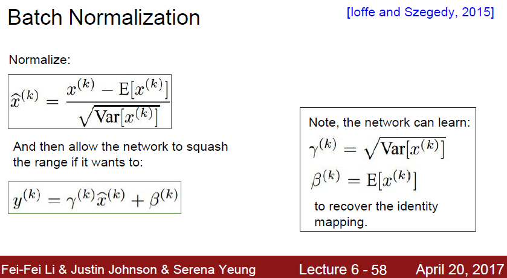
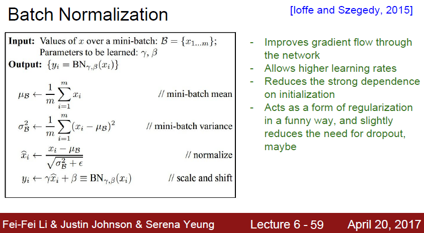

# cs231n lecture 6-3, Training Neural Networks





```markdown
Weight init 과 비슷한 결을 가지는 Batch normalization 을 살펴보자.
```





```markdown
BN 은 Gradient Vanishing, exploding 이 발생하지 않고, 데이터를 빠르게 학습하고자 시작된 normalization 입니다.
위에서는 activation의 연산량을 줄여서 학습 속도를 올리거나, learning rate 를 올리는 등의 작업을 하였습니다.
BN 은 training 과정 안에서 각 layer 에서 local input을 정규화하는것입니다.
```





```markdown
보통 input은 한번에 처리하지 않고, batch별로 처리하게된다.
batch normalizationd은 이 batch를 normalization한다는것이다.
```





```markdown
보통 activation 전에 들어가게된다.
한가지 문제점이 떠오릅니다.
바로 모든 상황에서 unit gaussian input 을 active function으로 보내줘야하나? 라는 질문입니다.
```





```markdown
하지만 문제없습니다!
BN 은 그 판단을 학습하기위한 layer 입니다.
BN은 하나의 layer 로써의 역활을 하게됩니다
layer 에서 Wx+b 에서 W 와 b 가 
r, b 등의 parameter 로 학습하게됩니다

감마는 얼마나 sacle 할것인지, 베타는 얼마나 움직일것인지인 shift 를 담당하게됩니다

```





```markdown
보통 BN 은 local input 을 안정화시켜주어 빠른 학습 및 정확도 증가를 가져올 수 있다.
또한 BN 은 regularization효과도 있어서 Dropout 을 사용하지 않아도 된다고 한다.
Dropout은 랜덤하게 몇가지 값을 버리고, 몇가지 값만 가져오게된다. 여기서 랜덤성이 들어가게 되면서 regularization이 발생한다는건데, 어떤 방식으로 BN 이 regularization 되는지는 잘 모르겠다.

추가적인 설명은 BN 논문을 보고 정리를 해두었으니 아래 링크에서 보면 된다.
```

https://github.com/strutive07/TIL/blob/master/paper_review/Batch%20Normalization%20Accelerating%20Deep%20Network%20Training%20by%20Reducing%20Internal%20Covariate%20Shift.md