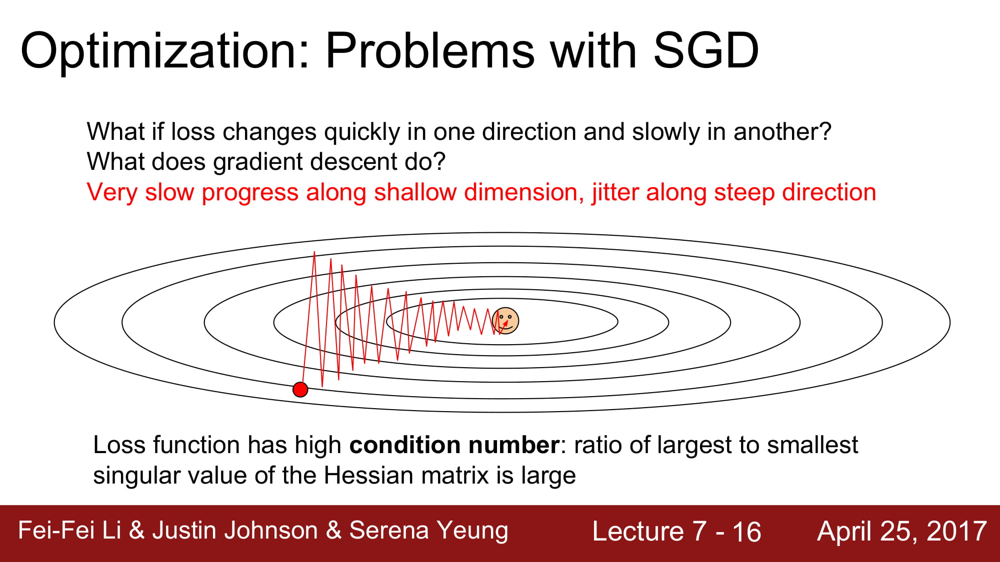
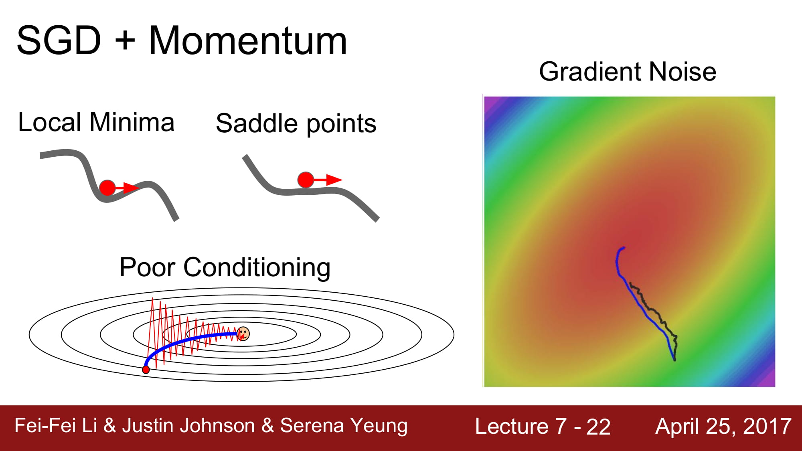

# cs231n lecture 7-1, Traning Neural Networks-2

cs231n lecture 7 에서는 지금까지 강의에서 배웠던 Optimization, Regularization 을 더 깊게 들어가게 됩니다.

또한 많이 사용하는 Dropout, transfer learning 등을 배우게됩니다.

중간에 Second order optimization, Hessian metrix, Tayler expansion 등 수학이 깊게 들어가는 부분이 있는데,

이 부분은 따로 더 학습이 필요할 거 같다. 다음주 학습은 미적분에대해 공부해봐야겠습니다.

지금까지 강의에서 사용하던 Optimization 방식은 문제가 있습니다. 

위 그림처럼 한 한 dimension이 엄청나게 얕게 설정되어있는경우, SGD 는 지그재그 형태로 학습하게됩니다.

학습 속도가 매우 느려지는 결과를 가져옵니다.

또한 local minima 에서 멈춘다는점과, saddle point 에서 특정 dimension에 기울기가 0인 지점을 만나  멈춰버릴수 있습니다. 이러면 더이상 학습이 진행되지 않는 문제가 생깁니다.

또한 Mini - batch 상태에서 학습하게될 경우, Noise 가 엄청 심하게 나올 수 있습니다.

이 시점부터 Optimizer 의 발전이 시작됩니다!

두가지 페러다임이 존재하는데, 하나의 페러다임은 바로 Momentum을 사용하는겁니다.

[momentum의 정의 in 위키백과](https://ko.wikipedia.org/wiki/%EC%9A%B4%EB%8F%99%EB%9F%89)

간단히 말해, 기울기가 0인 지점에서도 멈추지 않기를 바라면서 만든것이죠.

여기서 살짝 물리학적으로 접근하면 되는데, 물체가 움직일때 필연적으로 속도 뿐만아니라 '가속도' 도 붙게 됩니다. 지금까지 SGD는 가속도를 고려하지 않은 순간적인 속도로만 움직였다면(편미분을 통해!)

이제는 가속도를 더해보자! 라는 개념입니다.

수식에서 Vx는 velocity 이고, rho 는 마찰계수라고 생각하면 편합니다.

rho는 가속도를 제한해주는 역활을 하게 됩니다. 보통 rho값은 0.9~0.99 를 주게 됩니다.

위 그래프 처럼 가속도의 영향을 받으니 Local minima 와 saddle point 에서도 안전하게 이동하는 모습을 볼 수 있습니다.

모멘텀을 사용하게되면, 파라미터 벡터가 업데이트되는 속도의 방향은 gradient가 가리키는 방향중에서, 축적된 gradient 들의 방향중 많은 방향이 가리키는 곳을 가리키게 된다.

Nesterov Momentum 이라는것이 있는데,

원래 momentum 은 현재 위치에서 velocity 와 gradient 를 더해서 vector sum으로 actual step 을 예측한다.

Neserov Momentum은 현재위치에서 gradient 를 계산하는것이 아닌 velocity에 의해 예측된 위치 (초록 화살표) 에서 gradient 를 계산해서 vector sum을 통해 actual step 을 구하는것이다.

보통 convex function에서 강력한 성능을 가진다고 한다.

AdaGrad 는 각 매개

각 파라미터를 업데이트할때, 학습 속도를 적응적으로 조절하는 방식이다. 

grad_squared 에 지금까지 모든 gradient 의 제곱 값을 더해둔다.

이 값을 sqrt 에 감싸서 분모로 보낸다.

이렇게 수식을 전개하면, 각 파라미터를 업데이트할때 표준화의 효과가 생긴다는것이다.

높은 gradient 값을 가지는 weight 들은 학습 속도가 감소하고, gradient 값이 낮거나 업데이트가 없는 weight 들은 학습속도가 증가한다.

간단히 말하자면

올바른 지점으로 접근할때 처음에는 빠르게 접근하지만, 점차 속도가 느려지게 된다는 것이다.

하지만 여기서 몇가지 문제가 있는데, convex function 이 아닐떄, 학습이 멈출 수 있다는 문제가 있다고 한다.

딥러닝의 학습이 한 방향으로 매우 빠르게 튕겨나가버리면 학습이 안될수 있다고 한다.

이 해결책으로 나온게 RMSProp 이다.

Adagrad 와 비슷하게 감속과 가속이 가능하다.

하지만 momentum 처럼 grad_squared 값을 누적하긴 하지만, decay_rate 를 주어서 오래된 값을 상쇄시킵니다.

momentum 과 비슷하게 누적값 업데이트를 해주기 때문에 급진적인 움직임에서 학습 속도를 줄일 수 있다.

Adam 은 RMSPRop 에 실제로 momentum 을 합친 알고리즘이다.

가속, 감속과 운동량까지 합쳐진 모델이 바로 Adam !

빨강색은 Momentum 수식,

파랑색은 RMSProp 의 수식입니다.

그런데 이렇게 수식을 전개하면 first step 에서 문제가 발생합니다.

first_moment, second_moment 는 초기값이 0입니다. 

beta2 가 1에 가까운 숫자이기 때문에 초기에 second_moment 가 0에 가까워서 분자를 분모로 나눠서 값일 줄이는게 아닌, 오히려 나눠서 값이 급진적으로 커져버리게 될 수 있다고 한다.

따라서 이 현상을 보정하기 위해서 위와같은 수식을 추가한다고 한다.

