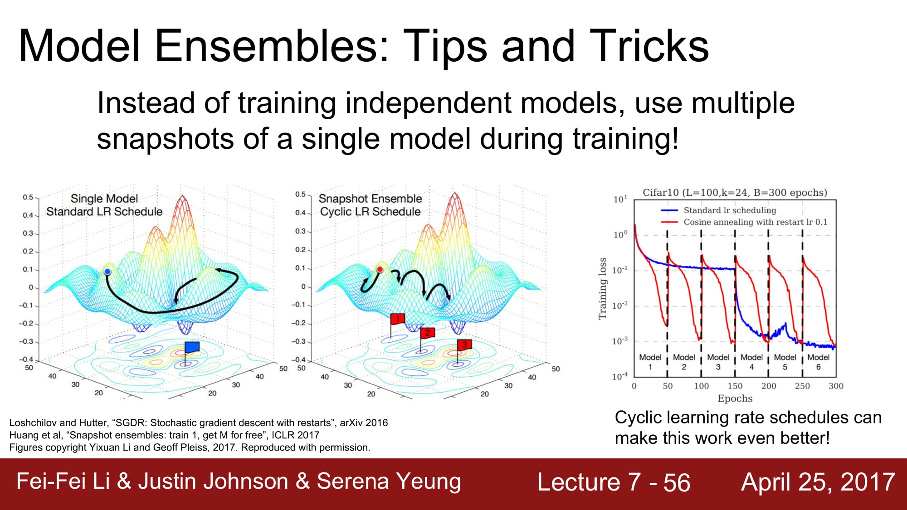

# cs231n lecture 7-3, Traning Neural Networks-2

loss 를 줄이는것도 좋지만,  validation 과 train 의 격차를 줄이는것도 중요합니다.

이를 바꿔 말하자면, overfitting 을 막자는 것이 됩니다.

deep learning 에서 overfitting 을 막는 방식은 regularization, Model ensembles 등이 있습니다.

Ensemble 기법은 다수의 모델을 만들어 이들을 평균을 내어 이용하는것입니다.

많은 모델을 사용하기 때문에 1~2% 정도의 성능 향상이 있다고 합니다.

조금 더 깊게 접근해보면, 모델을 통째로 여러게를 쓰는게 아니라, 학습 도중에 중간에 여러게의 모델을 섞는 방식입니다.

통칭 Snapshot 을 찍는다고 하는데, 특정 구간에서 train 할때는 여러 모델을 사용하고, test 에는 여러 snapshot을 평균을 내어 사용하겠다는것입니다.

앙상블 모델을 모델을 그만큼 더 학습해야하기때문에 시간이 훨씬 많이 걸립니다.

learning rate 을 앙상블 시키는 방식도 있습니다. 급격한 learning rate 변화를 앙상블 시켜서 더 넓고 많은 minima 들에 수렴할 수 있게 만드는 방식입니다.

두 번째 방법으로 Regularization 이 있습니다.

우리는 지금까지 L1, L2 regularization을 배웠습니다.

하지만 Neural network 에서는 L1, L2 를 잘 사용하지 않고 BN 이나 Dropout 을 많이 사용한다고 합니다.

Dropout 은 랜덤하게 node 를 삭제하고 학습하는것입니다.

이렇게되면, 하나의 네트워크로 엄청나게 다양한 모델을 앙상블해서 학습하는것과 동일한 효과를 불러올 수 있습니다.

방식은 정말 간단합니다! 그냥 일정 확률로 0을 곱해서 activation 을 안해버리는겁니다.

왜 Regularization 효과가 나올까요?

Neural network 에서 하나 하나의 node 는 각각 feature 에 대한 정보를 가지고 있습니다.

모든 feature 를 보고 계속 학습한다면, 모든 feature 가 없을때는 오답을 낼 확률이 높아집니다.

특정 feature 를 지우고 학습하는것을 랜덤하게 반복한다면, Neural network 는 적은수의 feature 로 판단할 수 있게 됩니다.

또한 거대한 앙상블 모델이 될 수 있습니다.

이걸 앙상블로 할려면 정말 어마어마한 모델을 학습해야하지만, Drop out 을 사용한다면 그저 activation 을 0으로 만들어 node 를 랜덤으로 비활성화 시킴으로써 같은 효과를 가져올 수 있습니다.

Test time 에서 drop out 은 어떻게 사용할까요?

drop out 을 사용할 경우 random mask 를 곱해서 학습하게 됩니다. 하지만 test 시에는 랜덤성은 최대한 배제해야하죠.

따라서 해당 랜덤성을 test time 에서는 average out 해버립니다.

이는 적분을 통해 구하게 됩니다.

실제로 딥러닝에서 적분을 하기에는 무리가 있으므로, 샘플링을 통해 근사 하는 방식을 사용합니다.

지속적으로 샘플링을 하게 되면, 원래 결과에 droupout probability 를 더한것과 같은 결과를 가저온다 합니다.

따라서 test time 때는 activation 단에서 droupout probability 만큼 곱해줘야합니다.

하나의 트릭을 사용해봅시다. test time 에서 곱하기가 activation 할때마다 발생할 경우, test time 에서 많은 컴퓨터 자원을 추가적으로 사용해야 합니다.

따라서 train 할때 역연산으로 droupout probability 만큼 나눠주고 시작하면 test time 에서는 더 깔끔하고 빠르게 predict 할 수 있습니다.

Drop out 에서 randomness는 결국 train data 에 overfitting 하지 않기 위한 장치 입니다.

Test time 에서는 이 randomness 를 사용하지 않기 위해서 평균 근사해서 사용하는것이구요.

http://fbsight.com/t/topic/3101/5

관련 좋은 글들이 있어서 가져와봤습니다.

Regularization 은 Overfitting 을 막기 위해 noise 를 주는 방식입니다.

drop out 은 특정 노드들로 weight 가 편중되는 현상을 막아주기 위함 이라고 합니다.

또한 Batch normalization 도 regularization 역활을 할 수 있다 라고 말하는데,

정확히 말하면 optimizer 를 도와준다고 합니다.

BN 은 layer 를 거친 input 값의 distribution 을 봤을떄, 특정 노드에서 나온 값이 지나치게 커지게 되면 그 node 에 편향될 수 있게 됩니다. 이렇게되면 weight 가 잘 학습되지 않게 되겠죠.

따라서 input distribution 에 normalization 을 통해 특정 영향력이 지나치게 큰 node 들의 영향을 줄여주는것이 아닐까? 라는 생각입니다.

BN 이 noise 를 줄 수 있는것인지에는 명확한 근거를 모르겠어서 아직은 모르겠습니다.