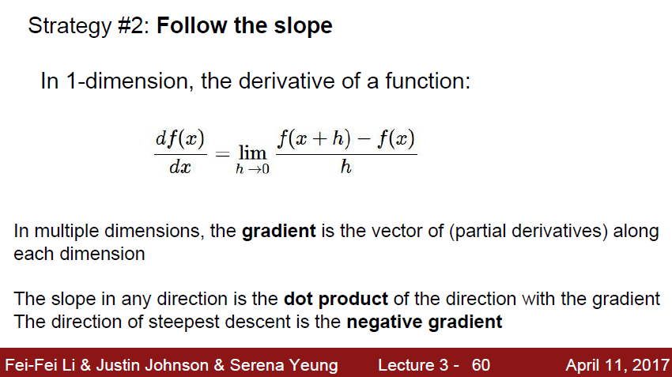
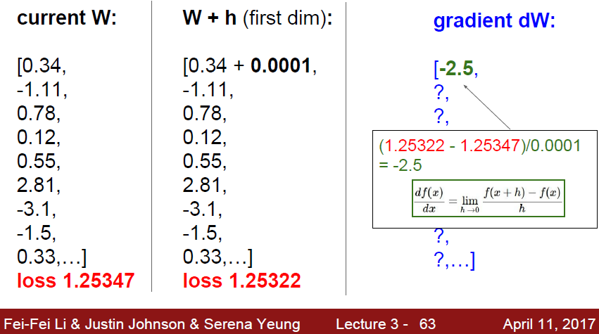
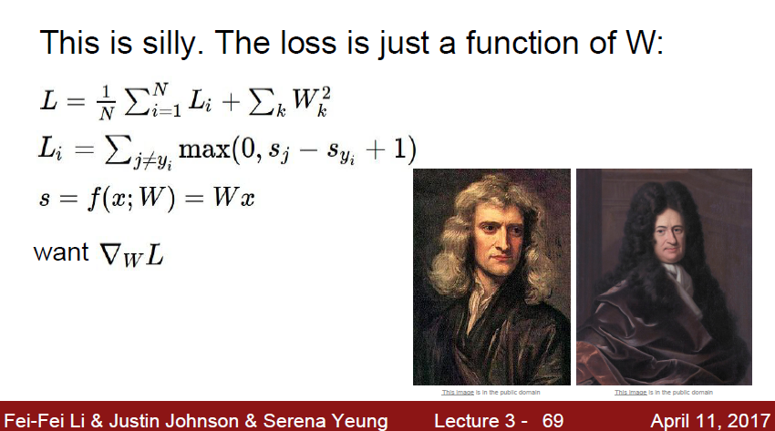
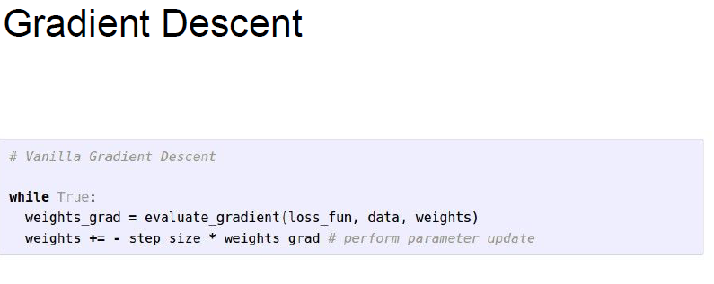
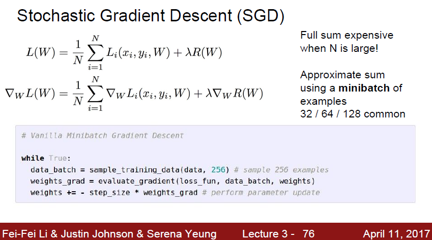

# cs231n 정리 Lecture 3 -2

이전 시간에서, 우리가 열심히 구한 Loss 가 있는데, Loss 를 어떻게 써먹을까? 에 대한 방안이 없었다.

자 이제 Optimization 이라는 기법으로 위의 Loss 를 사용해보자.

우리가 가지고 있는 데이터에 W를 최적화 시키기 위해서 가장 간단한 방법은 뭘까?

그냥 W 를 랜덤하게 계속 바꿔가면서 하나씩 고르는것이 가장 간단할 것이다.

근데 이건 거의 암호를 푸는 수준으로 시간이 기하급수적으로 올라가니, 다른 방법을 써야 한다.

조금 더 수학적이고 현실적인 방법을 찾아보자. 두 번쨰 방법은 기울기를 이용하는것이다.

W를 구하기 위해서, 점점 '기울기' 를 타고 잔걸음으로 이동한다.

자 미분값을 계산을 해야하는데... Matrix 에서 하나 하나 꺼내서 할 시간은 없다. 너무 느리다

이 계산을 빠르게 해줘야한다.

위의 사진에 나온 2분이 멋지게 마법을 부려주셨다.

어떻게 계산이 되는지는 잘 모르겠지만 간단하게 된다한다!

미분만 잘 된다면, 위 방식이 이렇게 간단하게 정의 될 수 있다.

step_size 는 learning rate 로, 한번에 얼마나 이동할지를 정해주는것이다.

gradient 는 이동할 방향과 정도를, learning rate 는 일시적 브레이크 역할을 해주게 된다.

한마디로 '잔걸음' 걷게 해준다는것이다.

learning rate 를 너무 높게 잡으면 학습하면서 gradient 방향으로 값이 뛰쳐 나가버릴것이다.

근데 이 미분도 계속 하기에는 너무 느리다.

따라서 대안으로 생각해낸것이 바로 Stochastic Gradient Descent 이다.

모든 loss를 구하기 어려울때는 mini-batch 를 뽑고, 거기서 gradient를 뽑고 이 값을 gradient descent 에 사용한다는것이다.

