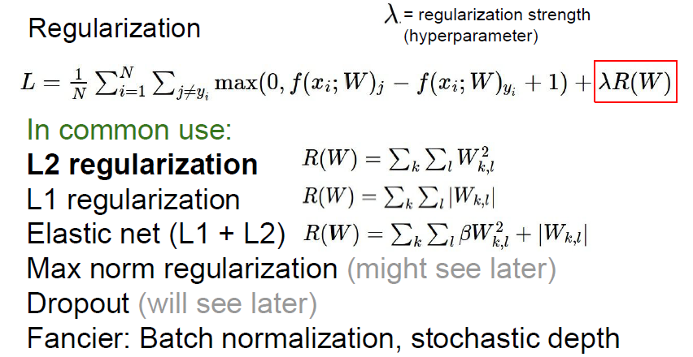

# cs231n 정리 Lecture 3 Loss Functions and Optimization

Wx+b 를 학습하면서, model 이 학습하는 paremeter인 W 와 b 는 어떻게 학습되는걸까?

일단 W 와 b 가 현재 상황에서 얼마나 나쁜지 좋은지에 대한 기준을 내릴 수 있어야 할 것이다.

따라서 '얼마나 실제와 다른지, 나쁜지' 를 구하는 함수가 바로 'Loss function' 이 된다.

여기서는 W,b 를 사용하여 예측된 결과와 실제 값의 Loss 를 모두 더해 평균을 내는것으로 Loss function 을 정의했다.

Loss 를 측정하는데는 여러가지 방법이 있다.

그 중 한가지 방법으로 SVM Loss 가 있다.

s_j 는 다른 레이블에 대한 점수, 즉 잘못된 정도에 대한 점수, s_y_i 는 실제값에 대한 점수 이다.

s_y_i 가 s_j 보다 충분히 커야 잘 분류된것이다.

+1 이 의미하는것은 safety margin 인데, safety margin 보다 충분히 커야 loss 가 없다 라고 정의하는, 즉 모델을 더 엄격하게 만드는 역할을 한다.

그럼 제곱을 하면 어떻게 될까? Loss 에 제곱을 붙인다는것은, Loss 의 영향을 그만큼 높인다는건데, linear 하게 높이는것이 아니라, loss가 낮은것들은 낮게 상승되고, 높은것들은 매우 많이 상승된다. Loss 의 중요도를 2차 함수처럼 점점 증가하게 만들어주게 된다.

하지만 머신러닝에서는 Training Data 에 대해서 Overfitting 이 이루어 질 수 있다.

들어온 데이터에 과적합 되지 않게 Loss function 에 페널티는 줄 수 있는데, 이를 Regularization 작업이라고 한다.

 L1, L2 regularization 이란?

L1 은 모든 값의 절댓값을 더하고, L2 는 모든 값의 제곱값을 더한다.

결과적으로 L2와 L1은 서로 다르게 미분된다.

L2의 미분계수는 2 * 가중치 이고

L1의 미분계수는 *k*(가중치와 무관한 값을 갖는 상수) 이다.

L2 는 매번 x% 만큼을 빼는것이고, L1 은 매번 상수 만큼 빼주게 된다.

다음으로 볼것은 그 유명한 softmax 이다.

softmax 는 값을 확률로 바꿔서 준다. 전체 값을 모두 e^x 해서 더한것을 분모로 잡고, 자기 자신의 e^y 값을 분자로 잡는다. 이렇게되면 각 숫자들이 합이 1인 확률값으로 변하게 된다.  지금은 그저 확률값이므로, 우리는 이 숫자를 뒤집어 줘야할 필요가 있다(오차율을 구하는것이기 때문에)

따라서 -log 를 취해주게되면 해당 feature 에 대한 오차율이 나오게 된다.

자 그래서 이렇게 구한 Loss 로, 어떻게 학습을 시킬까?

다음 문서에서 알아보자.

