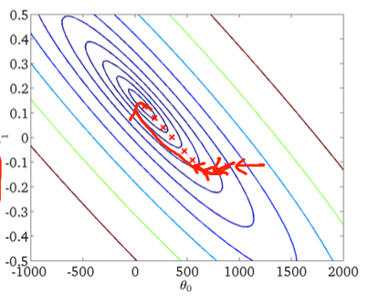
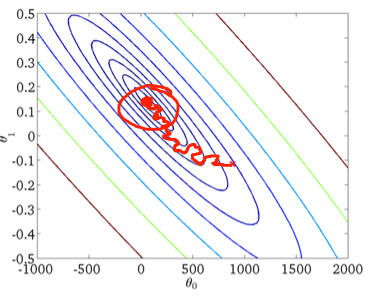

# mini-batch 를 사용하는 이유

애매하게 알던것 공부하기

- global average pooling :heavy_check_mark:
- weight decay :heavy_check_mark:
- 1x1 convolution :heavy_check_mark:
- mini-batch 를 사용하는 이유 :heavy_check_mark:
- resnet
- attention
- seq2seq 
- google net
- fast r-cnn
- faster r-cnn
- mask r-cnn
- yolo
- dropout
- transformer
- gru
- CAM

------

mini-batch 란?

전체 집합에서 특정 sample 을 뽑아서 학습에 사용하는것.

예를들어, 1000개의 데이터가 있다면, 각 iteration 에서 25개의 데이터로 데이터를 쪼개어 학습하는것이다.

그럼 mini batch 는 왜 사용하는것일까?

mini batch 를 사용하지 않고 전체 데이터를 한번에 학습했다고 가정해보자.

일단 엄청난 양의 데이터를 한번에 처리해야하기 때문에 컴퓨터 자원이 굉장히 많이 필요하다.

물론 데이터를 정말 정확하게 사용하는것이겠지만, 한번 iteration 을 돌리는데 굉장히 많은 시간이 소요되고 굉장히 고 사양의 컴퓨터를 요구하게 됩니다.

결론: 데이터를 정확하게 사용할 수 있다. 하지만 현실적인 장벽에서 너무 큰 cost 가 필요하다. 여기서 cost 는 시간, 돈(고사양 컴퓨터)를 뜻한다.

그럼 데이터를 1개씩 사용하여 학습하면 어떻게될까?

전체 데이터의 경향성을 반영해주기 힘들다. 또한 하나의 데이터에 편향된 데이터가 있다면, 올바르지 않은 방향으로 업데이트 될 가능성이 높습니다.

따라서 위 처럼 엄청 꼬불꼬불 update 되는것을 볼 수 있습니다.

또한 위의 전체 데이터를 사용할때는 컴퓨팅 파워가 엄청나게 필요했다면, 데이터를 1개씩 사용하면 컴퓨팅 파워가 낭비되게 됩니다.

GPU 는 병렬 처리를 위해서 만들어진 유닛인데, 데이터를 하나씩 처리하다보면 병렬처리의 이점을 보지 못해, 데이터를 전체를 다쓸때 처럼 속도가 느려집니다.

결론: 올바르지 않은 cost funciton 의 update, 병렬처리가 안되서 속도가 매우 느림.

따라서, 적절하게 조금 빼내서 사용한다는 의미로, mini-batch 기법으로 특정 샘플을 뽑아 데이터를 학습하게 됩니다.

참고

<https://arxiv.org/pdf/1409.4842.pdf>