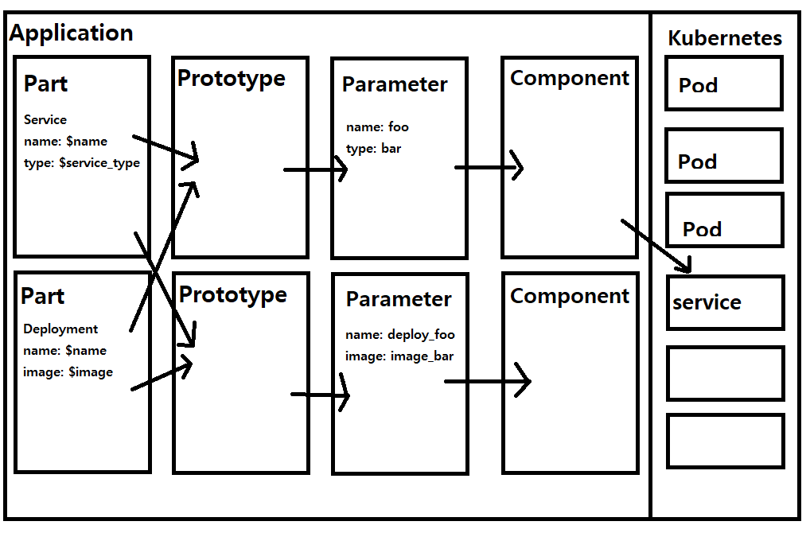
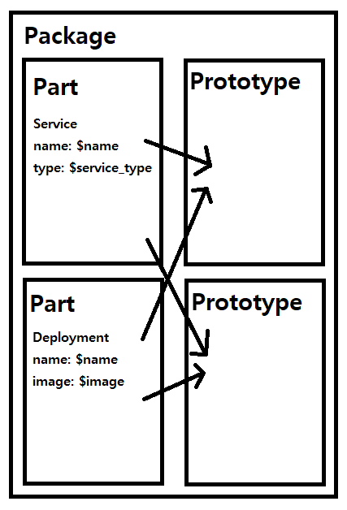

# Kubeflow component study - ksonnet

ksonnet 은 Package, Application, Part, Prototype, Parameter, Component 로 이루어져있다.

Ksonnet 의 목표는, `재사용성` 이다.

component 를 이루는 각 micro-service 들을 kubernetes 의 yml 파일로 정의할때, 중복되는 yml code 가 많이 발생한다.

ksonnet 은 jsonnnet 이라는 json 기반 템플릿 엔진으로 재사용성을 구현한것이다.

우선 크게 Prototype 과 Parameter 를 보면 된다.

Prototype 은 일종의 템플릿으로, component 를 템플릿으로 구현해둔것이다. 

보통 템플릿은 변수를 넣어 하나의 온전한 요소, 즉 component 로 구성되게 되는데, 여기서 변수 역활을 해주는게 parameter 이다 ( 이름이 참 정직하게 잘 지었다. )

그럼 part 는 무엇일까?

잘 생각해보면, 템플릿에도 중복되는 코드가 많다. 컴포넌트에서 중복되는 `변수` 만 parameter 로 변경했을 뿐이지, 전체적인 구조는 반복되기 때문이다.

이 반복되는 구조를 나누어 둔 것이 바로 `part` 이다.

따라서, Part 를 모아 Prototype 을 구성하고, parameter 를 넣어 Component 를 완성하는것이다.

이 과정을 묶어둔것이 바로 Application 이다.

그런데 Application 과 비슷한 개념인 Package 라는것이 있따.

Package 는 Application 에서 paramter 를 제외한 `구조` 만 담고 있는 것이다.

Package 는 Registry 를 통해서 upload / download 가 가능하다.

Registry 는 github repository 등을 제공한다.

