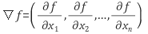
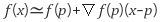
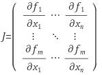
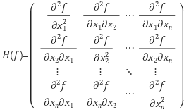
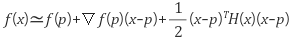

# 수학 이야기

## Gradient 

다변수 함수 f가 있을때 f 의 gradient 는 위와 같다.

보통 컴퓨터에서 사용하는 선형 근사식은 다음과 같다.

## Jacobian matrix

Jacobian matrix는 다변수 벡터 함수에 대한 일차미분이다.

Jacobian matrix는 gradient와 같이 일차 미분이므로 미분이 가지고 있는 특성은 모두 동일하게 가진다.

즉, 해당 함수의 극소, 극대를 찾을 때 사용 될 수 있다.

## Hessain matrix

Hessain matrix는 위의 2개와 다르게 이차 미분을 나타낸다.

Hessain은 함수의 곡률 특성을 나타내는 행렬이다.

따라서 최적화 문제에서 자주 사용된다.

2차항에 대한 근사(second-order taylor expansion)는 다음과 같다.

고교 수학때 배운 내용을 생각해보면, 

critical point 와 saddle point 모두 미분값은 0이다.

이때 critical point인지 saddle point인지 구분하는것은 한번 더 미분하는, 즉 2차 미분을 사용하는것이다.

Hessian matrix또한 똑같다.

critical point 에서 hessain matrix 의 모든 고유값이 positive이면 그 함수는 극소이고, 모든 고유값이 음수면 극대이다.

mixed 상태이면 saddle point이다.

