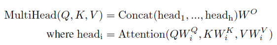

# Attention is all you need

[seq2seq with attention](https://github.com/strutive07/TIL/blob/master/paper_review/Neural%20machine%20translation%20by%20jointly%20learning%20to%20align%20and%20translate.md)  에서는 attention 을 활용하여 source sequence - target sequence 간의 관계를 잘 찾아내었습니다.

하지만 이러한 attention 기법은 하나의 sequence 안에서 relation 들을 구하지 못하는 문제가 있었습니다.

이 논문에서는 self attention 을 사용하여 하나의 문장 내부에서의 attention 을 찾아냅니다.

이 논문에서 제안한 모델을 통상 `transformer` 라고 부르며, 최근 NLP Sota 논문들의 base 는 대부분 이 transformer, self-attention을 사용 및 변형하고있습니다.

## Contribution

- 기존 RNN base attention 이 아닌, 병렬처리가 가능한 transformer 로 attention mechanism 을 구현하였다. RNN 없이 time sequence를 병렬처리 할 수 있어 병렬학습에 굉장히 유리하다.
- RNN 없이 self-attention과 look ahead mask만을 이용하여 language modeling을 진행한다. RNN이 없어졌으므로 기존 seq2seq의 long sequence 에서 input sequence 에서 attention을 구하기 위해 RNN cell length 만 큼의 connection이 필요했다. CNN(ConvSeq2Seq) 은 log(seq_length) 만큼의 connection이 필요했다. 이는 attention을 구하는 cost가 되고 long-range dependency를 구하는데 병목 구간이 된다. transformer는 self-attention 을 사용하여 이 connection을 constant 하게 줄여 long term dependency를 효과적으로 학습할 수 있다.
- 결국, self-attention을 사용하여 병렬 연산, 적은 연산 수, 긴 문장에 대한 dependency 계산을 효과적으로 진행할 수 있다는 큰 contribution을 한 논문 이다.

## Introduction

이 논문은 NMT(Neural Machine learning translation) 을 RNN, CNN 없이 푸는 논문이다. NLP 에서 RNN 이 자주 사용되었던 이유는, input sequence 와 output sequence 의 position 정보를 기반으로 문제를 푸는 능력이 뛰어났기 때문이다. 하지만 RNN 이 문제를 푸는 방식은, time t-1 RNN cell 의 hidden state 정보를 기반으로 time t 의 hidden state 를 생성하는 방식으로, 동작 방식도 sequential 하다는것이 문제이다.

따라서 RNN 의 경우 학습의 병렬화가 매우 어렵고 sequence의 길이가 길어질수록 모델 역시 매우 커진다.

attention mechanism 은 sequence 의 길이, position 간의 distance 와 무관하게 sequence 의 dependecy 를 모델링 할 수 있게 해준다.

하지만 이 논문 이전까지는, attention mechanism 이 RNN 에 의존적이였고, 이 논문에서 RNN 없이 오로지 attention mechanism 만으로 input - output sequence 간의 global dependency 를 구한다. RNN 의 이전 state 에 대한 한계가 사라지니, 학습 속도고 매우 빨라지고, 병렬화도 매우 용이해진다.

실제로 이 논문에서는 P100 gpu 8대를 가지고 12시간(base model) 3.5day(big) 을 학습시켰다고한다.

## Background

sequential 한 연산을 줄이기 위해 ByteNet, ConvSeq2Seq 논문들이 나왔지만, 이들 모두 input position 과 output position 의 distance가 매우 큰 경우 두 position 을 연결하는데 많은 연산을 요구한다.

따라서 distant position 의 dependency 를 학습하기 어렵다.

Transformer 는 attention-weighted position 을 averaging 해서 위의 operation 을 contanct time 으로 줄였다.

Self-attention 은 하나의 sequence 에서 다른 두 position을 연결해주는 역활을 한다. 

위 그림은 encoder 의 6개의 layer 중 5번 째 layer 의 self-attention 을 시각화 한것이다.

하나의 sequence 에서 단어간의 dependency 를 연결시켜주는 역활을 한다.

## Model Architecture

transformer 는 기존의 machine translation 방식에서 많이 사용하던 encoder - decoder 방식을 사용한다.

하지만 RNN 이 사용되지는 않고, self-attention 과 point-wise fully connected layer 를 stacking하여 사용한다.

왼쪽 그림에서 빨강색 box 부분이 encoder 이고, 파랑색 box 부분이 decoder 이다.

encoder 는 multi head attentnion, feed forward network, Layer normalization, residual network 등으로 이루어져있다. 이는 뒤에서 다시 자세히 설명하겠다.

decoder 는 비슷하지만 앞에 masked multi head attention 이 붙는다.

그럼 attention, encoder,  decoder 에 대해 조금 더 알아보자.

### Attention

**Scaled Dot-Product Attention**

**Query, Key, Value?**

논문을 보면, Query, Key, Value 라는 3가지 값이 나온다.

이는 이전에 seq2seq with attention 에서 attention score 를 계산할때와 매우 유사하다.

seq2seq 에서는 attention score 를 계산하는데 decoder 의 hidden state 과 encoder 의 hidden state 간의 관계를 attention score 로 계산했습니다. 이는 `decoder 에서 (Hidden state) 라는 것이 나왔는데, 이게 encoder의 (hidden state) 와 얼마나 관계가 있어?` 라고 물어보는것 입니다.

self-attention 에서도 마찬가지 입니다.

 `decoder 에서 (Hidden state) 라는 것이 나왔는데,` 는 바로 'Query' 입니다.  기존 sequence 에서 어떤 position 과 유사한지 질문하는 하나의 position 인것이죠.

`이게 encoder의 (hidden state) 와 얼마나 관계가 있어?` 는 바로 'Key - Value' 입니다. 기존 sequence 의 정보를 가지고 있죠. key-value 의 관계는 말 그대로 입니다. `{key: value}` . key 에 해당하는 값이 value 에 저장됩니다. 기존 seq2seq 에서 key-value 를 생각해봅시다.

**주의!** 위 사진은 transformer 가 아닌, seq2seq with attention 입니다. 이해를 위해 그때 사용한 사진을 활용하여 설명합니다. [seq2seq with attention](https://github.com/strutive07/TIL/blob/master/paper_review/Neural%20machine%20translation%20by%20jointly%20learning%20to%20align%20and%20translate.md)  

기존 attention 을 보면, key 인 encoder 의 hidden state 와 value 인 encdoer 의 hidden state 는 원래는 같은 값입니다. 그 이후 사용처를 보면, key 는 query 와 해당 hidden state 와 dependency 를 구하기 위해 사용되고,  alignment 와 곱해져 사용되는 '값' 입니다.

따라서, key에 해당하는 value 에 query 가 얼마나 dependency 를 둘 것인지를 계산하는것이 attention 이므로 key 와 value 는 초기에 같은 값 이고 사용하는 용도가 다르다고 생각하면 됩니다. 

transformer 에서 위의 attention score 를 구하는 식으로는 scaled dot-product attention 이 사용되었습니다.

기존의 additive attention 와 dot product attention 은 비슷하지만, dot product attention 이 더 빠르므로 dot product 를 사용합니다.

하지만, additive attention은 scaling 없이 좋은 성능을 보여주지만, dot product attention 은 아닙니다.

dot product 한 결과값이 매우 클 경우 문제가 될 수 있는데, 그 이유는 해당 값이 바로 softmax 로 들어가기 때문입니다.

값이 너무 크면 softmax 에서 거의 back propagation 을 받지 못해 학습이 잘 안되기 때문입니다. 따라서  d_k 를 활용하여 scaling 해줍니다.

최종적인 attention score function 은 다음과 같습니다.

그 이후, value 에 attention 을 적용하면 하나의 self-attention 이 끝납니다. 이는 다음과같은 수식으로 정리할 수 있습니다.

**Multi-Head Attention**

자 지금까지 위 사진에서 빨강색 부분을 살펴봤습니다.

그런데 transformer 의 실제 architecture 를 보면, multi head attention 을 사용하였다 합니다.

이는 방금 알아둔 scaled dot-product attention 을 병렬적으로 여러번 사용한 것 입니다.

Q, K, V 에 h time 만큼 다른 Linear projection을 한 후, 각각 다른  scaled dot-product attention 에 태우는겁니다.

그 결과들을 concat 하여 하나 처럼 사용하게됩니다.  단편적인 장점으로 일단  h 배 만큼 한번에 병렬적으로 계산할 수 있게 됩니다. 

jalammar's github blog 에서 가져온 image 입니다. http://jalammar.github.io/illustrated-transformer/

또 하나의 큰 장점으로, local sub sequence 에서 여러가지 관점을 볼 수 있게 됩니다.

각 attention 들이 input 을 쪼개서 들고가니, 여러가지 관점을 가질 수 있습니다.

여기서 input 을 쪼갠다 라는게 어떤 의미 일까요? 쪼개진 만큼을 하나의 sub sequence 로 볼 수 있습니다.  특정 local sub sequence 에서의 각각 attention 을 내놓게 되는것이죠.

하나의 head 는 it 에 대해서 the animal 에 attention을, 다른 head 는 tired 에 attention을 둔 모습을 볼 수 있습니다.

### Encoder

자 이제 기본적인 self-attention, multi-head attention, scaled dot-product attention 을 알았으니, encoder 에 적용해봅시다.

일단 input sequence 를 **embedding** 적용시킵니다. 그럼 이제 특정 matrix 형태의 batch 가 되었겠죠.

여기서 **Positional Encoding** 이 나옵니다. 우리는 RNN을 사용하지 않았기 때문에, sequence 한 정보를 살릴 방법을 찾아야 합니다. 따라서 sequential 한 정보를 data 자체에 적용하는것이 바로 positional encoding 입니다.

pos 는 단어의 position 이고, i 는 dimension 이다. 

각 embedding 에서 짝수 column 에 sin 값을, 홀수 column에 cos 값을 추가한다. 전체 dimension 이 각 다른 값을 가지면서 position 정보를 담을 수 있게 해주는것같다.

normalization 은 layer normalization을 사용하였고, residual connection 을 사용하여 normalization 직전에 input 을 더해준다.

그 이후 position wise feed forward network 를 통해 multi head attentnion 과정에서 정리되지 않은 정보들을 재정리 합니다.

이렇게 하나의 encoder 를 완성했습니다. 논문에서는 이 encoder 를 6번 쌓아서 사용했다 합니다.

layer 의 높이가 올라갈수록 문맥적인 의미들이 추가되게됩니다.

### Decoder

Encoder 는 주어진 sequence 전체를 보고 각 시점에서 정보들이 더 좋은 representation 이 되도록 encoding 하는 역활입니다.

Decoder 는 현재까지 알려진 정보를 바탕으로 새로운 정보를 생성하는 역활을 합니다. 여기서 중요한점은 `현재까지` 입니다.

미래의 정보를 바탕으로 현재의 정보를 예측하지 않으므로, 현재 까지의 정보만 사용해야합니다.

따라서 미래의 정보를 masking 해주는 작업이 필요합니다.

이 작업은 기존 encoder - decoder 모델들에서 time t 에서 새로운 정보를 생성하기위해 time t-1 까지만 정보를 사용하는 방식을 attention 으로 구현한 것 입니다.

decoder 를 잘 살펴보면 첫번째에 **Masked Multi-Head Attention** 이 있는것을 볼 수 있습니다. 이 단계에서 위와같은 masking 을 적용한 multi head attention 작업을 수행합니다. 여기서 계산하는 attention은 새로운 단어를 생성하기 위해서 어떤 단어에 attention 을 적용해야하는지를 계산합니다.

기존 encoder - decoder 에서도 새로운 정보를 만들어낼려면 encoder 의 정보가 필요합니다. 따라서 마지막 encoder layer 의 key-value 를 가져옵니다. 마치 초기 seq2seq 에서 context vector 를 가져오는것과 유사합니다.

그리고 decoder의 masked multi-head attention의 결과에서 query 를 가져옵니다. 기존 seq2seq 에서 이전 time 에서 decoder 의 hidden state 를 가져와서 encoder 와 함께 사용하던것과 유사합니다. `지금 decoer 에서 특정 값이 나왔는데 input 의 어느 부분을 집중해서 output을 만들면 될까?` 에 대한 query 를 의미하게 됩니다.

encoder 에서 문맥 정보를 가지고 있는 key-value 에 query 를 던져, 현재 생성하려는 단어가 encoder 의 어느 key-value 에 집중할것인지 결정합니다.

encoder 와 동일하게 multi head attention 의 결과를 정리해주기 위해 feed forward network 를 추가하고, residual network 와 layer normalization 을 추가해줍니다.

## Position-wise Feed-Forward Network

2개의 feed forward network 가 있고, 1번 layer 후 RELU 로 activation 을 해준다.

각 Position 마다 같은 W, B 를 적용해주기 떄문에 position wise 라고 부르는거같다. (layer 가 달라지면 다른 파라미터를 적용시켜준다.)

일종의 kernel size 가 1 인 CNN 을 2번 사용한것과 동일한 효과이다.

## Why Self-attention

1. computational complexity가 낮다.
2. 요구되는 sequential operation 의 수가 적다. 따라서 병렬화가 쉬워진다.
3. input sequence 와 output sequence 가 길어지면 두 position 간의 거리가 먼 경우, dependency 를 학습하기 힘들어집니다. 각 position 을 연결하는 connection 의 수 가 많아질수록 dependency 를 구하기 힘들어진다. RNN 은 sequence length 만큼 connection을, CNN 은 log_k(n) 만큼 걸린다. (binary graph 를 생각하면 편하다. binary 가 아니라 kernel size 만큼의 graph가 생긴다고 생각하고, tree height 만큼 탐색시간이 걸릴것이다.)
self-attention은 모든 position에 attention을 걸 수 있어 constant time 이 나오게 된다. 따라서 long-range sequence 에 대한 dependency 를 구하는 문제를 효과적으로 해결한것입니다.

