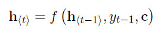
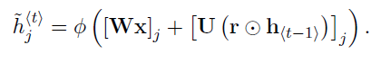

#  Learning Phrase Representations using RNN Encoder-Decoder for Statistical Machine Translation

그 유명한 seq2seq 의 근간이 되는 논문이다.

GRU 를 사용하여 encoder & decoder model을 통해 machine translation 문제를 푸는 논문 이다. 기존 translation의 경우, 보통 SMT(statistical machine translation)의 형태에 복잡한 function의 일부만 Neural network로 근사시키는 논문이였지만, 이 논문을 기점으로 Neural network를 기반으로한 end2end machine translation 논문들이 나오기 시작했다.

이 논문에서 제안한 NMT 방식은 encoder - decoder 를 기반으로한 seq2seq(sequence to sequence) 모델이다.

## Encoder - Decoder

encoder 에서 RNN을 거치면서 hidden state 가 만들어지는데, 마지막 hidden state 에 input sequence 의 정보를 모두 담게 학습한다. 이 hidden state 를 context vector C 라고 한다.

기본적인 RNN 구조를 따른다(Basic RNN Cell 을 사용하는건 아니고, GRU 를 사용한다. 이는 뒤에서 다시 설명하겠다.)

아무튼, encoder 는 기본적인 RNN 구조를 가지고 있다.

RNN 은 next time의 output 을 예측하면서 sequence 의 probability distribution을 학습할 수 있다.

이를 수식으로 정리하면 다음과같은 조건부 확률일것이다.

전체 time 에 대한 확률은 모든 time 에 대한 조건부 확률을 곱하는것으로 표현하고있다.

이제 decoder 를 살펴보자.

그 후, decoder 에서 새로운 word 를 generate 할때, context vector 와 이전 rnn cell 의 hidden state, 이전 cell 의 generate 된 word 를 사용하여 다음 hidden state 와 word 를 예측한다.

이를 조건부 확률로 나타낸다면, 다음과 같은 식이 나올것이다.

y_t 를 generate 하기 위해서 y_1 ~ y_t-1 이 필요하고, 또한 context vector 또한 필요하기 떄문이다.

전체 조건부 확률은 위와같이 나타낼 수 있다. 여기서 Y에는 T', X 에는 T 로 길이를 표현한것은, input 과 output의 길이가 다르다는것을 표현한것이다.

학습은 위 식(log-likelihodd) 를 최대화 하는 방향으로 진행한다.

## GRU(Gated Recurrent Unit)

일반적인 LSTM 을 사용하는 것이 아닌, GRU 를 사용했다. GRU 를 처음 소개한 논문이기도 하다.

- Reset Gate

  

  이전 hidden state 가 얼마나 무시될 지 계산합니다.

  sigma 기호는 sigmoid function 입니다.

- Update Gate

  

  update gate 는 이전 state 를 얼마나 기억할지 정합니다. 

  reset gate 가 1이고, update gate 가 0이라면 기존 RNN 과 같은 구조가 됩니다.

- Hidden state

  reset gate 가 0에 가까워질수록 hidden state 가 이전 hidden state 를 무시하고 현재 input에 집중하게됩니다.

  

  

  update gate 는 이전 hidden state 가 현재 hiddenstate 에 얼마나 영향을 줄 지 정합니다.

