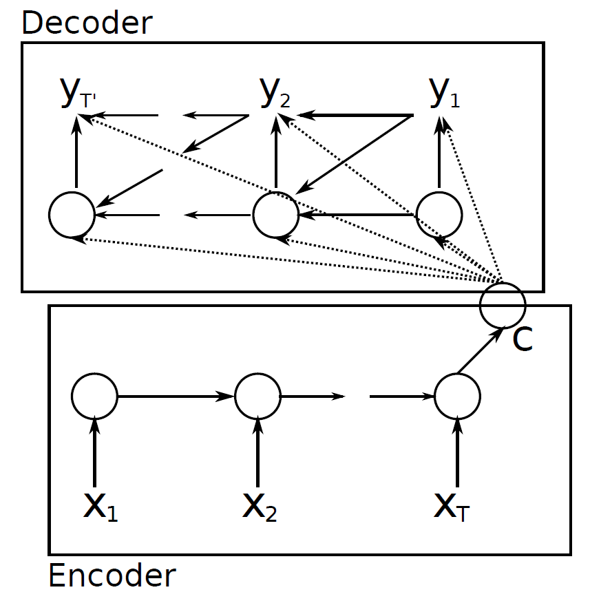

# Neural machine translation by jointly learning to align and translate

이전에 리뷰했던 [seq2seq 논문](./Learning Phrase Representations using RNN Encoder-Decoder for Statistical Machine Translation) 의 1 저자이신 조경현 교수님의 또다른 논문 입니다. 사실 seq2seq 의 단점을 극복하겠다 하면서 나온 논문이였는데, 그 방식으로 쓰인 `attention mechanism` 가 최근 NLP sota 에서는 거의 필수적으로 사용되고있어 매우 중요한 논문이 되었다. 이번 논문에서는 seq2seq 의 단점을 attention 으로 어떻게 극복하였고, attention 이 어떤것인지 알아봅시다.

이 논문에서 중심적으로 다룬 문제는 바로 context vector 그 자체 이다, seq2seq 에서 encoder 와 decoder 를 이어주는 context vector 가 fixed size vector 이고, 가장 마지막 hidden state 만 사용하므로 이 하나의 vector 에 time 에 따른 dynamic 한 정보를 담을 수 없다 라고 한다.

생각해보면 맞는 말이다.

예를들어, `I love apple.` 이란 문장이 있다고 치자. 한국어로 `나는 사과를 사랑합니다.` 로 번역할 경우, `나는` 을 generate 할 때 집중해야 하는 단어는 `I` 이고,  `사과를` 을 generate 할때 `apple` 에 집중해야합니다.

하지만 seq2seq 에서는 이 모든 정보를 context vector 라는 fixed size vector 에 담아두고 전체 time 의 generate 에 사용합니다. 

이러한 문제점을 해결하고자, dynamic context vector 를 구현하는것이 attention mechanism 의 목표 입니다.

논문에서는 이렇게 말하고 있습니다.

>encoder–decoders and encode a source sentence into a fixed-length vector from which a decoder generates a translation.

> potential issue with this encoder–decoder approach is that a neural network needs to be able to
> compress all the necessary information of a source sentence into a fixed-length vector.

그에 따른 해결책으로 다음과같이 말합니다.

>Each time the proposed model generates a word in a translation, it (soft-)searches for a set of positions in a source sentence where the most relevant information is concentrated.

## seq2seq

다시 seq2seq 를 복습하고 가봅시다.

각 time 에서 하나씩 input 이 존재한다고 가정해봅시다.

encoder 에서는 기본적인 RNN 연산을 통해 h_1 ~ h_t 의 hidden state 가 만들어질 것 입니다.

기존 seq2seq 모델에서는 모든 hidden state 의 결과를 하나의 context vector 에 압축하여 정보를 저장하였습니다.

최종적으로, generate 시에는 이전 decoder rnn cell 의 hidden state, output, 그리고 context vector를 기반으로 다음 hidden state, output 을 만들어냈습니다. 이 확률을 조건부확률곱으로 나타내보면 위와같이 정리할 수 있습니다.

## seq2seq with attention mechanism

이 논문에서 기존 seq2seq 와 차이점은 크게 2가지로, 우리가 가장 집중해서 봐야할 attention mechanism, 그리고 bidirection rnn (biRNN) 입니다.

하나 하나 살펴봅시다.

### Attention mechanism

우선, 이 논문의 attention score 를 구하는 방식을 bahdanau attention 이라고 합니다.

attention score 는 decoder 로 부터 시작됩니다.

decoder time t 에서 하나의 새로운 word 를 만들어야 한다고 가정해봅시다.

이때 필요한 정보는 t-1 decoder cell 의 hidden state, output 그리고 context vector 입니다.

우리는 context vector 를 이전 hidden state 에 기반하여 dynamic 하게 만들어볼것입니다.

위 그림을 그려보았는데요, 위 그림을 보면 attention score 라는것을 계산합니다.

decoder t-1 의 hidden state 와 encoder 의 모든 hidden state 에 대하여 각각 위와같은 수식으로 attention score 를 계산합니다. 여기서 v, W, U 는 learnable parameter 입니다.

그 이후, 이 값들을 확률 형태로 만들어 주기 위해,  attention score 에 softmax 를 사용합니다.

그럼 우리가 구한 값은 `특정 decoder 상태일때 어떤 hidden state 에 얼마나 많은 집중을 할것인지` 에 대한 수치를 알아냈습니다.

우리가 처음 목적으로 한 말에 수학적으로 접근하였다고 생각하면 편합니다.(아래에 다시 적어두었습니다.)

> 예를들어, `I love apple.` 이란 문장이 있다고 치자. 한국어로 `나는 사과를 사랑합니다.` 로 번역할 경우, `나는` 을 generate 할 때 집중해야 하는 단어는 `I` 이고,  `사과를` 을 generate 할때 `apple` 에 집중해야합니다.

우리는 decoder 에서 source 와 target 을 비교하여 loss 를 구하고, 해당 loss 를 decoder -> attention -> encoder 까지 backprop 을 통하여 end2end 로 학습할 수 있게 되었습니다.

## biRNN

encoder 부분을 보면 seq2seq 에서 보지 못한 부분이 있습니다. 바로 biRNN 으로 변했다는 것인데요.

encoder 에서 biRNN 을 사용하였다는것은, translation 을 진행할 때, 이 전 단어에만 dependency 를 두는것이 아닌, 주변 단어를 보고 학습을 진행하겠다는 의도 입니다.

사실 학습은 매우 쉽습니다. X_1 부터 X_T 로 흐르는 RNN 하나와, X_T 부터 X_1 으로 흐르는 RNN 하나를 학습하면 끝입니다.

그럼 해당 RNN 들로 부터 만들어진 hidden state 는 어떻게 같이 사용할까요?

이 논문에서는 단순하게 concat 하여 사용하였습니다.

## Experiment

실험 결과를 보면 놀랍습니다.

기존 seq2seq 에서는 sequence 의 길이가 길어지면 길어질수록, fixed size context vector 에 많은 정보를 담을 수 없어 성능이 내려감을 볼 수 있었습니다.

seq2seq with attention 은 긴 문장에서도 좋은 성능을 보여줍니다.

또한, attention 은 attention alignment 를 시각화 하면 다음과같이 어떤 input 에 집중하였는지 알 수 있다.

